.. _main_interface_window:

******************************
Main Interface Window
******************************

.. |br| raw:: html

  

.. contents::
    :depth: 2
    :local:

.. |registry_save| image:: _static/registry_save.png
	:width: 20pt
	
.. |project_save| image:: _static/project_save.png
	:width: 20pt
	
.. |optional| image:: _static/optional.png
	:width: 20pt
	
.. |input_list| image:: _static/input_list.jpg
	:width: 20pt
	
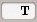
	
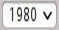
	
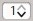
	
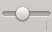
	
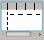
	
.. |add| image:: _static/semiautomaticclassificationplugin_add.png
	:width: 20pt
	
.. |checkbox| image:: _static/checkbox.png
	:width: 18pt
	
.. |pointer| image:: _static/semiautomaticclassificationplugin_pointer_tool.png
	:width: 20pt
	
.. |radiobutton| image:: _static/radiobutton.png
	:width: 18pt
	
.. |reload| image:: _static/semiautomaticclassificationplugin_reload.png
	:width: 20pt
	
.. |reset| image:: _static/semiautomaticclassificationplugin_reset.png
	:width: 20pt
	
.. |remove| image:: _static/semiautomaticclassificationplugin_remove.png
	:width: 20pt
	
.. |run| image:: _static/semiautomaticclassificationplugin_run.png
	:width: 24pt
	
.. |open_file| image:: _static/semiautomaticclassificationplugin_open_file.png
	:width: 20pt
	
.. |new_file| image:: _static/semiautomaticclassificationplugin_new_file.png
	:width: 20pt
	
.. |open_dir| image:: _static/semiautomaticclassificationplugin_open_dir.png
	:width: 20pt
	
.. |select_all| image:: _static/semiautomaticclassificationplugin_select_all.png
	:width: 20pt
	
.. |move_up| image:: _static/semiautomaticclassificationplugin_move_up.png
	:width: 20pt
	
.. |move_down| image:: _static/semiautomaticclassificationplugin_move_down.png
	:width: 20pt
	
.. |search_images| image:: _static/semiautomaticclassificationplugin_search_images.png
	:width: 20pt

.. |image_preview| image:: _static/semiautomaticclassificationplugin_download_image_preview.png
	:width: 20pt

.. |import| image:: _static/semiautomaticclassificationplugin_import.png
	:width: 20pt
	
.. |export| image:: _static/semiautomaticclassificationplugin_export.png
	:width: 20pt

.. |plus| image:: _static/semiautomaticclassificationplugin_plus.png
	:width: 20pt

.. |order_by_name| image:: _static/semiautomaticclassificationplugin_order_by_name.png
	:width: 20pt

.. |image_overview| image:: _static/semiautomaticclassificationplugin_download_image_overview.png
	:width: 20pt
	
.. |enter| image:: _static/semiautomaticclassificationplugin_enter.png
	:width: 20pt

.. |download| image:: _static/semiautomaticclassificationplugin_download_arrow.png
	:width: 20pt
	
.. |landsat_download| image:: _static/semiautomaticclassificationplugin_landsat8_download_tool.png
	:width: 20pt

.. |sentinel_download| image:: _static/semiautomaticclassificationplugin_sentinel_download_tool.png
	:width: 20pt
	
.. |tools| image:: _static/semiautomaticclassificationplugin_roi_tool.png
	:width: 20pt
	
.. |roi_multiple| image:: _static/semiautomaticclassificationplugin_roi_multiple.png
	:width: 20pt

.. |import_spectral_library| image:: _static/semiautomaticclassificationplugin_import_spectral_library.png
	:width: 20pt
	
.. |export_spectral_library| image:: _static/semiautomaticclassificationplugin_export_spectral_library.png
	:width: 20pt
	
.. |weight_tool| image:: _static/semiautomaticclassificationplugin_weight_tool.png
	:width: 20pt
	
.. |LCS_threshold_ROI_tool| image:: _static/semiautomaticclassificationplugin_LCS_threshold_ROI_tool.png
	:width: 20pt
	
.. |threshold_tool| image:: _static/semiautomaticclassificationplugin_threshold_tool.png
	:width: 20pt
	
.. |LCS_threshold| image:: _static/semiautomaticclassificationplugin_LCS_threshold_tool.png
	:width: 20pt
	
.. |LCS_threshold_set_tool| image:: _static/semiautomaticclassificationplugin_LCS_threshold_set_tool.png
	:width: 20pt
	
.. |sign_plot| image:: _static/semiautomaticclassificationplugin_sign_tool.png
	:width: 20pt
	
.. |rgb_tool| image:: _static/semiautomaticclassificationplugin_rgb_tool.png
	:width: 20pt
	
.. |preprocessing| image:: _static/semiautomaticclassificationplugin_class_tool.png
	:width: 20pt
	
.. |landsat_tool| image:: _static/semiautomaticclassificationplugin_landsat8_tool.png
	:width: 20pt
	
.. |sentinel2_tool| image:: _static/semiautomaticclassificationplugin_sentinel_tool.png
	:width: 20pt
	
.. |aster_tool| image:: _static/semiautomaticclassificationplugin_aster_tool.png
	:width: 20pt
	
.. |split_raster| image:: _static/semiautomaticclassificationplugin_split_raster.png
	:width: 20pt
	
.. |clip_tool| image:: _static/semiautomaticclassificationplugin_clip_tool.png
	:width: 20pt
	
.. |pca_tool| image:: _static/semiautomaticclassificationplugin_pca_tool.png
	:width: 20pt
	
.. |vector_to_raster_tool| image:: _static/semiautomaticclassificationplugin_vector_to_raster_tool.png
	:width: 20pt
	
.. |post_process| image:: _static/semiautomaticclassificationplugin_post_process.png
	:width: 20pt
	
.. |accuracy_tool| image:: _static/semiautomaticclassificationplugin_accuracy_tool.png
	:width: 20pt
	
.. |land_cover_change| image:: _static/semiautomaticclassificationplugin_land_cover_change.png
	:width: 20pt
	
.. |report_tool| image:: _static/semiautomaticclassificationplugin_report_tool.png
	:width: 20pt

.. |class_to_vector_tool| image:: _static/semiautomaticclassificationplugin_class_to_vector_tool.png
	:width: 20pt

.. |reclassification_tool| image:: _static/semiautomaticclassificationplugin_reclassification_tool.png
	:width: 20pt

.. |edit_raster| image:: _static/semiautomaticclassificationplugin_edit_raster.png
	:width: 20pt

.. |undo_edit_raster| image:: _static/semiautomaticclassificationplugin_undo_edit_raster.png
	:width: 20pt

.. |classification_sieve| image:: _static/semiautomaticclassificationplugin_classification_sieve.png
	:width: 20pt

.. |classification_erosion| image:: _static/semiautomaticclassificationplugin_classification_erosion.png
	:width: 20pt

.. |classification_dilation| image:: _static/semiautomaticclassificationplugin_classification_dilation.png
	:width: 20pt

.. |bandcalc_tool| image:: _static/semiautomaticclassificationplugin_bandcalc_tool.png
	:width: 20pt
	
.. |batch_tool| image:: _static/semiautomaticclassificationplugin_batch.png
	:width: 20pt

.. |bandset_tool| image:: _static/semiautomaticclassificationplugin_bandset_tool.png
	:width: 20pt
	
.. |settings_tool| image:: _static/semiautomaticclassificationplugin_settings_tool.png
	:width: 20pt

The Main Interface Window is composed of several tabs and subtabs.
The functions are described in detail in the following paragraphs, using these conventions:

|input_date| = Input date

|input_text| = Input text

|input_list| = List

|input_number| = Input number

|optional| = Optional

|project_save| = Configuration stored in the active project of QGIS

|registry_save| = Configuration stored in QGIS registry

|input_slider| = Slider

|input_table| = Table

.. _download_tab:
 
Download images 
================================

The tab |download| :guilabel:`Download images` includes the tools for searching and downloading free remote sensing images.
An internet connection is required.

.. _Landsat_download_tab:

Landsat download 
----------------------------------------

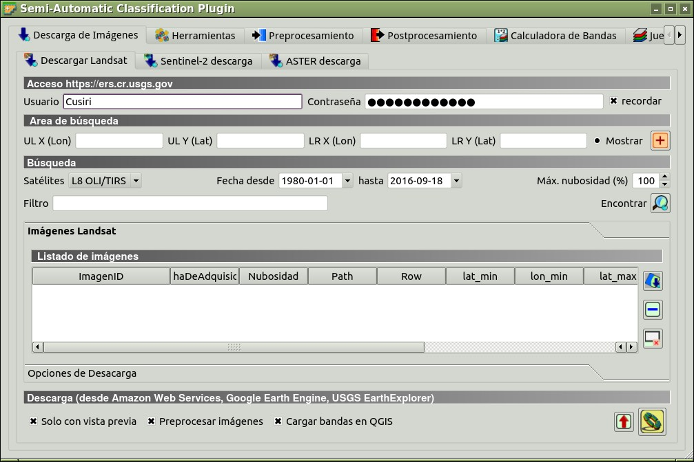
	
	|landsat_download| :guilabel:`Landsat download`

This tab allows for searching and downloading the whole archive of :ref:`Landsat_definition` images (from 1 MSS to 8 OLI), acquired from the 80s to present days.
Search is performed through the `CMR Search API <https://cmr.earthdata.nasa.gov/search/site/search_api_docs.html>`_ developed by NASA.
 
Landsat images are freely available through the services: `EarthExplorer <http://earthexplorer.usgs.gov/>`_ , `Google Earth Engine <https://earthengine.google.com/datasets/>`_ , and the `Amazon Web Services (AWS) <http://aws.amazon.com/public-data-sets/landsat/>`_ (for Landsat 8).
This tool attempts to download images first from `Amazon Web Services` and `Google Earth Engine` ; only if images are not available, the download is performed through the service `EarthExplorer` in order to prevent the server from becoming saturated.

Images are downloaded as compressed archives (this tool allows for the download of single bands for Landsat 8 images provided by the `Amazon Web Services`).
Also, automatic conversion to reflectance of downloaded bands is available.
	
.. _login_Landsat:

Login https://ers.cr.usgs.gov/
^^^^^^^^^^^^^^^^^^^^^^^^^^^^^^^^^^^^^^^^^^^^^^^^^^^

`USGS EROS` credentials (https://ers.cr.usgs.gov) are required for downloads from `EarthExplorer <http://earthexplorer.usgs.gov/>`_ .
Login using your `USGS EROS` credentials or register for free at https://ers.cr.usgs.gov/register .
	
* :guilabel:`User` |input_text| |registry_save|: enter the user name;
* :guilabel:`Password` |input_text| |registry_save|: enter the password;
* |checkbox| :guilabel:`remember`: remember user name and password in QGIS;
	
.. _search_area_Landsat:

Search area
^^^^^^^^^^^^^^^^^
	
Define the search area by entering the coordinates (longitude and latitude) of an ``Upper Left`` (UL) point and ``Lower Right`` (LR) point, or interactively drawing an area in the map.

The definition of a search area is required before searching the images.

* :guilabel:`UL X (Lon)` |input_number|: set the UL longitude;
* :guilabel:`UL Y (Lat)` |input_number|: set the UL latitude;
* :guilabel:`LR X (Lon)` |input_number|: set the LR longitude;
* :guilabel:`LR Y (Lat)` |input_number|: set the LR latitude;
* |radiobutton| :guilabel:`Show`: show or hide the search area drawn in the map;
* |pointer|: define a search area by drawing a rectangle in the map; left click to set the UL point and right click to set the LR point; the area is displayed in the map;
	
.. _search_Landsat:

Search
^^^^^^^^^^^^^^^^^
	
Define the search settings such as date of acquisition, maximum cloud cover, or specify Landsat satellites.

* :guilabel:`Satellites` |input_list|: set the Landsat satellites;
* :guilabel:`Date from` |input_date|: set the starting date of acquisition;
* :guilabel:`to` |input_date|: set the ending date of acquisition;
* :guilabel:`Max cloud cover (%)` |input_number|: maximum cloud cover in the image;
* :guilabel:`Results` |input_number|: maximum number of images returned by the search;
* :guilabel:`Filter` |input_text|: set a filter such as the Image ID of Landsat images (e.g. ``LC81910312015006LGN00``); it is possible to enter multiple Image IDs separated by comma or semicolon (e.g. ``LC81910312015006LGN00, LC81910312013224LGN00`` ); filtered images must be inside the search area;
* :guilabel:`Find` |search_images|: find the images in the search area; results are displayed inside the table in :ref:`landsat_images`; results are added to previous results;

	**Tip**: Search results (and the number thereof) depend on the defined area extent and the range of dates. In order to get more results, perform multiple searches defining smaller area extent and narrow acquisition dates (from and to).
	
.. _landsat_images:

Landsat images
^^^^^^^^^^^^^^^^^

* |input_table| :guilabel:`Image list`: found images are displayed in this table, which includes the following fields;
	* :guilabel:`ImageID`: the Landsat Image ID;
	* :guilabel:`AcquisitionDate`: date of acquisition of Landsat image;
	* :guilabel:`CloudCover`: percentage of cloud cover in the image;
	* :guilabel:`Path`: WRS path of the image;
	* :guilabel:`Row`: WRS row of the image;
	* :guilabel:`min_lat`: minimum latitude of the image;
	* :guilabel:`min_lon`: minimum longitude of the image;
	* :guilabel:`max_lat`: maximum latitude of the image;
	* :guilabel:`max_lon`: maximum longitude of the image;
	* :guilabel:`USGScollection`: USGS collection code of the image;
	* :guilabel:`Preview`: URL of the image preview;
	* :guilabel:`collection`: collection code of the image;
	
* |image_preview|: display preview of highlighted images in the map; preview is roughly georeferenced on the fly;
* |remove|: remove highlighted images from the list;
* |reset|: remove all images from the list;

.. _landsat_download_options:

Download options
^^^^^^^^^^^^^^^^^

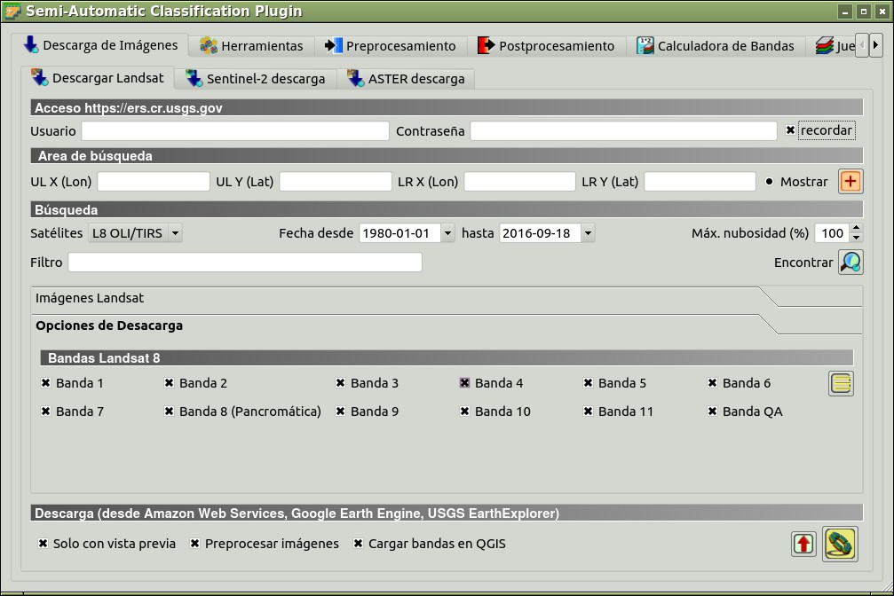
	
	:guilabel:`Download options`
		
**Landsat 8 bands**

This tab allows for the selection of single bands (only for Landsat 8 images provided by the `Amazon Web Services`).

* |checkbox| :guilabel:`Band` ``X``: select bands for download;
* |select_all|: select or deselect all bands;

.. _landsat_download:

Download
^^^^^^^^^^^^^^^^^

Download  the Landsat images in the :ref:`landsat_images`.
During the download it is recommended not to interact with QGIS.

Download is performed according to image availability from the services `EarthExplorer <http://earthexplorer.usgs.gov/>`_ , `Google Earth Engine <https://earthengine.google.com/datasets/>`_ , or the `Amazon Web Services (AWS) <http://aws.amazon.com/public-data-sets/landsat/>`_ .
If the image is not available for download it is possible to check the availability thereof on `http://earthexplorer.usgs.gov/ <http://earthexplorer.usgs.gov/>`_ .

* |checkbox| :guilabel:`Only if preview in Layers`: if checked, download only those images listed in :ref:`landsat_images` which are also listed in the QGIS layer panel;
* |checkbox| :guilabel:`Preprocess images`: if checked, bands are automatically converted after the download, according to the settings defined in :ref:`landsat_tab`;
* |checkbox| :guilabel:`Load bands in QGIS`: if checked, bands are loaded in QGIS after the download;
* |export|: export the download links to a text file;
* |run|: start the download process of all the images listed in :ref:`landsat_images`;

.. _Sentinel_download_tab:

Sentinel-2 download 
----------------------------------------

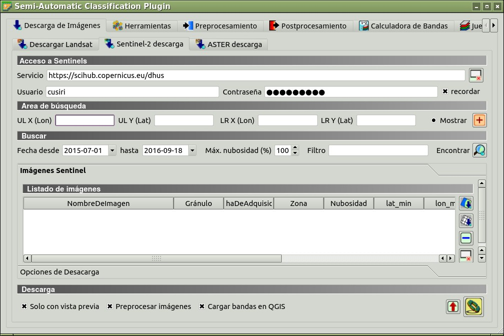
	
	|sentinel_download| :guilabel:`Sentinel-2 download`

**Sentinel-2** is a European satellite launched in 2015, developed in the frame of Copernicus land monitoring services, which acquires 13 spectral bands (see :ref:`Sentinel2_definition`).
This tab allows for searching and downloading the free Sentinel-2 images (Level-1C) from the Sentinels `Scientific Data Hub <https://scihub.copernicus.eu/>`_ (using the `Data Hub API <https://scihub.copernicus.eu/userguide/5APIsAndBatchScripting>`_ ).

Sentinel-2 satellite has a swath width of 290km.
Sentinel-2 Level-1C images are delivered in granules (also called tiles) with a side of 100km in UTM/WGS84 projection.
This tool allows for the selection and download of granules and bands.

	**Tip**: In case of errors please see :ref:`error_4` and :ref:`error_5`.

.. _login_Sentinel:

Login Sentinels
^^^^^^^^^^^^^^^^^^^^^^^^^^^^^^^^^^^^^^^^^^^^^^^^^^^

In order to access to Sentinel data a free registration is required at https://scihub.copernicus.eu/userguide/1SelfRegistration (other services may require different registrations).
After the registration, enter the user name and password for accessing data.
	
* :guilabel:`Service` |input_text| |registry_save|: enter the service URL (default is https://scihub.copernicus.eu/s2); other mirror services that share the same infrastructure can be used (such as https://scihub.copernicus.eu/dhus , https://finhub.nsdc.fmi.fi , https://data.sentinel.zamg.ac.at);
* |reset|: reset the default service https://scihub.copernicus.eu/s2);
* :guilabel:`User` |input_text| |registry_save|: enter the user name;
* :guilabel:`Password` |input_text| |registry_save|: enter the password;
* |checkbox| :guilabel:`remember`: remember user name and password in QGIS;

.. _area_coordinates_Sentinel:

Area coordinates
^^^^^^^^^^^^^^^^^
	
Define the search area by entering the coordinates (longitude and latitude) of an ``Upper Left`` (UL) point and ``Lower Right`` (LR) point, or interactively drawing an area in the map.
The definition of a search area is required before searching the images.

* :guilabel:`UL X (Lon)` |input_number|: set the UL longitude;
* :guilabel:`UL Y (Lat)` |input_number|: set the UL latitude;
* :guilabel:`LR X (Lon)` |input_number|: set the LR longitude;
* :guilabel:`LR Y (Lat)` |input_number|: set the LR latitude;
* |radiobutton| :guilabel:`Show`: show or hide the search area drawn in the map;
* |pointer|: define a search area by drawing a rectangle in the map; left click to set the UL point and right click to set the LR point; the area is displayed in the map;

.. _search_Sentinel:

Search
^^^^^^^^^^^^^^^^^
	
Define search settings such as the date of acquisition or search for specific Sentinel images using the Image ID or name.

* :guilabel:`Date from` |input_date|: set the starting date of acquisition;
* :guilabel:`to` |input_date|: set the ending date of acquisition;
* :guilabel:`Max cloud cover (%)` |input_number|: maximum cloud cover in the image;
* :guilabel:`Results` |input_number|: maximum number of images returned by the search;
* :guilabel:`Filter` |input_text|: set a filter such as the Image Name of Sentinel images (e.g. ``S2A_OPER_PRD_MSIL1C_PDMC_20160419T190217_R022_V20160419T101026``);
* :guilabel:`Find` |search_images|: find the images in the search area; results are displayed inside the table in :ref:`Sentinel_images`; results are added to previous results;

	**Tip**: Search results (and the number thereof) depend on the defined area extent and the range of dates. In order to get more results, perform multiple searches defining smaller area extent and narrow acquisition dates (from and to).
	
.. _Sentinel_images:

Sentinel images
^^^^^^^^^^^^^^^^^
		
* |input_table| :guilabel:`Image list`: found images are displayed in this table, which includes the following fields;
	* :guilabel:`ImageName`: the Sentinel Image Name;
	* :guilabel:`Granule`: the single granule name;
	* :guilabel:`AcquisitionDate`: date of acquisition of Sentinel image;
	* :guilabel:`Zone`: tile zone according to the US-MGRS naming convention;
	* :guilabel:`CloudCover`: percentage of cloud cover in the image;
	* :guilabel:`min_lat`: minimum latitude of the image;
	* :guilabel:`min_lon`: minimum longitude of the image;
	* :guilabel:`max_lat`: maximum latitude of the image;
	* :guilabel:`max_lon`: maximum longitude of the image;
	* :guilabel:`Size`: the size of the image (unused);
	* :guilabel:`Preview`: URL of the image overview;
	* :guilabel:`GranulePreview`: URL of the granule preview; if available, preview is downloaded from the `Amazon Web Services <http://sentinel-pds.s3-website.eu-central-1.amazonaws.com/>`_ ;
	* :guilabel:`ImageID`: the Sentinel Image ID;
	
* |image_preview|: display preview of highlighted granules in the map;
* |image_overview|: display overview of highlighted images in the map; overview is roughly georeferenced on the fly; overviews could not be available when using mirror services;
* |remove|: remove highlighted images from the list;
* |reset|: remove all images from the list;

	**Tip**: download this `zip file <https://docs.google.com/uc?id=0BysUrKXWIDwBZHF6dENlZ0g1Y0k>`_ containing the shapefile of Sentinel-2 granules for identifying the zone; load this shapefile in QGIS, select the granules in your search area and open the attribute table to see the zone name.

.. _sentinel2_download_options:

Download options
^^^^^^^^^^^^^^^^^

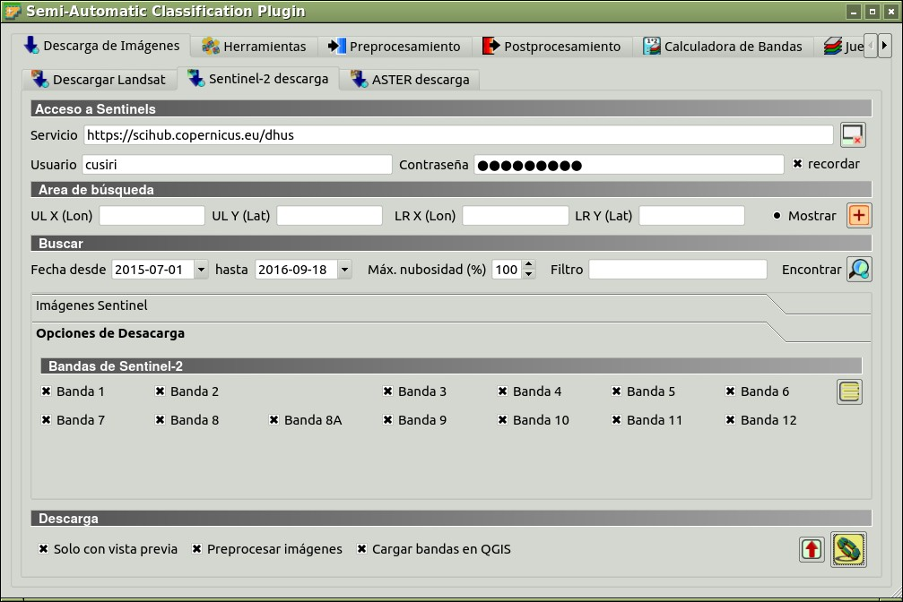
	
	:guilabel:`Download options`

This tab allows for the selection of single bands.

* |checkbox| :guilabel:`Band` ``X``: select bands for download;
* |select_all|: select or deselect all bands;
	
.. _Sentinel_download:

Download
^^^^^^^^^^^^^^^^^

Download  the Sentinel-2 images in the :ref:`Sentinel_images`.
Bands selected in :ref:`sentinel2_download_options` are downloaded.
Also, the metadata files (a .xml file whose name contains ``MTD_SAFL1C`` and a .xml file whose name contains ``MTD_L1C``) and the cloud mask file (a .gml file whose name contains ``MSK_CLOUDS``) are downloaded.

During the download it is recommended not to interact with QGIS.

* |checkbox| :guilabel:`Only if preview in Layers`: if checked, download only those images listed in :ref:`Sentinel_images` which are also listed in the QGIS layer panel;
* |checkbox| :guilabel:`Preprocess images`: if checked, bands are automatically converted after the download, according to the settings defined in :ref:`sentinel2_tab`;
* |checkbox| :guilabel:`Load bands in QGIS`: if checked, bands are loaded in QGIS after the download;
* |export|: export the download links to a text file;
* |run|: start the download process of all the images listed in :ref:`Sentinel_images`;
	
.. _ASTER_download_tab:

ASTER download 
----------------------------------------

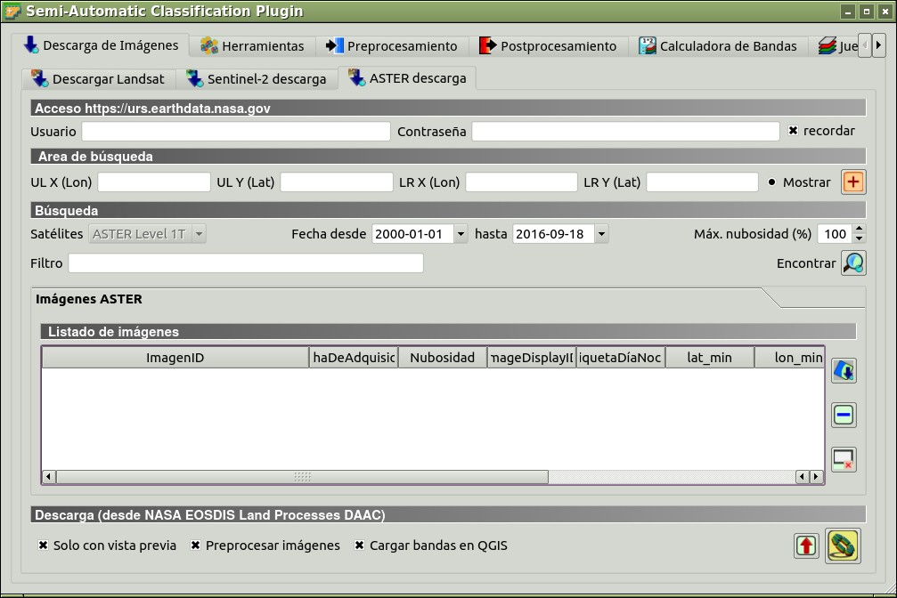
	
	|landsat_download| :guilabel:`ASTER download`

This tab allows for searching and downloading the whole archive of free images L1T acquired by :ref:`ASTER_definition` since 2000.
Search is performed through the `CMR Search API <https://cmr.earthdata.nasa.gov/search/site/search_api_docs.html>`_ developed by NASA.
The ASTER L1T data products are retrieved from the online Data Pool, courtesy of the NASA Land Processes Distributed Active Archive Center (LP DAAC), USGS/Earth Resources Observation and Science (EROS) Center, Sioux Falls, South Dakota, https://lpdaac.usgs.gov/data_access/data_pool.

Also, automatic conversion to reflectance of downloaded bands is available.
	
.. _login_ASTER:

Login https://urs.earthdata.nasa.gov 
^^^^^^^^^^^^^^^^^^^^^^^^^^^^^^^^^^^^^^^^^^^^^^^^^^^

`EOSDIS Earthdata` credentials (https://urs.earthdata.nasa.gov ) are required for download.
Login using your `EOSDIS Earthdata` credentials or register for free at https://urs.earthdata.nasa.gov/users/new .
	
	**Warning**: Before downloading ASTER images, you must approve LP DAAC Data Pool clicking the following https://urs.earthdata.nasa.gov/approve_app?client_id=ijpRZvb9qeKCK5ctsn75Tg
	
* :guilabel:`User` |input_text| |registry_save|: enter the user name;
* :guilabel:`Password` |input_text| |registry_save|: enter the password;
* |checkbox| :guilabel:`remember`: remember user name and password in QGIS;
	
.. _search_area_ASTER:

Search area
^^^^^^^^^^^^^^^^^
	
Define the search area by entering the coordinates (longitude and latitude) of an ``Upper Left`` (UL) point and ``Lower Right`` (LR) point, or interactively drawing an area in the map.

The definition of a search area is required before searching the images.

* :guilabel:`UL X (Lon)` |input_number|: set the UL longitude;
* :guilabel:`UL Y (Lat)` |input_number|: set the UL latitude;
* :guilabel:`LR X (Lon)` |input_number|: set the LR longitude;
* :guilabel:`LR Y (Lat)` |input_number|: set the LR latitude;
* |radiobutton| :guilabel:`Show`: show or hide the search area drawn in the map;
* |pointer|: define a search area by drawing a rectangle in the map; left click to set the UL point and right click to set the LR point; the area is displayed in the map;
	
.. _search_ASTER:

Search
^^^^^^^^^^^^^^^^^
	
Define the search settings such as date of acquisition, maximum cloud cover, or specify ASTER satellites.

* :guilabel:`Satellites` |input_list|: set the ASTER satellites (unused);
* :guilabel:`Date from` |input_date|: set the starting date of acquisition;
* :guilabel:`to` |input_date|: set the ending date of acquisition;
* :guilabel:`Max cloud cover (%)` |input_number|: maximum cloud cover in the image;
* :guilabel:`Results` |input_number|: maximum number of images returned by the search;
* :guilabel:`Filter` |input_text|: set a filter such as the Image ID of ASTER images; it is possible to enter multiple Image IDs separated by comma or semicolon; filtered images must be inside the search area;
* :guilabel:`Find` |search_images|: find the images in the search area; results are displayed inside the table in :ref:`ASTER_images`; results are added to previous results;

	**Tip**: Search results (and the number thereof) depend on the defined area extent and the range of dates. In order to get more results, perform multiple searches defining smaller area extent and narrow acquisition dates (from and to).
	
.. _ASTER_images:

ASTER images
^^^^^^^^^^^^^^^^^

* |input_table| :guilabel:`Image list`: found images are displayed in this table, which includes the following fields;
	* :guilabel:`ImageID`: the ASTER Image ID;
	* :guilabel:`AcquisitionDate`: date of acquisition of ASTER image;
	* :guilabel:`CloudCover`: percentage of cloud cover in the image;
	* :guilabel:`ImageDisaplyID`: the ASTER Image ID;
	* :guilabel:`DayNightFlag`: flag for acquisition during day or night;
	* :guilabel:`min_lat`: minimum latitude of the image;
	* :guilabel:`min_lon`: minimum longitude of the image;
	* :guilabel:`max_lat`: maximum latitude of the image;
	* :guilabel:`max_lon`: maximum longitude of the image;
	* :guilabel:`Service`: download service of the image;
	* :guilabel:`Preview`: URL of the image preview;
	* :guilabel:`collection`: collection code of the image;
	
* |image_preview|: display preview of highlighted images in the map; preview is roughly georeferenced on the fly;
* |remove|: remove highlighted images from the list;
* |reset|: remove all images from the list;

.. _ASTER_download:

Download
^^^^^^^^^^^^^^^^^

Download  the ASTER images in the :ref:`ASTER_images`.
During the download it is recommended not to interact with QGIS.

* |checkbox| :guilabel:`Only if preview in Layers`: if checked, download only those images listed in :ref:`ASTER_images` which are also listed in the QGIS layer panel;
* |checkbox| :guilabel:`Preprocess images`: if checked, bands are automatically converted after the download, according to the settings defined in :ref:`aster_tab`;
* |checkbox| :guilabel:`Load bands in QGIS`: if checked, bands are loaded in QGIS after the download;
* |export|: export the download links to a text file;
* |run|: start the download process of all the images listed in :ref:`ASTER_images`;

	
.. _tools_tab:
 
Tools 
==============

The tab |tools| ``Tools`` includes several tools for manipulating ROIs and spectral signatures.

.. _multiple_rois_tab:

Multiple ROI Creation 
--------------------------------------

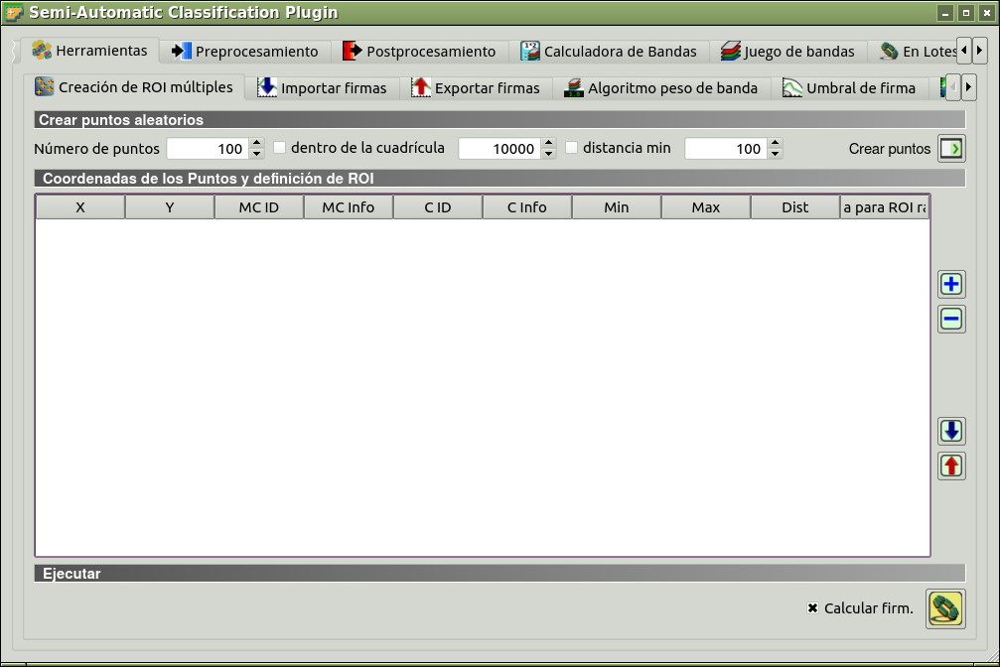
	
	|roi_multiple| :guilabel:`Multiple ROI Creation`

This tab allows for the automatic creation of ROIs, useful for the rapid classification of multi-temporal images, or for accuracy assessment.
Given a list of point coordinates and ROI options, this tool performs the region growing of ROIs.
Created ROIs are automatically saved to the :ref:`training_input`.

.. _create_random_points:

Create random points
^^^^^^^^^^^^^^^^^^^^^^^^^^^^^^^^^^^^

* :guilabel:`Number of points` |input_number|: set a number of points that will be created when :guilabel:`Create points` |enter| is clicked;
* |checkbox| :guilabel:`inside grid` |input_number|: if checked, the :guilabel:`input image` area is divided in cells where the size thereof is defined in the combobox (image unit, usually meters); points defined in ``Number of random points`` are created randomly within each cell;
* |checkbox| :guilabel:`min distance` |input_number|: if checked, random points have a minimum distance defined in the combobox (image unit, usually meters); setting a minimum distance can result in fewer points than the number defined in :guilabel:`Number of points`;
* :guilabel:`Create points` |enter|: create random points inside the :guilabel:`input image` area;

.. _point_coordinates:

Point coordinates and ROI definition
^^^^^^^^^^^^^^^^^^^^^^^^^^^^^^^^^^^^^^^

* |input_table| :guilabel:`Point coordinates and ROI definition`: table containing the following fields;
	* :guilabel:`X` : point X coordinate (float);
	* :guilabel:`Y` : point Y coordinate (float);
	* :guilabel:`MC ID`: ROI Macroclass ID (int);
	* :guilabel:`MC Info`: ROI Macroclass information (text);
	* :guilabel:`C ID`: ROI Class ID (int);
	* :guilabel:`C Info`: ROI Class information (text);
	* :guilabel:`Min` : the minimum area of a ROI (in pixel unit);
	* :guilabel:`Max` : the maximum width of a ROI (in pixel unit);
	* :guilabel:`Dist` : the interval which defines the maximum spectral distance between the seed pixel and the surrounding pixels (in radiometry unit);
	* :guilabel:`Rapid ROI band` : if a band number is defined, ROI is created only using the selected band, similarly to :guilabel:`Rapid ROI band` in :ref:`ROI_creation` ;

* |add|: add a new row to the table; all the table fields must be filled for the ROI creation;
* |remove|: delete the highlighted rows from the table;
* |import|: import a point list from text file to the table; every line of the text file must contain values separated by tabs of ``X``, ``Y``, ``MC ID``, ``MC Info``, ``Class ID``, ``C Info``, ``Min``, ``Max``, ``Dist``, and optionally the ``Rapid ROI band``;
* |export|: export the point list to text file;

.. _run_tool_1:

Run
^^^^^^^^^^^^^^^^^^^^^^^^^^^^^^^^^^^^^^^

* |checkbox| :guilabel:`Calculate sig.`: if checked, the spectral signature is calculated while the ROI is saved to :ref:`training_input`;
* |run|: start the ROI creation process for all the points and save ROIs to the :ref:`training_input`;

.. _import_signatures_tab:

Import signatures 
-----------------

The tab |import_spectral_library| :guilabel:`Import signatures` allows for importing spectral signatures from various sources.

.. _import_library_file_tab:

Import library file
^^^^^^^^^^^^^^^^^^^^^^^^^^^^^^^^

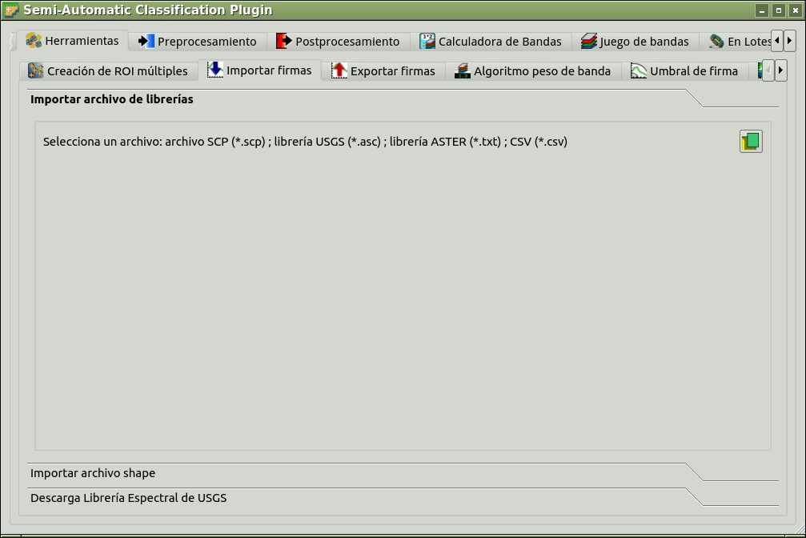
	
	:guilabel:`Import library file`

This tool allows for importing spectral signatures from various sources: a previously saved :ref:`training_input` (.scp file); a USGS Spectral Library (.asc file); a previously exported CSV file.
In case of USGS Spectral Library, the library is automatically sampled according to the image band wavelengths defined in the :ref:`band_set_tab`, and added to the :ref:`ROI_list`;
	
* :guilabel:`Select a file` |open_file|: open a file to be imported in the :ref:`training_input`;
	
.. _import_shapefile_tab:

Import shapefile
^^^^^^^^^^^^^^^^^^^^^^^^^^^^^^^^

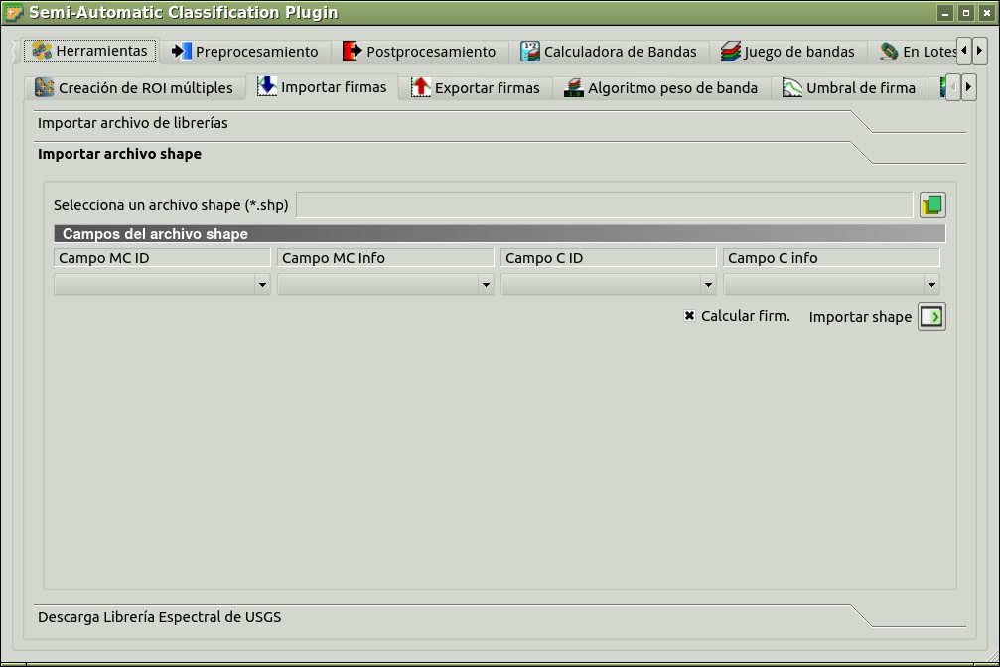
	
	:guilabel:`Import shapefile`

This tool allows for importing a shapefile, selecting the corresponding fields of the :ref:`training_input`.

* :guilabel:`Select a shapefile` |open_file|: open a shapefile; 
* :guilabel:`MC ID field` |input_list|: select the shapefile field corresponding to MC ID;
* :guilabel:`MC Info field` |input_list|: select the shapefile field corresponding to MC Info;
* :guilabel:`C ID field` |input_list|: select the shapefile field corresponding to C ID;
* :guilabel:`C Info field` |input_list|: select the shapefile field corresponding to C Info;
* |checkbox| :guilabel:`Calculate sig.`: if checked, the spectral signature is calculated while the ROI is saved to :ref:`training_input`;
* :guilabel:`Import shapefile` |enter|: import all the shapefile polygons as ROIs in the :ref:`training_input`;

.. _USGS_spec_library_tab:

Download USGS Spectral Library
^^^^^^^^^^^^^^^^^^^^^^^^^^^^^^^^

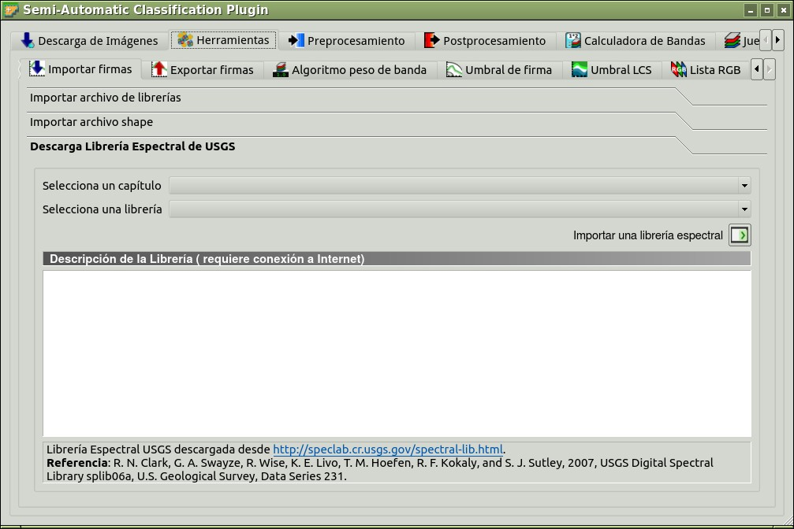
	
	:guilabel:`Download USGS Spectral Library`

The tab :guilabel:`Download USGS Spectral Library` allows for the download of the `USGS spectral library <http://speclab.cr.usgs.gov/spectral-lib.html>`_ (Clark, R.N., Swayze, G.A., Wise, R., Livo, E., Hoefen, T., Kokaly, R., Sutley, S.J., 2007, USGS digital spectral library splib06a: U.S. Geological Survey, Digital Data Series 231).

The libraries are grouped in chapters including Minerals, Mixtures, Coatings, Volatiles, Man-Made, Plants, Vegetation Communities, Mixtures with Vegetation, and Microorganisms.
An internet connection is required.

* :guilabel:`Select a chapter` |input_list|: select one of the library chapters; after the selection, chapter libraries are shown in :guilabel:`Select a library`;
* :guilabel:`Select a library` |input_list|: select one of the libraries; the library description is displayed in the frame :guilabel:`Library description`;
* :guilabel:`Import spectral library` |enter|: download the library and add the sampled spectral signature to the :ref:`ROI_list` using the parameters defined in :ref:`ROI_creation`; the library is automatically sampled according to the image band wavelengths defined in the :ref:`band_set_tab`, and added to the :ref:`ROI_list`;

	**Tip**: Spectral libraries downloaded from the ``USGS Spectral Library`` can be used with Minimum Distance or Spectral Angle Mapping algorithms, but not Maximum Likelihood because this algorithm needs the covariance matrix that is not included in the spectral libraries.
	
.. _export_signatures_tab:

Export signatures 
-----------------

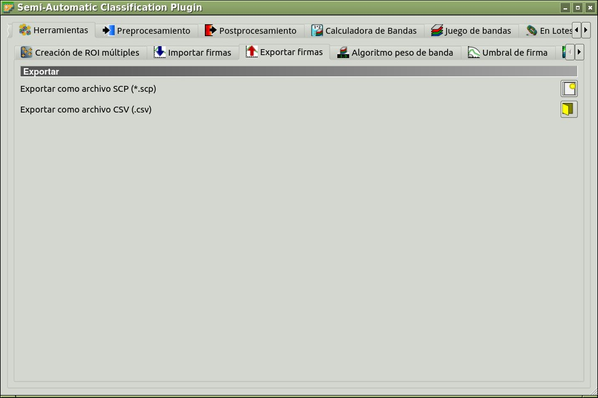
	
	|export_spectral_library| :guilabel:`Export signatures`

This tool allows for exporting the signatures highlighted in the :ref:`ROI_list`.

* :guilabel:`Export as SCP file` |new_file|: create a new .scp file and export highlighted ROIs and spectral signatures as :guilabel:`SCP` file (* .scp);
* :guilabel:`Export as CSV file` |open_dir|: open a directory, and export highlighted spectral signatures as individual CSV files (* .csv) separated by semicolon ( ; );

.. _Algorithm_band_weight_tab:

Algorithm band weight
-------------------------

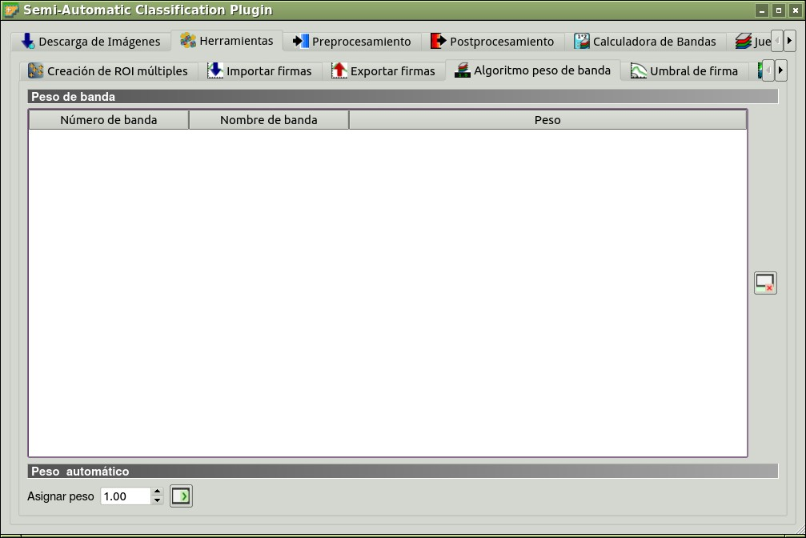
	
	|weight_tool| :guilabel:`Algorithm band weight`

This tab allows for the definition of band weights that are useful for improving the spectral separability of materials at certain wavelengths (bands).
During the classification process, band values and spectral signature values are multiplied by the corresponding band weights, thus modifying the spectral distances.

.. _band_weight:

Band weight
^^^^^^^^^^^^^^^^^
		
* |input_table| :guilabel:`Band weight`: table containing the following fields;
	* :guilabel:`Band number` : number of the band in the :guilabel:`Band set`;
	* :guilabel:`Band name` : name of the band;
	* :guilabel:`Weight` : weight of the band; this value can be edited;

.. _automatic_weight:

Automatic weight
^^^^^^^^^^^^^^^^^
	
* |reset|: reset all band weights to 1;
* :guilabel:`Set weight` |input_number| |enter|: set the defined value as weight for all the highlighted bands in the table; 
		
.. _Signature_threshold_tab:

Signature threshold
-------------------------

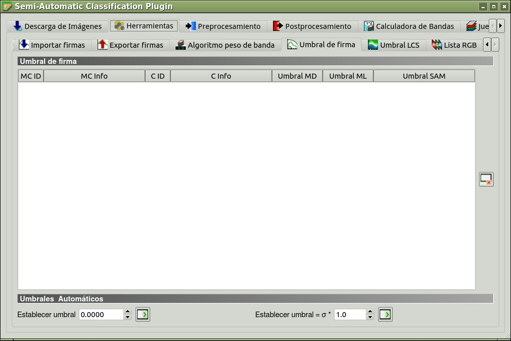
	
	|threshold_tool| :guilabel:`Signature threshold`

This tab allows for the definition of a classification threshold for each spectral signature.
All the signatures contained in the :ref:`training_input` are listed.
This is useful for improving the classification results, especially when spectral signatures are similar.
Thresholds of signatures are saved in the :ref:`training_input`.

If threshold is 0 then no threshold is applied.
Depending on the selected :ref:`classification_alg` the threshold value is evaluated differently:

* for Minimum Distance, pixels are unclassified if distance is greater than threshold value;
* for Maximum Likelihood, pixels are unclassified if probability is less than threshold  value (max 100);
* for Spectral Angle Mapping, pixels are unclassified if spectral angle distance is greater than threshold value (max 90).
	
.. _signature_threshold:

Signature threshold
^^^^^^^^^^^^^^^^^^^^^^^
		
* |input_table| :guilabel:`Signature threshold`: table containing the following fields;
	* :guilabel:`MC ID`: signature Macroclass ID;
	* :guilabel:`MC Info`: signature Macroclass Information;
	* :guilabel:`C ID`: signature Class ID;
	* :guilabel:`C Info`: signature Class Information;
	* :guilabel:`MD Threshold`: Minimum Distance threshold; this value can be edited;
	* :guilabel:`ML Threshold`: Maximum Likelihood threshold; this value can be edited;
	* :guilabel:`SAM Threshold`: Spectral Angle Mapping threshold; this value can be edited;

* |reset|: reset all signatures thresholds to 0 (i.e. no threshold used);

.. _automatic_thresholds:

Automatic thresholds
^^^^^^^^^^^^^^^^^^^^^^^

* :guilabel:`Set threshold` |input_number| |enter|: set the defined value as threshold for all the highlighted signatures in the table;
* :guilabel:`Set threshold = σ *` |input_number| |enter|: for all the highlighted signatures, set an automatic threshold calculated as the distance (or angle) between mean signature and (mean signature + (σ * v)), where σ is the standard deviation and v is the defined value; currently works for Minimum Distance and Spectral Angle Mapping;

.. _LCS_threshold:

LCS threshold
-------------------------

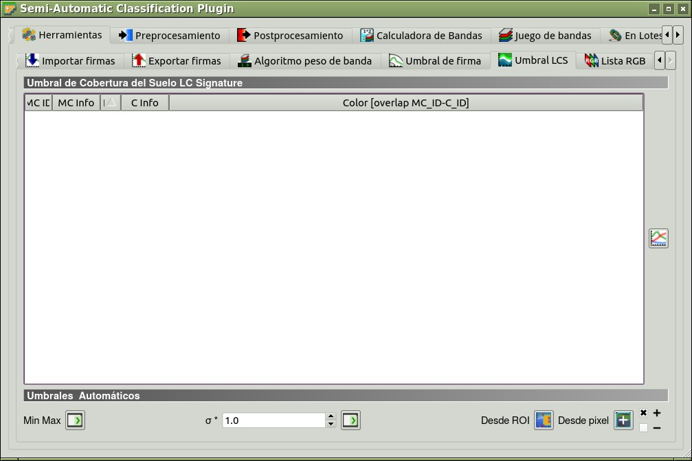
	
	|LCS_threshold| :guilabel:`LCS threshold`
	
This tab allows for setting the signature thresholds used by :ref:`LCS_algorithm`.
All the signatures contained in the :ref:`training_input` are listed; also, signature thresholds are saved in the :ref:`training_input`.

Overlapping signatures (belonging to different classes or macroclasses) are highlighted in orange in the table :guilabel:`LC Signature threshold`; the overlapping check is performed considering :guilabel:`MC ID` or :guilabel:`C ID` according to the setting :guilabel:`Use` |checkbox| :guilabel:`MC ID` |checkbox| :guilabel:`C ID` in :ref:`classification_alg`.
Overlapping signatures sharing the same :guilabel:`ID` are not highlighted.

.. _LC_signature_threshold:

LC Signature threshold
^^^^^^^^^^^^^^^^^^^^^^^
		
* |input_table| :guilabel:`LC Signature threshold`: table containing the following fields;
	* :guilabel:`MC ID`: signature Macroclass ID;
	* :guilabel:`MC Info`: signature Macroclass Information;
	* :guilabel:`C ID`: signature Class ID;
	* :guilabel:`C Info`: signature Class Information;
	* :guilabel:`Color [overlap MC_ID-C_ID]`: signature color; also, the combination :guilabel:`MC ID`-:guilabel:`C ID` is displayed in case of overlap with other signatures (see :ref:`LCS_algorithm`);
	* :guilabel:`Min B` ``X``: minimum value of band ``X``; this value can be edited;
	* :guilabel:`Max B` ``X``: maximum value of band ``X``; this value can be edited;

* |sign_plot|: show the ROI spectral signature in the :ref:`spectral_signature_plot`; spectral signature is calculated from the :ref:`input_image`;

.. _LC_automatic_thresholds:

Automatic thresholds
^^^^^^^^^^^^^^^^^^^^^^^

Set thresholds automatically for highlighted signatures in the table :guilabel:`LC Signature threshold`; if no signature is highlighted, then the threshold is applied to all the signatures.

* :guilabel:`Min Max` |enter|: set the threshold based on the minimum and maximum of each band;
* :guilabel:`σ *` |input_number| |enter|: set an automatic threshold calculated as (band value + (σ * v)), where σ is the standard deviation of each band and v is the defined value;
* :guilabel:`From ROI` |LCS_threshold_ROI_tool|: set the threshold using the temporary ROI pixel values, according to the following checkboxes:
	* |checkbox| **+**: if checked, signature threshold is extended to include pixel signature;
	* |checkbox| **–**: if checked, signature threshold is reduced to exclude pixel signature;
* :guilabel:`From pixel` |LCS_threshold_set_tool|: set the threshold by clicking on a pixel, according to the following checkboxes:
	* |checkbox| **+**: if checked, signature threshold is extended to include pixel signature;
	* |checkbox| **–**: if checked, signature threshold is reduced to exclude pixel signature;

.. _RGB_list_tab:

RGB list
-------------------------

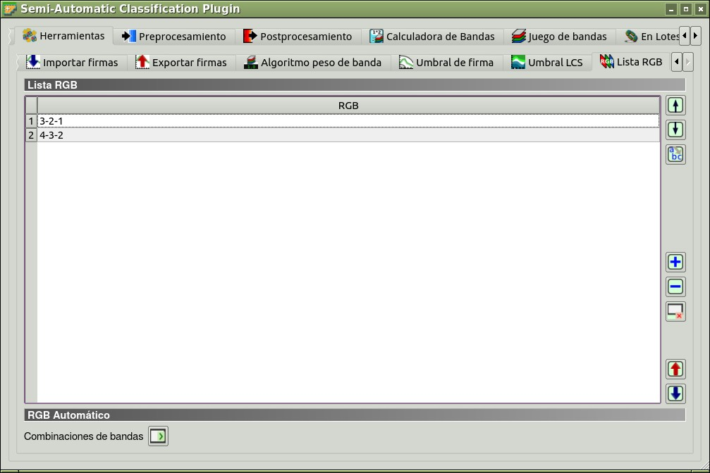
	
	|rgb_tool| :guilabel:`RGB list`
	
This tab allows for managing the RGB :ref:`color_composite_definition` used in the list :guilabel:`RGB=` of the :ref:`image_control`.

.. _RGB_list_table:

RGB list
^^^^^^^^^^^^^^^^^^^^^^^
		
* |input_table| :guilabel:`RGB list`: table containing the following fields;
	* :guilabel:`RGB`: RGB combination; this field can be manually edited;

* |move_up|: move highlighted RGB combination upward;
* |move_down|: move highlighted RGB combination downward;
* |order_by_name| : automatically sort RGB combinations by name;
* |add|: add a row to the table;
* |remove|: remove highlighted rows from the table;
* |reset|: clear all RGB combinations from :guilabel:`RGB list`;
* |export|: export the :guilabel:`RGB list` to a file (i.e. ``.csv``);
* |import|: import a previously saved :guilabel:`RGB list` from file (i.e. ``.csv``);

.. _automatic_RGB_list:

Automatic RGB
^^^^^^^^^^^^^^^^^^^^^^^
	
* :guilabel:`Band combinations` |enter|: add the combinations of all bands (i.e. permutation) to the :ref:`RGB_list_table` (e.g. 1-2-3, 1-2-4, ..., 3-2-1);

.. _pre_processing_tab:
 
Preprocessing
==================

The tab |preprocessing| :guilabel:`Preprocessing` provides several tools for data manipulation which are useful before the actual classification process.

.. _landsat_tab:
 
Landsat
-----------

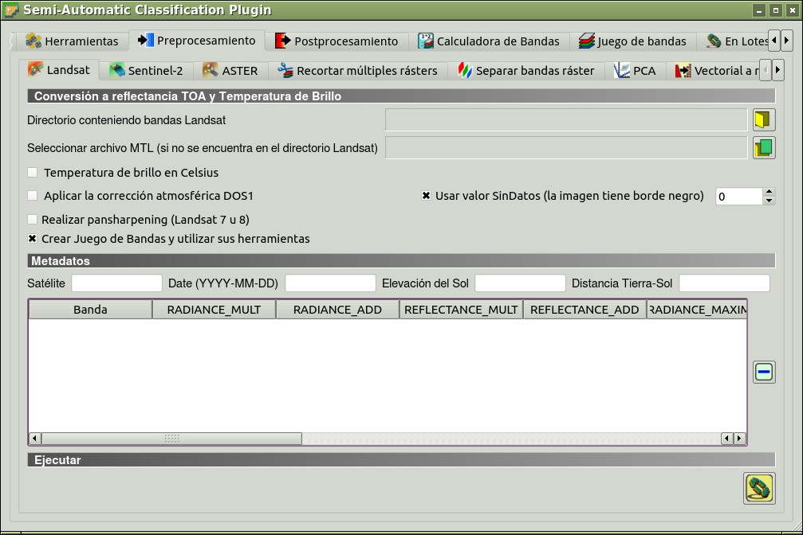
	
	|landsat_tool| :guilabel:`Landsat`
	
This tab allows for the conversion of **Landsat 1, 2, and 3 MSS** and **Landsat 4, 5, 7, and 8** images from DN (i.e. Digital Numbers) to the physical measure of Top Of Atmosphere reflectance (TOA), or the application of a simple atmospheric correction using the DOS1 method (Dark Object Subtraction 1), which is an image-based technique (for more information about the Landsat conversion to TOA and DOS1 correction, see :ref:`conversion_to_reflectance`).
Pan-sharpening is also available; for more information read :ref:`pan_sharpening_definition`.

Once the input is selected, available bands are listed in the metadata table.

.. _landsat_conversion:

Landsat conversion to TOA reflectance and brightness temperature
^^^^^^^^^^^^^^^^^^^^^^^^^^^^^^^^^^^^^^^^^^^^^^^^^^^^^^^^^^^^^^^^

* :guilabel:`Directory containing Landsat bands` |open_dir|: open a directory containing Landsat bands; names of Landsat bands must end with the corresponding number; if the metadata file is included in this directory then :ref:`landsat_metadata` are automatically filled;
* :guilabel:`Select MTL file` |open_file| |optional|: if the metadata file is not included in the :guilabel:`Directory containing Landsat bands`, select the path of the metadata file in order to fill the :ref:`landsat_metadata` automatically;
* |checkbox| :guilabel:`Brightness temperature in Celsius`: if checked, convert brightness temperature to Celsius (if a Landsat thermal band is listed in :ref:`landsat_metadata`); if unchecked temperature is in Kelvin;
* |checkbox| :guilabel:`Apply DOS1 atmospheric correction`: if checked, the :ref:`DOS1_correction` is applied to all the bands (thermal bands excluded);
* |checkbox| :guilabel:`Use NoData value (image has black border)` |input_number|: if checked, pixels having ``NoData`` value are not counted during conversion and the DOS1 calculation of DNmin; it is useful when image has a black border (usually pixel value = 0);
* |checkbox| :guilabel:`Perform pan-sharpening`: if checked, a Brovey Transform is applied for the :ref:`pan_sharpening_definition` of Landsat bands;
* |checkbox| :guilabel:`Create Band set and use Band set tools`: if checked, the :guilabel:`Band set` is created after the conversion; also, the :guilabel:`Band set` is processed according to the tools checked in the :ref:`band_set_tab`;

.. _landsat_metadata:

Metadata
^^^^^^^^^^^^^^^^^

All the bands found in the :guilabel:`Directory containing Landsat bands` are listed in the table :guilabel:`Metadata`.
If the Landsat metadata file (a .txt or .met file with the suffix MTL) is provided, then :guilabel:`Metadata` are automatically filled.
For information about :guilabel:`Metadata` fields read `this page <http://landsat.usgs.gov/Landsat8_Using_Product.php>`_  and `this one <http://landsat.usgs.gov/how_is_radiance_calculated.php>`_ .

* :guilabel:`Satellite` |input_text|: satellite name (e.g. Landsat8);
* :guilabel:`Date` |input_text|: date acquired (e.g. 2013-04-15);
* :guilabel:`Sun elevation` |input_number|: Sun elevation in degrees;
* :guilabel:`Earth sun distance` |input_number|: Earth Sun distance in astronomical units (automatically calculated if :guilabel:`Date` is filled;
* |remove|: remove highlighted bands from the table :guilabel:`Metadata`;

* |input_table| :guilabel:`Metadata`: table containing the following fields;
	* :guilabel:`Band`: band name;
	* :guilabel:`RADIANCE_MULT`: multiplicative rescaling factor;
	* :guilabel:`RADIANCE_ADD`: additive rescaling factor;
	* :guilabel:`REFLECTANCE_MULT`: multiplicative rescaling factor;
	* :guilabel:`REFLECTANCE_ADD`: additive rescaling factor;
	* :guilabel:`RADIANCE_MAXIMUM`: radiance maximum;
	* :guilabel:`REFLECTANCE_MAXIMUM`: reflectance maximum;
	* :guilabel:`K1_CONSTANT`: thermal conversion constant;
	* :guilabel:`K2_CONSTANT`: thermal conversion constant;
	* :guilabel:`LMAX`: spectral radiance that is scaled to QCALMAX;
	* :guilabel:`LMIN`: spectral radiance that is scaled to QCALMIN;
	* :guilabel:`QCALMAX`: minimum quantized calibrated pixel value;
	* :guilabel:`QCALMIN`: maximum quantized calibrated pixel value;

.. _run_tool_2:

Run
^^^^^^^^^^^^^^^^^^^^^^^^^^^^^^^^^^^^^^^

* |run|: select an output directory and start the conversion process; only bands listed in the table :guilabel:`Metadata` are converted; converted bands are saved in the output directory with the prefix ``RT_`` and automatically loaded in QGIS;

.. _sentinel2_tab:
 
Sentinel-2
-----------

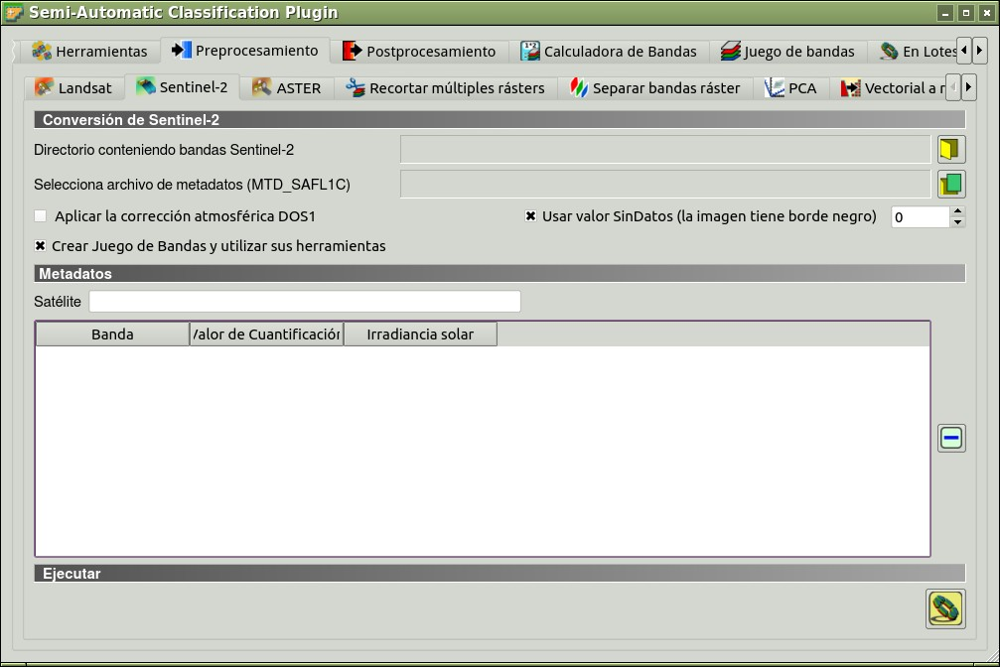
	
	|sentinel2_tool|  :guilabel:`Sentinel-2`
	
This tab allows for the conversion of **Sentinel-2** images to the physical measure of Top Of Atmosphere reflectance (TOA), or the application of a simple atmospheric correction using the DOS1 method (Dark Object Subtraction 1), which is an image-based technique (for more information about conversion to TOA and DOS1 correction, see :ref:`conversion_to_reflectance`).

Once the input is selected, available bands are listed in the metadata table.

.. _sentinel2_conversion:

Sentinel-2 conversion
^^^^^^^^^^^^^^^^^^^^^^^^^^^^^^^^^^^^^^^^^^^^^^^^^^^^^^^^^^^^^^^^

* :guilabel:`Directory containing Sentinel-2 bands` |open_file|: open a directory containing Sentinel-2 bands; names of Sentinel-2 bands must end with the corresponding number; if the metadata file is included in this directory then :ref:`sentinel2_metadata` are automatically filled;
* |checkbox| :guilabel:`Brightness temperature in Celsius`: if checked, convert brightness temperature to Celsius (if a Landsat thermal band is listed in :ref:`landsat_metadata`); if unchecked temperature is in Kelvin;
* |checkbox| :guilabel:`Apply DOS1 atmospheric correction`: if checked, the :ref:`DOS1_correction` is applied to all the bands;
* |checkbox| :guilabel:`Use NoData value (image has black border)` |input_number|: if checked, pixels having ``NoData`` value are not counted during conversion and the DOS1 calculation of DNmin; it is useful when image has a black border (usually pixel value = 0);
* |checkbox| :guilabel:`Create Band set and use Band set tools`: if checked, the :guilabel:`Band set` is created after the conversion; also, the :guilabel:`Band set` is processed according to the tools checked in the :ref:`band_set_tab`;

.. _sentinel2_metadata:

Metadata
^^^^^^^^^^^^^^^^^

All the bands found in the :guilabel:`Directory containing Sentinel-2 bands` are listed in the table :guilabel:`Metadata`.
If the Sentinel-2 metadata file (a .xml file whose name contains ``MTD_SAFL1C``) is provided, then :guilabel:`Metadata` are automatically filled.
For information about :guilabel:`Metadata` fields read `this informative page <https://sentinel.esa.int/web/sentinel/user-guides/sentinel-2-msi/data-formats>`_ .

* :guilabel:`Satellite` |input_text|: satellite name (e.g. Sentinel-2A);
* |remove|: remove highlighted bands from the table :guilabel:`Metadata`;

* |input_table| :guilabel:`Metadata`: table containing the following fields;
	* :guilabel:`Band`: band name;
	* :guilabel:`Quantification value`: value for conversion to TOA reflectance;
	* :guilabel:`Solar irradiance`: solar irradiance of band;

.. _run_tool_3:

Run
^^^^^^^^^^^^^^^^^^^^^^^^^^^^^^^^^^^^^^^

* |run|: select an output directory and start the conversion process; only bands listed in the table :guilabel:`Metadata` are converted; converted bands are saved in the output directory with the prefix ``RT_`` and automatically loaded in QGIS;
	
.. _aster_tab:
 
ASTER
-----------

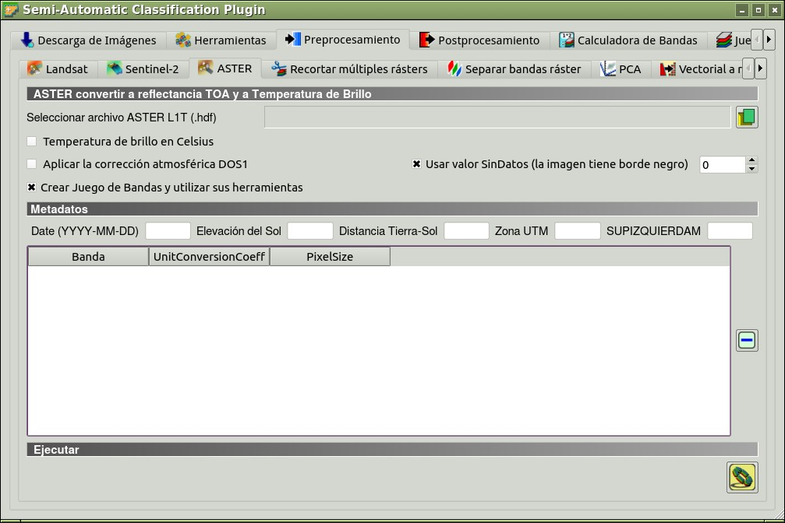
	
	|aster_tool|  :guilabel:`ASTER`
	
This tab allows for the conversion of **ASTER L1T** images to the physical measure of Top Of Atmosphere reflectance (TOA), or the application of a simple atmospheric correction using the DOS1 method (Dark Object Subtraction 1), which is an image-based technique (for more information about conversion to TOA and DOS1 correction, see :ref:`conversion_to_reflectance`).

Once the input is selected, available bands are listed in the metadata table.

.. _aster_conversion:

ASTER conversion
^^^^^^^^^^^^^^^^^^^^^^^^^^^^^^^^^^^^^^^^^^^^^^^^^^^^^^^^^^^^^^^^

* :guilabel:`Select file ASTER L1T` |open_file|: select an ASTER image (file .hdf);
* |checkbox| :guilabel:`Apply DOS1 atmospheric correction`: if checked, the :ref:`DOS1_correction` is applied to all the bands;
* |checkbox| :guilabel:`Use NoData value (image has black border)` |input_number|: if checked, pixels having ``NoData`` value are not counted during conversion and the DOS1 calculation of DNmin; it is useful when image has a black border (usually pixel value = 0);
* |checkbox| :guilabel:`Create Band set and use Band set tools`: if checked, the :guilabel:`Band set` is created after the conversion; also, the :guilabel:`Band set` is processed according to the tools checked in the :ref:`band_set_tab`;

.. _aster_metadata:

Metadata
^^^^^^^^^^^^^^^^^

All the bands found in the :guilabel:`Select file ASTER L1T` are listed in the table :guilabel:`Metadata`.
For information about :guilabel:`Metadata` fields visit `the ASTER page <https://lpdaac.usgs.gov/dataset_discovery/aster>`_ .

* :guilabel:`Date` |input_text|: date acquired (e.g. 20130415);
* :guilabel:`Sun elevation` |input_number|: Sun elevation in degrees;
* :guilabel:`Earth sun distance` |input_number|: Earth Sun distance in astronomical units (automatically calculated if :guilabel:`Date` is filled;
* :guilabel:`UTM zone` |input_text|: UTM zone code of the image;
* :guilabel:`UPPERLEFTM` |input_text|: coordinates of the upper left corner of the image;
* |remove|: remove highlighted bands from the table :guilabel:`Metadata`;

* |input_table| :guilabel:`Metadata`: table containing the following fields;
	* :guilabel:`Band`: band name;
	* :guilabel:`UnitConversionCoeff`: value for radiance conversion;
	* :guilabel:`PixelSize`: solar irradiance of band;

.. _run_tool_4:

Run
^^^^^^^^^^^^^^^^^^^^^^^^^^^^^^^^^^^^^^^

* |run|: select an output directory and start the conversion process; only bands listed in the table :guilabel:`Metadata` are converted; converted bands are saved in the output directory with the prefix ``RT_`` and automatically loaded in QGIS;
	
.. _clip_multiple_rasters_tab:

Clip multiple rasters
-------------------------

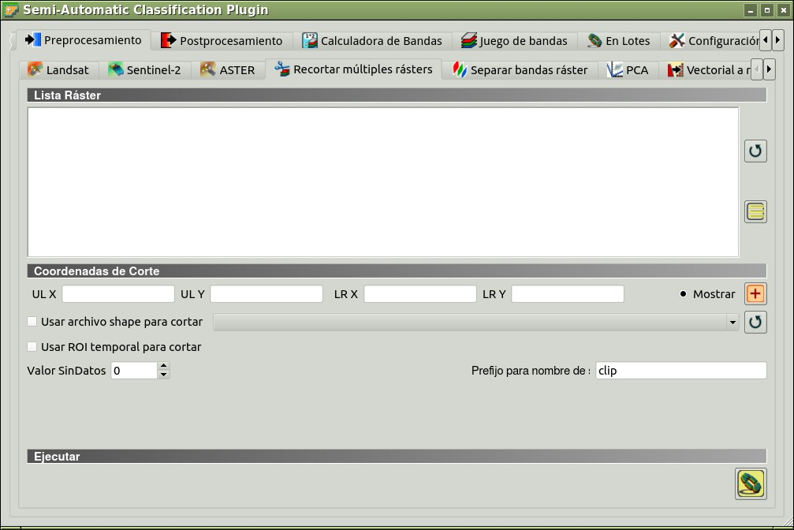
	
	|clip_tool| :guilabel:`Clip multiple rasters`

This tab allows for cutting several image bands at once, using a rectangle defined with point coordinates or a boundary defined with a shapefile.

.. _raster_list:

Raster list
^^^^^^^^^^^

* |reload|: refresh layer list;
* |select_all|: select all the rasters;

.. _clip_coordinates:

Clip coordinates
^^^^^^^^^^^^^^^^

Set the Upper Left (UL) and Lower Right (LR) point coordinates of the rectangle used for clipping; it is possible to enter the coordinates manually.
Alternatively use a shapefile.

* :guilabel:`UL X` |input_number|: set the UL X coordinate;
* :guilabel:`UL Y` |input_number|: set the UL Y coordinate;
* :guilabel:`LR X` |input_number|: set the LR X coordinate;
* :guilabel:`LR Y` |input_number|: set the LR Y coordinate;
* |radiobutton| :guilabel:`Show`: show or hide the clip area drawn in the map;
* |pointer|: define a clip area by drawing a rectangle in the map; left click to set the UL point and right click to set the LR point; the area is displayed in the map;
* |checkbox| :guilabel:`Use shapefile for clipping` |input_list|: if checked, use the selected shapefile (already loaded in QGIS) for clipping; UL and LR coordinates are ignored;
* |checkbox| :guilabel:`Use temporary ROI for clipping`: if checked, use a temporary ROI (see :ref:`ROI_creation`) for clipping; UL and LR coordinates are ignored;
* |reload|: refresh layer list;
* |checkbox| :guilabel:`NoData value` |input_number|: if checked, set the value for ``NoData`` pixels (e.g. pixels outside the clipped area);
* :guilabel:`Output name prefix` |input_text|: set the prefix for output file names (default is ``clip``);

.. _run_tool_5:

Run
^^^^^^^^^^^^^^^^^^^^^^^^^^^^^^^^^^^^^^^

* |run|: choose an output destination and clip selected rasters; only rasters selected in the :ref:`raster_list` are clipped and automatically loaded in QGIS;

.. _split_raster_tab:

Split raster bands
-------------------------

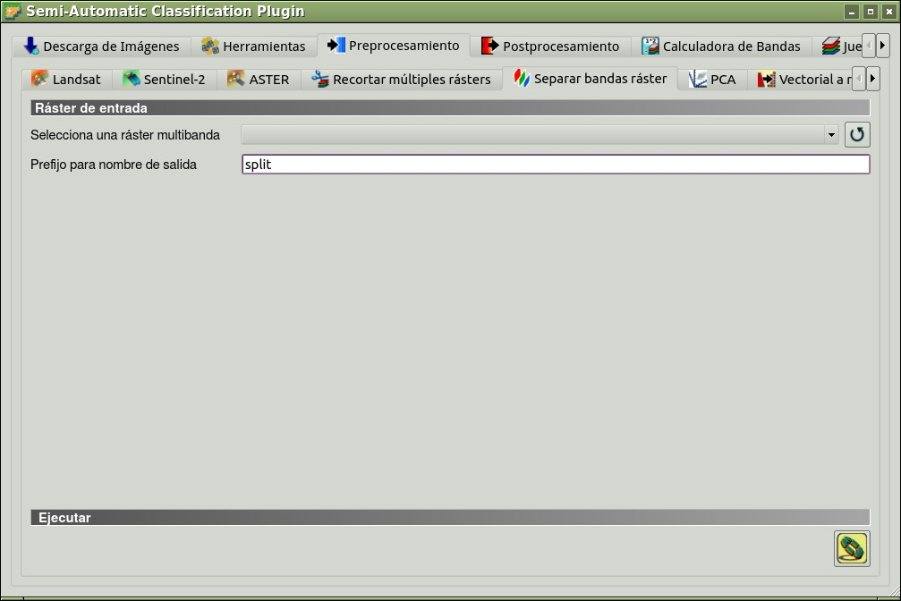
	
	|split_raster| :guilabel:`Split raster bands`

Split a multiband raster to single bands.

.. _raster_input:

Raster input
^^^^^^^^^^^^^^^^

* :guilabel:`Select a multiband raster` |input_list|: select a multiband raster already loaded in QGIS;
* |reload|: refresh layer list;
* :guilabel:`Output name prefix` |input_text|: set the prefix for output file names (default is ``split``);

.. _run_tool_6:

Run
^^^^^^^^^^^^^^^^^^^^^^^^^^^^^^^^^^^^^^^

* |run|: choose the output destination and split selected raster; output bands are automatically loaded in QGIS;

.. _pca_tab:

PCA
-------------------------

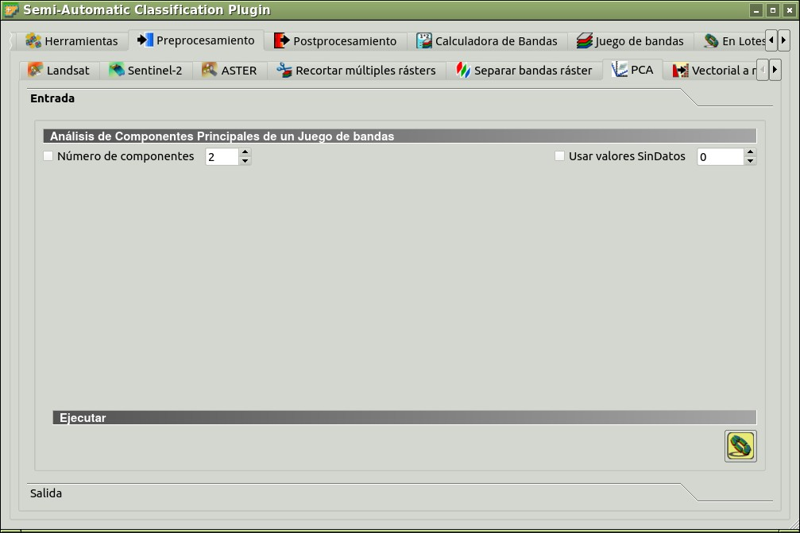
	
	|pca_tool| :guilabel:`PCA`

This tab allows for the PCA (:ref:`principal_component_analysis`) of bands loaded in the :guilabel:`Band set`.

.. _pca_input:

Principal Component Analysis of Band set
^^^^^^^^^^^^^^^^^^^^^^^^^^^^^^^^^^^^^^^^^^^^^^^^

* |checkbox| :guilabel:`Number of components` |input_number|: if checked, set the number of calculated components; if unchecked, all the components are calculated;
* |checkbox| :guilabel:`Use NoData value` |input_number|: if checked, set the value of ``NoData`` pixels, ignored during the calculation;

.. _run_tool_7:

Run
^^^^^^^^^^^^^^^^^^^^^^^^^^^^^^^^^^^^^^^

* |run|: select an output directory and start the calculation process; principal components are calculated and saved as raster files; also, the details about the PCA are displayed in the tab :guilabel:`Output` and saved in a .txt file in the output directory;

.. _vector_to_raster_tab:

Vector to raster
-------------------------

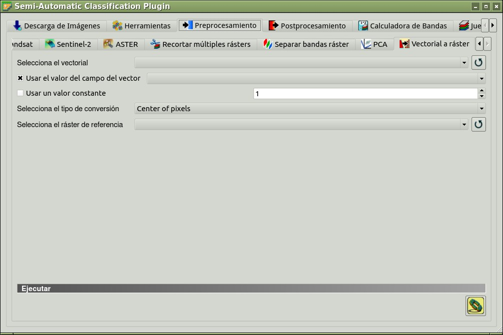
	
	|vector_to_raster_tool| :guilabel:`Vector to raster`

This tab allows for the conversion of a vector to raster format.

* :guilabel:`Select the vector` |input_list|: select a vector already loaded in QGIS;
* |reload|: refresh layer list;
* |checkbox| :guilabel:`Use the value field of the vector` |input_list|: if checked, the selected field is used as attribute for the conversion; pixels of the output raster have the same values as the vector attribute;
* |checkbox| :guilabel:`Use constant value` |input_number|: if checked, the polygons are converted to raster using the selected constant value;
* :guilabel:`Select the type of conversion` |input_list|: select the type of conversion between :guilabel:`Center of pixels` and :guilabel:`All pixels touched`:
	* :guilabel:`Center of pixels`: during the conversion, vector is compared to the reference raster; output raster pixels are attributed to a polygon if pixel center is within that polygon;
	* :guilabel:`All pixels touched`: during the conversion, vector is compared to the reference raster; output raster pixels are attributed to a polygon if pixel touches that polygon;
* :guilabel:`Select the reference raster` |input_list|: select a reference raster; pixels of the output raster have the same size and alignment as the reference raster;
* |reload|: refresh layer list;

.. _run_tool_8:

Run
^^^^^^^^^^^^^^^^^^^^^^^^^^^^^^^^^^^^^^^

* |run|: choose the output destination and start the conversion to raster;

.. _post_processing_tab:
 
Postprocessing
===================

The tab |post_process| :guilabel:`Postprocessing` provides several functions that can be applied to the classification output.

.. _accuracy_tab:
 
Accuracy
------------

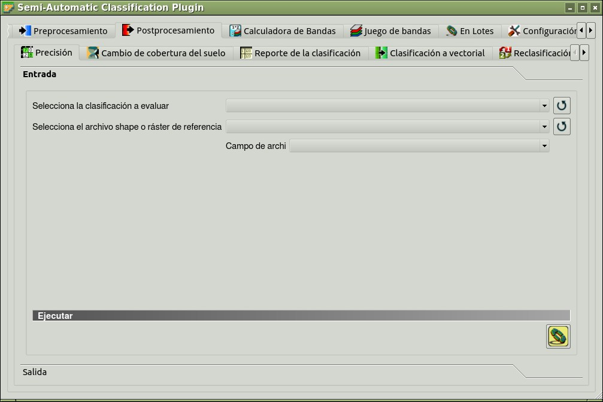
	
	|accuracy_tool| :guilabel:`Accuracy`
	
This tab allows for the validation of a classification (read :ref:`accuracy_assessment_definition` ).
Classification is compared to a reference raster or reference shapefile (which is automatically converted to raster).
If a shapefile is selected as reference, it is possible to choose a field describing class values.

Several statistics are calculated such as overall accuracy, user's accuracy, producer's accuracy, and Kappa hat.
The output is an ``error raster`` that is a ``.tif`` file showing the errors in the map, where pixel values represent the categories of comparison (i.e. combinations identified by the ``ErrorMatrixCode`` in the error matrix) between the classification and reference.
Also, a text file containing the error matrix (i.e. a ``.csv`` file separated by tab) is created with the same name defined for the ``.tif`` file.

.. _error_matrix_input:

Input
^^^^^^^^^^^^^^^^^^

* :guilabel:`Select the classification to assess` |input_list|: select a classification raster (already loaded in QGIS);
* |reload|: refresh layer list;
* :guilabel:`Select the reference shapefile or raster` |input_list|: select a raster or a shapefile (already loaded in QGIS), used as reference layer (ground truth) for the accuracy assessment;
* |reload|: refresh layer list;
* :guilabel:`Shapefile field` |input_list|: if a shapefile is selected as reference, select a shapefile field containing numeric class values;

.. _run_tool_9:

Run
^^^^^^^^^^^^^^^^^^^^^^^^^^^^^^^^^^^^^^^

* |run|: choose the output destination and start the calculation; the error matrix is displayed in the tab :guilabel:`Output` and the ``error raster`` is loaded in QGIS;
	
.. _land_cover_change_tab:

Land cover change 
---------------------

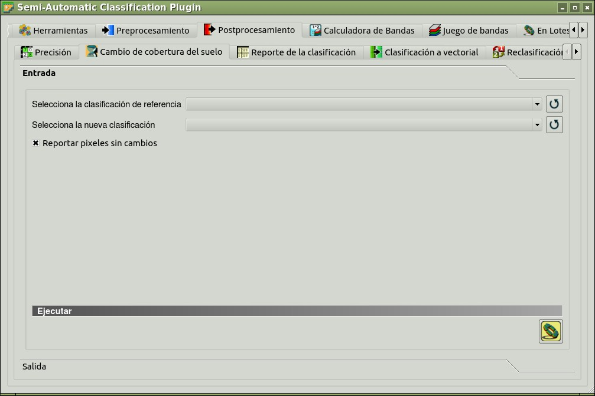
	
	|land_cover_change| :guilabel:`Land cover change`
	
The tab ``Land cover change`` allows for the comparison between two classifications in order to assess land cover changes.
Output is a ``land cover change raster`` (i.e. a file .tif showing the changes in the map, where each pixel represents a category of comparison (i.e. combinations) between the two classifications, which is the ``ChangeCode`` in the land cover change statistics) and a text file containing the land cover change statistics (i.e. a file .csv separated by tab, with the same name defined for the .tif file).

.. _classification_input:

Input
^^^^^^^^^^^^^^^^^^^^

* :guilabel:`Select the reference classification` |input_list|: select a reference classification raster (already loaded in QGIS);
* |reload|: refresh layer list;
* :guilabel:`Select the new classification` |input_list|: select a new classification raster (already loaded in QGIS), to be compared with the reference classification;
* |reload|: refresh layer list;
* |checkbox| :guilabel:`Report unchanged pixels`: if checked, report also unchanged pixels (having the same value in both classifications);

.. _run_tool_10:

Run
^^^^^^^^^^^^^^^^^^^^^^^^^^^^^^^^^^^^^^^

* |run|: choose the output destination and start the calculation; the land cover change statistics are displayed in the tab :guilabel:`Output` (and saved in a text file) and the ``land cover change raster`` is loaded in QGIS;

.. _classification_report_tab:

Classification report
-------------------------

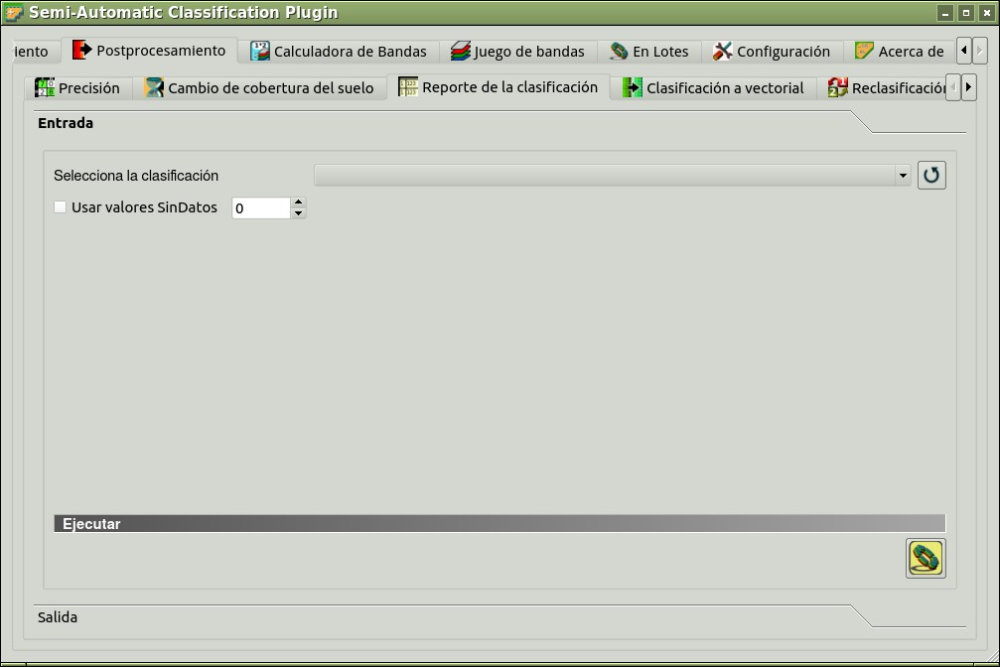
	
	|report_tool| :guilabel:`Classification report`
	
This tab allows for the calculation of class statistics such as number of pixels, percentage and area (area unit is defined from the image itself).

.. _classification_input2:

Input
^^^^^^^^^^^^^^^^^^^^

* :guilabel:`Select the classification` |input_list|: select a classification raster (already loaded in QGIS);
* |reload|: refresh layer list;
* |checkbox| :guilabel:`Use NoData value` |input_number|: if checked, `NoData`` value will be excluded from the report;

.. _run_tool_11:

Run
^^^^^^^^^^^^^^^^^^^^^^^^^^^^^^^^^^^^^^^

* |run|: choose the output destination and start the calculation; the report is saved in a text file and displayed in the tab :guilabel:`Output`;

.. _classification_vector_tab:

Classification to vector 
-------------------------

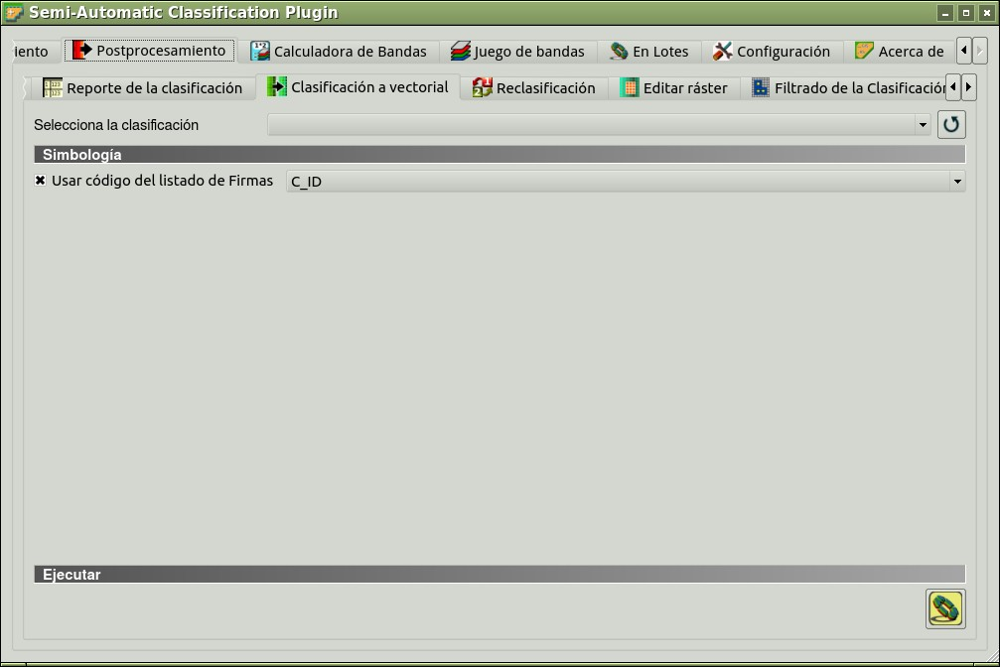
	
	|class_to_vector_tool| :guilabel:`Classification to vector`
	
This tab allows for the conversion of a classification raster to vector shapefile.

* :guilabel:`Select the classification` |input_list|: select a classification raster (already loaded in QGIS);
* |reload|: refresh layer list;

.. _rastertovector_symbology:

Symbology
^^^^^^^^^^^^^^^^^^^^

* |checkbox| :guilabel:`Use code from Signature list` |input_list|: if checked, color and class information are defined from :ref:`ROI_list`:
	* ``MC ID``: use the ID of macroclasses;
	* ``C ID``: use the ID of classes;
	
.. _run_tool_12:

Run
^^^^^^^^^^^^^^^^^^^^^^^^^^^^^^^^^^^^^^^

* |run|: choose the output destination and start the conversion;

.. _reclassification_tab:

Reclassification 
-------------------------

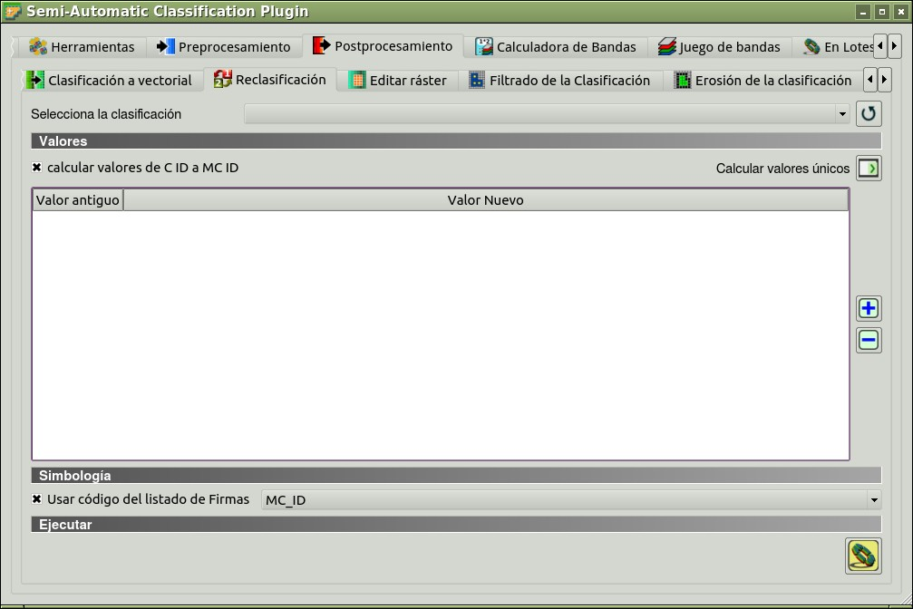
	
	|reclassification_tool| :guilabel:`Reclassification`
		
This tab allows for the reclassification (i.e. assigning a new class code to raster pixels).
In particular, it eases the conversion from C ID to MC ID values.

* :guilabel:`Select the classification` |input_list|: select a classification raster (already loaded in QGIS);
* |reload|: refresh layer list;

.. _reclass_values:

Values
^^^^^^^^^^^^^^^^^^^^^^^^^^^^^^^^^^^^^^^

* |checkbox| :guilabel:`calculate C ID to MC ID values`: if checked, the reclassification table is filled according to the :ref:`ROI_list` when :guilabel:`Calculate unique values` |enter| is clicked;
* :guilabel:`Calculate unique values` |enter|: calculate unique values in the classification and fill the reclassification table;

* |input_table| :guilabel:`Values`: table containing the following fields;
	* :guilabel:`Old value`: set the expression defining old values to be reclassified; ``Old value`` can be a value or an expressions defined using the variable name ``raster`` (custom names can be defined in :ref:`variable_name` ), following Python operators (e.g. ``raster > 3`` select all pixels having value > 3 ; ``raster > 5 | raster < 2`` select all pixels having value > 5 or < 2 ; ``raster >= 2 & raster <= 5`` select all pixel values between 2 and 5);
	* :guilabel:`New value`: set the new value for the old values defined in ``Old value``;

* |add|: add a row to the table;
* |remove|: remove highlighted rows from the table;

.. _reclass_symbology:

Symbology
^^^^^^^^^^^^^^^^^^^^^^^^^^^^^^^^^^^^^^^

* |checkbox| :guilabel:`Use code from Signature list` |input_list|: if checked, color and class information are defined from :ref:`ROI_list`:
	* ``MC ID``: use the ID of macroclasses;
	* ``C ID``: use the ID of classes;

.. _run_tool_13:

Run
^^^^^^^^^^^^^^^^^^^^^^^^^^^^^^^^^^^^^^^

* |run|: choose the output destination and start the calculation; reclassified raster is loaded in QGIS;

.. _edit_raster_tab:

Edit raster
-------------------------

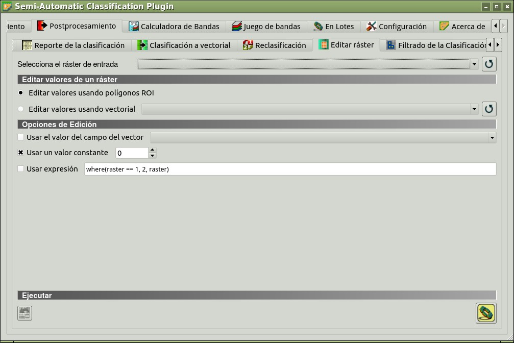
	
	|edit_raster| :guilabel:`Edit raster`
		
This tab allows for the direct editing of pixel values in a raster.
Only pixels beneath ROI polygons or vector polygons are edited.

	**Attention**: the input raster is directly edited; it is recommended to create a **backup copy** of the input raster before using this tool in order to prevent data loss.

This tool can rapidly edit large rasters, especially when editing polygons are small, because pixel values are edited directly.
In addition, the :ref:`toolbar_edit_raster` is available for easing the raster editing using multiple values.
	
* :guilabel:`Select the input raster` |input_list|: select a raster (already loaded in QGIS);
* |reload|: refresh layer list;

.. _edit_input:

Edit raster values
^^^^^^^^^^^^^^^^^^^^

* |radiobutton| :guilabel:`Edit values using ROI polygons`: if checked, raster is edited using temporary ROI polygons in the map;
* |radiobutton| :guilabel:`Edit values using a vector` |input_list|: if checked, raster is edited using all the polygons of selected vector;
* |reload|: refresh layer list;

.. _edit_options:

Edit options
^^^^^^^^^^^^^^^^^^^^

* |checkbox| :guilabel:`Use the value field of the vector` |input_list|: if checked, raster is edited using the selected vector (in :guilabel:`Edit values using a vector`) and the polygon values of selected vector field;
* |checkbox| :guilabel:`Use constant value` |input_number|: if checked, raster is edited using the selected constant value;
* |checkbox| :guilabel:`Use expression` |input_text|: if checked, raster is edited according to the entered expression; the expression must contain one or more ``where``; the following example expression ``where(raster == 1, 2, raster)`` is already entered, which sets 2 where ``raster`` equals 1, and leaves unchanged the values where ``raster`` is not equal to 1;

.. _run_tool_14:

Run
^^^^^^^^^^^^^^^^^^^^^^^^^^^^^^^^^^^^^^^

* |undo_edit_raster|: undo the last raster edit (available only when using ROI polygons);
* |run|: edit the raster;

.. _classification_sieve_tab:

Classification sieve
-------------------------

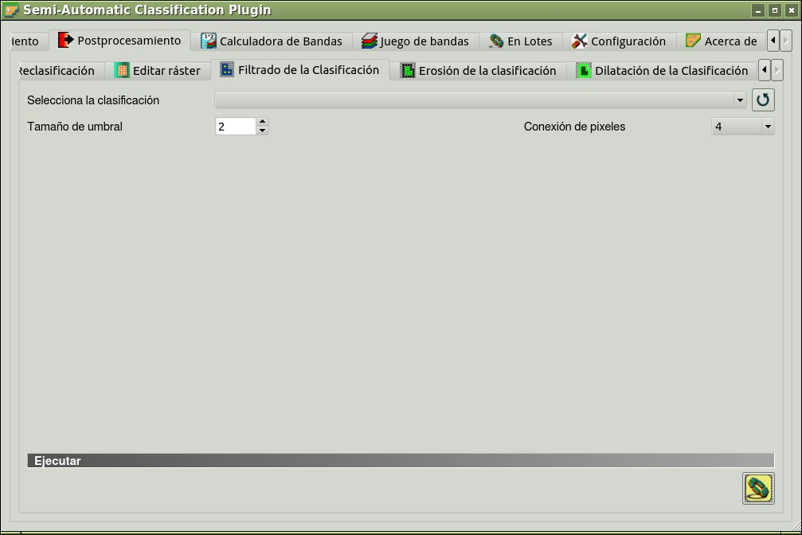
	
	|classification_sieve| :guilabel:`Classification sieve`
		
This tab allows for the replacement of isolated pixel values with the value of the largest neighbour patch (based on `GDAL Sieve <http://www.gdal.org/gdal_sieve.html>`_ ).
It is useful for removing small patches from a classification.

* :guilabel:`Select the classification` |input_list|: select a raster (already loaded in QGIS);
* |reload|: refresh layer list;
* :guilabel:`Size threshold` |input_number|: size of the patch to be replaced (in pixel unit); all patches smaller the the selected number of pixels will be replaced by the value of the largest neighbour patch;
* :guilabel:`Pixel connection` |input_list|: select the type of pixel connection:
	* :guilabel:`4`: in a 3x3 window, diagonal pixels are not considered connected;
	* :guilabel:`8`: in a 3x3 window, diagonal pixels are considered connected;

.. _run_tool_15:

Run
^^^^^^^^^^^^^^^^^^^^^^^^^^^^^^^^^^^^^^^

* |run|: choose the output destination and start the calculation; 

.. _classification_erosion_tab:

Classification erosion
-------------------------

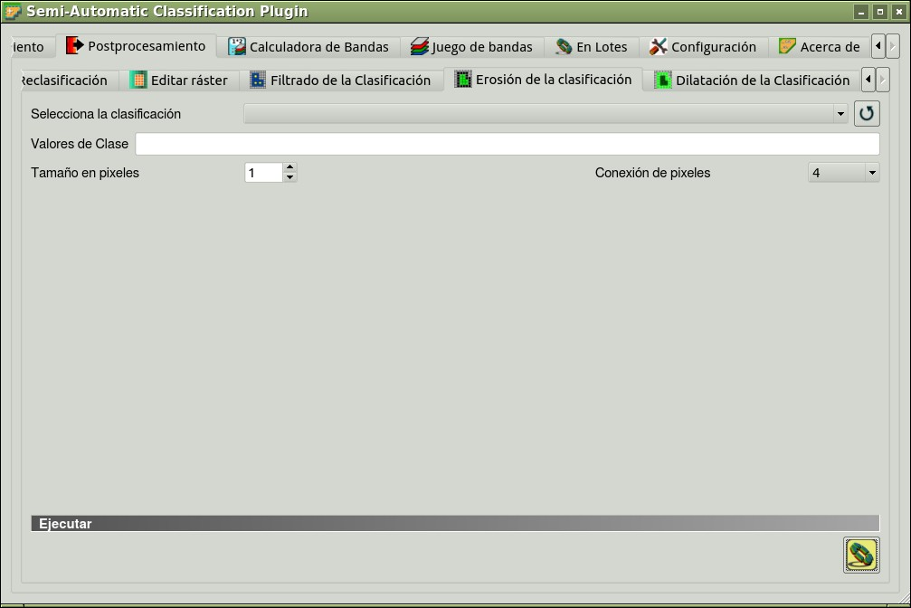
	
	|classification_erosion| :guilabel:`Classification erosion`
		
This tab allows for removing the border of a class patch (erosion), defining the class values to be eroded and the number of pixels from the border.
It is useful for classification refinement.

* :guilabel:`Select the classification` |input_list|: select a raster (already loaded in QGIS);
* |reload|: refresh layer list;
* :guilabel:`Class values` |input_text|: set the class values to be eroded; class values must be separated by ``,`` and ``-`` can be used to define a range of values (e.g. ``1, 3-5, 8`` will select classes 1, 3, 4, 5, 8); if the text is red then the expression contains errors;
* :guilabel:`Size in pixels` |input_number|: number of pixels to be eroded from the border;
* :guilabel:`Pixel connection` |input_list|: select the type of pixel connection:
	* :guilabel:`4`: in a 3x3 window, diagonal pixels are not considered connected;
	* :guilabel:`8`: in a 3x3 window, diagonal pixels are considered connected;

.. _run_tool_16:

Run
^^^^^^^^^^^^^^^^^^^^^^^^^^^^^^^^^^^^^^^

* |run|: choose the output destination and start the calculation; 

.. _classification_dilation_tab:

Classification dilation
-------------------------

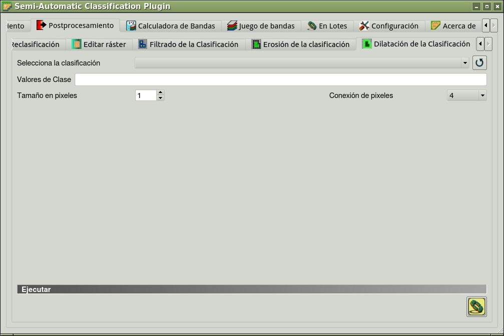
	
	|classification_dilation| :guilabel:`Classification dilation`
		
This tab allows for dilating the border of a class patch, defining the class values to be dilated and the number of pixels from the border.
It is useful for classification refinement.

* :guilabel:`Select the classification` |input_list|: select a raster (already loaded in QGIS);
* |reload|: refresh layer list;
* :guilabel:`Class values` |input_text|: set the class values to be dilated; class values must be separated by ``,`` and ``-`` can be used to define a range of values (e.g. ``1, 3-5, 8`` will select classes 1, 3, 4, 5, 8); if the text is red then the expression contains errors;
* :guilabel:`Size in pixels` |input_number|: number of pixels to be dilated from the border;
* :guilabel:`Pixel connection` |input_list|: select the type of pixel connection:
	* :guilabel:`4`: in a 3x3 window, diagonal pixels are not considered connected;
	* :guilabel:`8`: in a 3x3 window, diagonal pixels are considered connected;

.. _run_tool_17:

Run
^^^^^^^^^^^^^^^^^^^^^^^^^^^^^^^^^^^^^^^

* |run|: choose the output destination and start the calculation; 

.. _band_calc_tab:
 
Band calc
=============

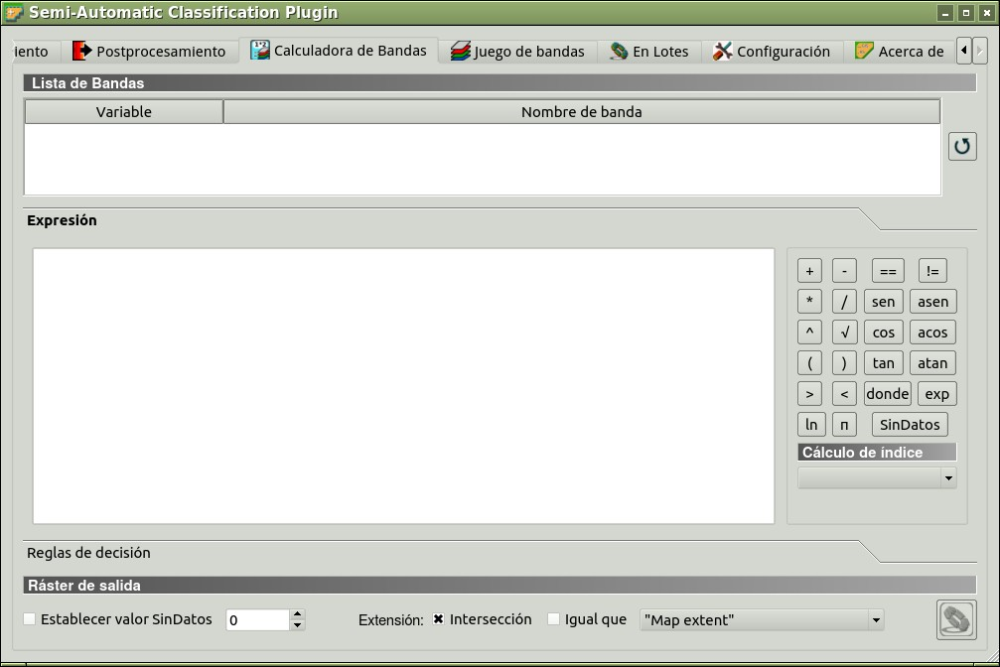
	
	|bandcalc_tool| :guilabel:`Band calc`
		
The ``Band calc`` allows for the **raster calculation for bands** (i.e. calculation of pixel values) using `NumPy functions <http://docs.scipy.org/doc/numpy/reference/routines.math.html>`_ .
Raster bands must be already loaded in QGIS.
Input rasters must be in the same projection.

In addition, it is possible to calculate a raster using **decision rules**. 

.. _band_list2:

Band list
---------

* |input_table| :guilabel:`Band list`: table containing a list of single band rasters (already loaded in QGIS);
	* :guilabel:`Variable`: variable name defined automatically for every band (e.g. raster1, raster2);
	* :guilabel:`Band name`: band name (i.e. the layer name in QGIS);
	
* |reload|: refresh image list;

.. _expression:

Expression
----------

Enter a mathematical expression for raster bands.
In particular, NumPy functions can be used with the prefix `np.` (e.g. ``np.log10(raster1)`` ).
For a list of NumPy functions see `the NumPy page <http://docs.scipy.org/doc/numpy/reference/routines.math.html>`_ .

The expression can work with both :guilabel:`Variable` and :guilabel:`Band name` (between double quotes).
Also, bands in the :ref:`band_set_tab` can be referenced directly; for example ``bandset#b1`` refers to band 1 of the :guilabel:`Band set`.
Double click on any item in the :ref:`band_list2` for adding its name to the expression.
In addition, the following variables related to :ref:`band_set_tab` the are available:

* :guilabel:`"#BLUE#"`: the band with the center wavelength closest to 0.475 :math:`\mu m`;
* :guilabel:`"#RED#"`: the band with the center wavelength closest to 0.65 :math:`\mu m`;
* :guilabel:`"#NIR#"`: the band with the center wavelength closest to 0.85 :math:`\mu m`;

If text in the :guilabel:`Expression` is green, then the syntax is correct; if text is red, then the syntax is incorrect and it is not possible to execute the calculation.

It is possible to enter multiple expressions separated by newlines such as the following example:

	``"raster1" + "raster2"``
	
	``"raster3" - "raster4"``

The above example calculates two new rasters in the output directory with the suffix ``_1`` (e.g. ``calc_raster_1`` ) for the first expression and ``_2`` (e.g. ``calc_raster_2`` ) for the second expression.
Also, it is possible to define the output name using the symbol ``@`` followed by the name, such as the following example:

	``"raster1" + "raster2" @ calc_1``
	
	``"raster3" - "raster4" @ calc_2``
	
The following buttons are available:

* :guilabel:`+`: plus;
* :guilabel:`-`: minus;
* :guilabel:`*`: product;
* :guilabel:`/`: ratio;
* :guilabel:`^`: power;
* :guilabel:`V`: square-root;
* :guilabel:`(`: open parenthesis;
* :guilabel:`)`: close parenthesis;
* :guilabel:`>`: greater then;
* :guilabel:`<`: less then;
* :guilabel:`ln`: natural logarithm;
* :guilabel:`π`: pi;
* :guilabel:`==`: equal;
* :guilabel:`!=`: not equal;
* :guilabel:`sin`: sine;
* :guilabel:`asin`: inverse sine;
* :guilabel:`cos`: cosine;
* :guilabel:`acos`: inverse cosine;
* :guilabel:`tan`: tangent;
* :guilabel:`atan`: inverse tangent;
* :guilabel:`where`: conditional expression according to the syntax ``where( condition , value if true, value if false)`` (e.g. ``where("raster1" == 1, 2, "raster1")``);
* :guilabel:`exp`: natural exponential;
* :guilabel:`nodata`: NoData value of raster (e.g. ``nodata("raster1")``); it can be used as value in the expression (e.g. ``where("raster1" == nodata("raster1"), 0, "raster1")``);

.. _index_calculation:

Index calculation
----------------------------

:guilabel:`Index calculation` allows for entering a spectral index expression.

* :guilabel:`Index calculation` |input_list|: list of spectral indices:
	* :guilabel:`NDVI`: if selected, the NDVI calculation is entered in the :guilabel:`Expression` ( ``(( "#NIR#" - "#RED#") / ( "#NIR#" + "#RED#") @ NDVI)`` );
	* :guilabel:`EVI`: if selected, the EVI calculation is entered in the :guilabel:`Expression` ( ``2.5 * ( "#NIR#" - "#RED#" ) / ( "#NIR#" + 6 * "#RED#" - 7.5 * "#BLUE#" + 1) @ EVI`` );
* |open_file|: open a text file (.txt) containing custom expressions to be listed in :guilabel:`Index calculation`; the text file must contain an expression for each line; each line must be in the form ``expression_name; expression`` (separated by ``;``) where the ``expression_name`` is the expression name that is displayed in the :guilabel:`Index calculation`; if you open an empty text file, the default values are restored; following an example of text content::

	NDVI; ( "#NIR#" - "#RED#" ) / ( "#NIR#" + "#RED#" ) @NDVI
	EVI; 2.5 * ( "#NIR#" - "#RED#" ) / ( "#NIR#" + 6 * "#RED#" - 7.5 * "#BLUE#" + 1) @EVI
	SR; ( "#NIR#" / "#RED#" ) @SR

.. _decision_rules:

Decision rules
----------------------------

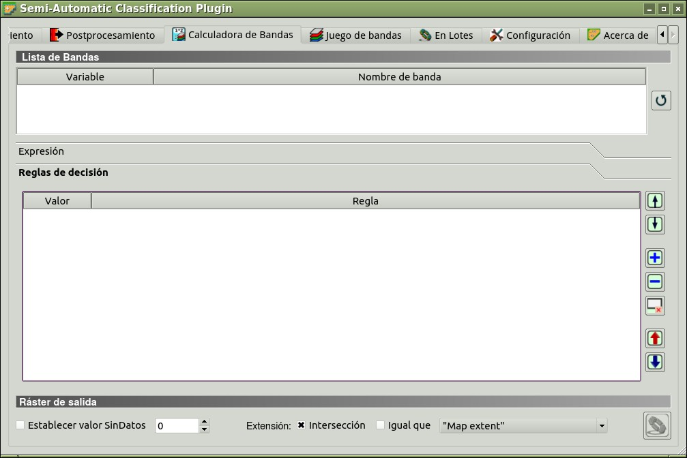
	
:guilabel:`Decision rules` allows for the calculation of an output raster based on rules.
Rules are conditional statements based on other rasters; if the :guilabel:`Rule` is true, the corresponding :guilabel:`Value` is assigned to the output pixel.

Rules are verified from the first to the last row in the table; if the first :guilabel:`Rule` is false, the next :guilabel:`Rule` is verified for that pixel, until the last rule.
If multiple rules are true for a certain pixel, the value of the first :guilabel:`Rule` is assigned to that pixel.
The ``NoData`` value is assigned to those pixels where no :guilabel:`Rule` is true.

* |input_table| :guilabel:`Decision rules`: table containing the following fields;
	* :guilabel:`Value`: the value assigned to pixels if the :guilabel:`Rule` is true;
	* :guilabel:`Rule`: the rule to be verified (e.g. ``"raster1" > 0``); multiple conditional statements can be entered separated by ``;`` (e.g. ``"raster1" > 0; "raster2" < 1`` which means to set the :guilabel:`Value` where ``raster1`` > 0 and ``raster2`` < 1);

* |move_up|: move highlighted rule up;
* |move_down|: move highlighted rule down;
* |add|: add a new row to the table;
* |remove|: delete the highlighted rows from the table;
* |reset|: clear the table;
* |export|: export the rules to a text file that can be imported later;
* |import|: import rules from a text file;
	
.. _output_raster:

Output raster
--------------

The output raster is a .tif file, with the same spatial resolution and projection of input rasters; if input rasters have different spatial resolutions, then the highest resolution (i.e. minimum pixel size) is used for output raster.

* |checkbox| :guilabel:`Use NoData value` |input_number|: if checked, set the value of ``NoData`` pixels in output raster;
* Extent: if the following options are unchecked, the output raster extent will include the extents of all input rasters;
	* |checkbox| :guilabel:`Intersection`: if checked, the extent of output raster equals the intersection of input raster extents (i.e. minimum extent);
	* |checkbox| :guilabel:`Same as` |input_list|: if checked, the extent of output raster equals the extent of :guilabel:`"Map extent"` (the extent of the map currently displayed) or a selected layer;
* |radiobutton| :guilabel:`Align`: if checked, and |checkbox| :guilabel:`Same as` is checked selecting a raster, the calculation is performed using the same extent and pixel alignment of selected raster;
* |run|: if ``Expression`` is active and text is green, choose the output destination and start the calculation based on ``Expression``; if ``Decision rules`` is active and text is green, choose the output destination and start the calculation based on ``Decision rules``;

.. _band_set_tab:
 
Band set
============

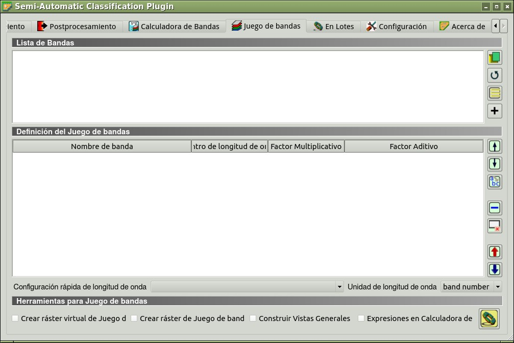
	
	|bandset_tool| :guilabel:`Band set`
	
This tab allows for the definition of a set of single band rasters (:guilabel:`Band set`) used as :guilabel:`Input image`.
The ``Center wavelength`` of bands should be defined in order to use several functions of :guilabel:`SCP`.

If a :guilabel:`Band set` of single band rasters is defined, then the item ``<< band set >>`` will be listed in the :ref:`working_toolbar` as :guilabel:`input image`.

The :guilabel:`Band set` definition is saved with the QGIS project.

.. _band_list:

Band list
---------

List of single band rasters loaded in QGIS.

* |open_file|: open one or more raster file (single band) which are added to the :guilabel:`Band set` and loaded in QGIS;
* |reload|: refresh list of raster bands loaded in QGIS;
* |select_all|: select all raster bands;
* |plus|: add selected rasters to the :guilabel:`Band set`.

.. _band_set_definition:

Band set definition
-------------------

Definition of bands composing the :guilabel:`input image` .

If the :guilabel:`Center wavelength` of bands is not defined, the band number is used and some :guilabel:`SCP` tools will be disabled.
It is possible to define a multiplicative rescaling factor and additive rescaling factor for each band (for instance using the values in Landsat metadata), which are used on the fly (i.e. ``pixel value = original pixel value * multiplicative rescaling factor + additive rescaling factor``) during the processing.

* |input_table| :guilabel:`Band set definition`: table containing the following fields;
	* :guilabel:`Band name` |project_save|: name of the band; name cannot be edited;
	* :guilabel:`Center wavelength` |project_save|: center of the wavelength of the band;
	* :guilabel:`Multiplicative Factor` |project_save|: multiplicative rescaling factor;
	* :guilabel:`Additive Factor` |project_save|: additive rescaling factor;

* |move_up|: move highlighted bands upward;
* |move_down|: move highlighted bands downward;
* |order_by_name| : sort automatically bands by name, giving priority to the ending numbers of name;
* |remove|: remove highlighted bands from the :guilabel:`Band set`;
* |reset|: clear all bands from :guilabel:`Band set`;
* |export|: export the :guilabel:`Band set` to a file;
* |import|: import a previously saved :guilabel:`Band set` from file;
	
* :guilabel:`Quick wavelength settings` |input_list| |optional|: rapid definition of band center wavelength for the following satellite sensors:
	* ASTER;
	* GeoEye-1;
	* Landsat 8 OLI;
	* Landsat 7 ETM+;
	* Landsat 5 TM;
	* Landsat 4 TM;
	* Landsat 1, 2, and 3 MSS;
	* Pleiades;
	* QuickBird;
	* RapidEye;
	* Sentinel-2;
	* SPOT 4;
	* SPOT 5;
	* SPOT 6;
	* WorldView-2 and WorldView-3;

* :guilabel:`Wavelength unit` |input_list| |project_save|: select the wavelength unit among:
	* :guilabel:`Band number`: no unit, only band number;
	* :math:`\mu m`: micrometres;
	* :guilabel:`nm`: nanometres;
	
.. _band_set_tools:

Band set tools
-------------------

It is possible to perform several processes directly on :guilabel:`Band set`.

* |checkbox| :guilabel:`Create virtual raster of band set`: if checked, create a virtual raster of bands;
* |checkbox| :guilabel:`Create raster of band set (stack bands)`: if checked, stack all the bands and create a unique .tif raster;
* |checkbox| :guilabel:`Build band overviews`: if checked, build raster overviews (i.e. pyramids) for improving display performance; overview files are created in the same directory as bands;
* |checkbox| :guilabel:`Band calc expression`: if checked, calculate the :ref:`expression` entered in :ref:`band_calc_tab`; it is recommended the use of :guilabel:`Band set` variables in the expression (e.g. ``bandset#b1`` );
* |run|: choose the output destination and start the process; 

.. _batch_tab:
 
Batch
=============

.. figure:: _static/batch_tab.jpg
	:align: center
	:width: 500pt
	
	|batch_tool| :guilabel:`Batch`
		
This tab allows for the automatic execution (batch) of several :guilabel:`SCP` functions using a scripting interface.

.. _batch_tools:

Batch
-------------------

Enter a batch expression; each function must be in a new line.
Functions have the following structure:

	``function name``; ``function options``
	
Each functions has options, identified by a name, with the following structure:

	``option name``: ``option argument``
	
Options must be separated by the character ``;`` .
Each function option represents an option in the corresponding interface of :guilabel:`SCP`; option arguments of type text must be between the character ``'`` ; in case of checkboxes, the value 1 represents checked, while the value 0 represents unchecked.

According to the function, some of the options are mandatory while other options can be omitted from the expression. Option names that contain ``path`` require the full path to a file.
Some options that require multiple arguments such as lists; lists must be separated by ``,`` .

If the expression contains errors, the text is red.

* |reset|: clear the expression;
* |export|: export the batch expression to a file;
* |import|: import a previously saved batch expression from file;

:guilabel:`Functions`: the following functions are available with the corresponding options;
	* :ref:`accuracy_tab`: calculate accuracy (``accuracy;classification_file_path : '';reference_file_path : '';shapefile_field_name : '';output_raster_path : ''``);
	* :ref:`aster_tab`: ASTER conversion of (``aster_conversion;input_raster_path : '';celsius_temperature : 0;apply_dos1 : 0;use_nodata : 1;nodata_value : 0;create_bandset : 1;output_dir : ''``);
	* :ref:`band_calc_tab`: band calculation (``band_calc;expression : '';output_raster_path : '';extent_same_as_raster_name : '';extent_intersection : 1;set_nodata : 0;nodata_value : 0``);
	* :ref:`classification_output`: perform classification (``classification;use_macroclass : 0;algorithm_name  : 'Minimum Distance';use_lcs : 0;use_lcs_algorithm : 0;use_lcs_only_overlap : 0;apply_mask : 0;mask_file_path : '';vector_output : 0;classification_report : 0;save_algorithm_files : 0;output_classification_path : ''``);
	* :ref:`classification_dilation_tab`: dilation of a classification (``classification_dilation;input_raster_path : '';class_values : '';size_in_pixels : 1;pixel_connection : 4;output_raster_path : ''``);
	* :ref:`classification_erosion_tab`: erosion of a classification (``classification_erosion;input_raster_path : '';class_values : '';size_in_pixels : 1;pixel_connection : 4;output_raster_path : ''``);
	* :ref:`classification_report_tab`: report of a classification (``classification_report;input_raster_path : '';use_nodata : 0;nodata_value : 0;output_report_path : ''``);
	* :ref:`classification_sieve_tab`: classification sieve(``classification_sieve;input_raster_path : '';size_threshold : 2;pixel_connection : 4;output_raster_path : ''``);
	* :ref:`classification_vector_tab`: convert classification to vector (``classification_to_vector;input_raster_path : '';use_signature_list_code : 1;code_field : 'C_ID';output_vector_path : ''``);
	* :ref:`clip_multiple_rasters_tab`: clip multiple rasters (``clip_multiple_rasters;input_raster_path : '';output_dir : '';use_shapefile : 0;shapefile_path : '';ul_x : '';ul_y : '';lr_x : '';lr_y : '';nodata_value : 0;output_name_prefix : 'clip'``);
	* :ref:`edit_raster_tab`: edit raster values using a shapefile (``edit_raster_using_shapefile;input_raster_path : '';input_vector_path : '';vector_field_name : '';constant_value : 0;expression :  'where(raster == 1, 2, raster)'``);
	* :ref:`land_cover_change_tab`: calculate land cover change (``land_cover_change;reference_raster_path : '';new_raster_path : '';output_raster_path : ''``);
	* :ref:`landsat_tab`: Landsat conversion (``landsat_conversion;input_dir : '';mtl_file_path : '';celsius_temperature : 0;apply_dos1 : 0;use_nodata : 1;nodata_value : 0;pansharpening : 0;create_bandset : 1;output_dir : ''``);
	* :ref:`pca_tab`: Principal Component Analysis (``pca;use_number_of_components : 0, number_of_components : 2;use_nodata : 1;nodata_value : 0;output_dir : ''``);
	* :ref:`reclassification_tab`: raster reclassification (``reclassification;input_raster_path : '';value_list : 'oldVal-newVal;oldVal-newVal';use_signature_list_code : 1;code_field : 'MC_ID';output_raster_path : ''``);
	* :ref:`sentinel2_tab`: Sentinel-2 conversion(``sentinel_conversion;input_dir : '';mtd_safl1c_file_path : '';apply_dos1 : 0;use_nodata : 1;nodata_value : 0;create_bandset : 1;output_dir : ''``);
	* :ref:`split_raster_tab`: split raster to single bands (``split_raster_bands;input_raster_path : '';output_dir : '';output_name_prefix : 'split'``);
	* :ref:`vector_to_raster_tab`: convert vector to raster (``vector_to_raster;vector_file_path : '';use_value_field : 1;vector_field_name : '';constant_value : 1;reference_raster_path : '';type_of_conversion : 'Center of pixels';output_raster_path : ''``);

In addition, the following functions are available:
	* :guilabel:`Add raster to QGIS`: add a raster to QGIS (``add_raster;input_raster_path : '';input_raster_name : ''``);
	* :guilabel:`Create Band set`: create a :guilabel:`Band set` (``create_bandset;raster_path_list : '';center_wavelength : '';multiplicative_factor : '';additive_factor : ''``);
	* :guilabel:`Open training input`: open a training input file (``open_training_input;training_file_path : ''``);
	* :guilabel:`Set working directory`: set a working directory (argument is the path to a directory) (``!working_dir!;''``);

If a working directory is defined, ``!working_dir!`` can be entered in other functions where a path is required (e.g. ``add_raster;input_raster_path : '!working_dir!/raster1.tif';input_raster_name : 'raster1.tif'``);
An example of batch expression is::

	!working_dir!; '/home/user/Desktop/temp/'
	add_raster;input_raster_path : '!working_dir!/raster1.tif';input_raster_name : 'raster1.tif'
	band_calc;expression : 'where("raster1.tif" > 1, 1,0)';output_raster_path : '!working_dir!/calc1.tif';set_nodata : 1;nodata_value : 0
	band_calc;expression : '"raster1.tif" * "calc1.tif"';output_raster_path : '!working_dir!/calc2.tif';extent_intersection : 0
	
.. _batch_run:

Run
-------------------

* |run|: if text in the batch expression is green, start the batch processes; 

.. _settings_tab:
 
Settings
============
	
The tab |settings_tool| :guilabel:`Settings` allows for the customization of :guilabel:`SCP`.

.. _settings_interface_tab:

Interface
-------------------------

Customization of the interface.

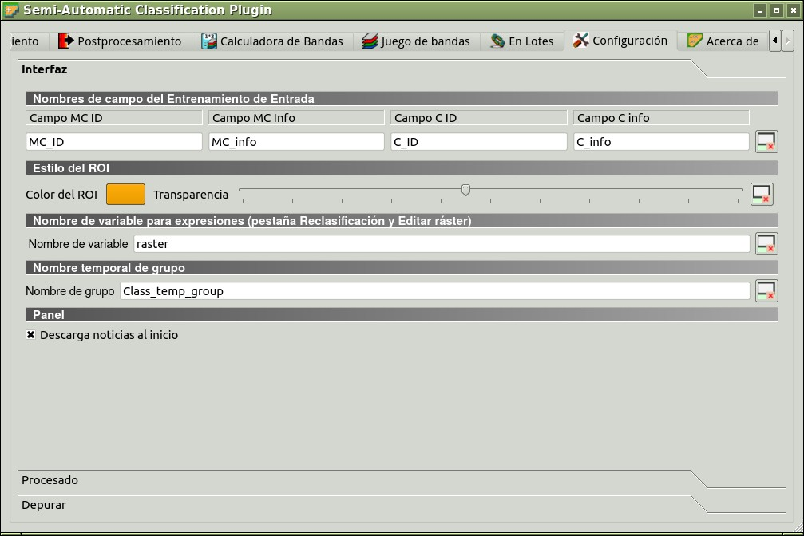
	
	:guilabel:`Interface`

.. _field_names_training_shapefile:

Field names of training input
^^^^^^^^^^^^^^^^^^^^^^^^^^^^^^^^^^^^

Set the names of fields in the :ref:`training_input` .
Changing field names should usually be avoided.

* :guilabel:`MC ID field` |input_text| |registry_save|: name of the Macroclass ID field (default is ``MC_ID``);
* :guilabel:`MC Info field` |input_text| |registry_save|: name of the Macroclass Information field (default is ``MC_info``);
* :guilabel:`C ID field` |input_text| |registry_save|: name of the Class ID field (default is ``C_ID``);
* :guilabel:`C Info field` |input_text| |registry_save|: name of the Class Information field (default is ``C_info``);
* |reset|: reset field names to default;
	
.. _roi_style:

ROI style
^^^^^^^^^^^^^^^^^^

Change ROI color and transparency for a better visualization of temporary ROIs on the map.

* :guilabel:`ROI color` |registry_save|: button for changing ROI color;
* :guilabel:`Transparency` |input_slider| |registry_save|: change ROI transparency;
* |reset|: reset ROI color and transparency to default;

.. _variable_name:

Variable name for expressions
^^^^^^^^^^^^^^^^^^^^^^^^^^^^^^^^^^^^^^^^^^^^^^^^^^^^^^^^^

Set the variable name used in expressions of the :ref:`reclassification_tab` and  :ref:`edit_raster_tab` .

* :guilabel:`Variable name` |input_text| |registry_save|: set variable name (default is ``raster``);
* |reset|: reset variable name to default;

.. _group_name:

Temporary group name
^^^^^^^^^^^^^^^^^^^^^^^^^^^^^^^^^^^^^^^^^^^^^^^^^^^^^^^^^

Set the temporary group name in QGIS Layers used for temporary layers .

* :guilabel:`Group name` |input_text| |registry_save|: set group name (default is ``Class_temp_group``);
* |reset|: reset group name to default;

.. _dock_settings:

Dock
^^^^^^^^^^^^^^^^^^^^^^^^^^^^^^^^^^^^^^^^^^^^^^^^^^^^^^^^^

* |checkbox| :guilabel:`Download news on startup`: if checked, news about the :guilabel:`SCP` and related services are downloaded on startup and displayed in :guilabel:`Dock`;

.. _settings_processing_tab:

Processing
-------------------------

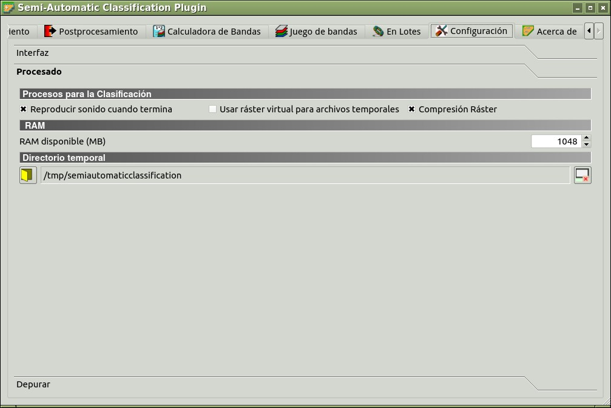
	
	:guilabel:`Processing`
	
.. _classification_process:

Classification process
^^^^^^^^^^^^^^^^^^^^^^^^^

* |checkbox| :guilabel:`Play sound when finished` |registry_save|: if checked, play a sound when the classification process is completed;
* |checkbox| :guilabel:`Use virtual rasters for temp files` |registry_save|: if checked, create virtual rasters for certain temporary files, instead of creating real rasters; it is useful for reducing disk space usage during calculations;
* |checkbox| :guilabel:`Raster compression` |registry_save|: if checked, a lossless compression (DEFLATE or PACKBITS) is applied to raster outputs in order to save disk space; it is recommended to check this option, however compressed files are sometimes larger than files without compression;

.. _ram:

RAM
^^^^^^^^^^^^^^^^^^

* :guilabel:`Available RAM (MB)` |input_number| |registry_save|: set the available RAM (in MB) that is used during the processes in order to improve the :guilabel:`SCP` performance; this value should be half of the system RAM (e.g. 1024MB if system has 2GB of RAM); in case of errors, set a value lower than 512MB;

.. _temporary_directory:

Temporary directory
^^^^^^^^^^^^^^^^^^^^^^

* |open_dir| |registry_save|: select a new temporary directory where temporary files are saved during processing; the path to the current temporary directory is displayed; default is a system temporary directory;
* |reset|: reset to default temporary directory;

.. _settings_debug_tab:

Debug
-------------------------

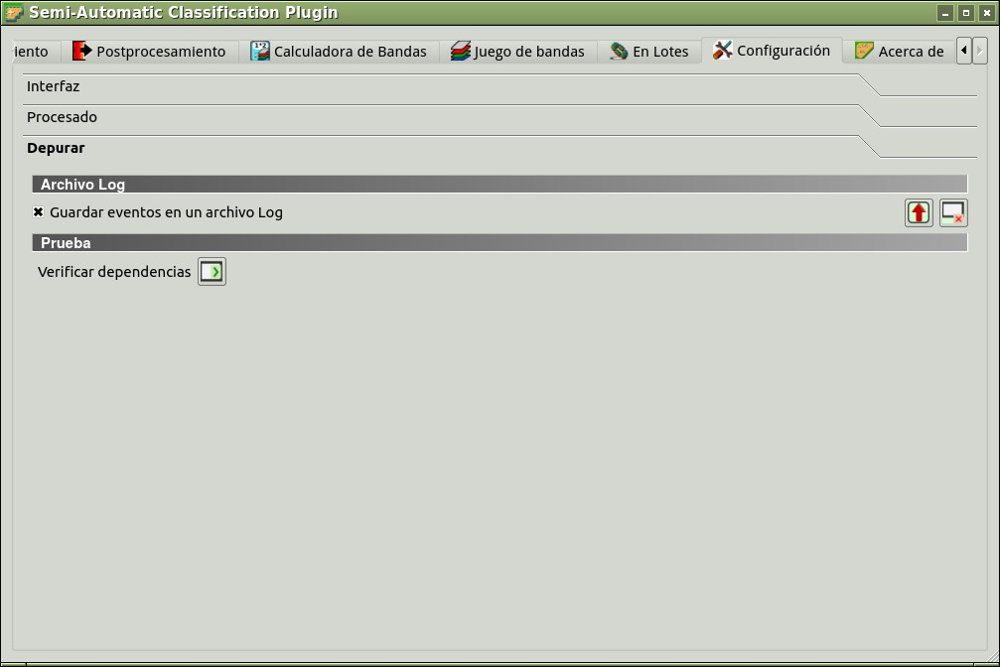
	
	:guilabel:`Debug`

Debugging utilities for the creation of a Log file (i.e. recording of :guilabel:`SCP` activities for reporting issues) and testing :guilabel:`SCP` dependencies.

If you found a plugin error, please read :ref:`error_0` .

.. _log_file:

Log file
^^^^^^^^^^^^^^^^^^

* |checkbox| :guilabel:`Records events in a log file` |registry_save|: if checked, start recording events in a Log file;
* |export|: export the Log file (i.e. a .txt file);
* |reset|: clear the content of Log file;

.. _test_dependencies:

Test
^^^^^^^^^^^^^^^^^^

* :guilabel:`Test dependencies` |enter|: test :guilabel:`SCP` dependencies (GDAL, GDAL subprocess, NumPy, SciPy, Matplotlib, Internet connection); results are displayed in a window;
