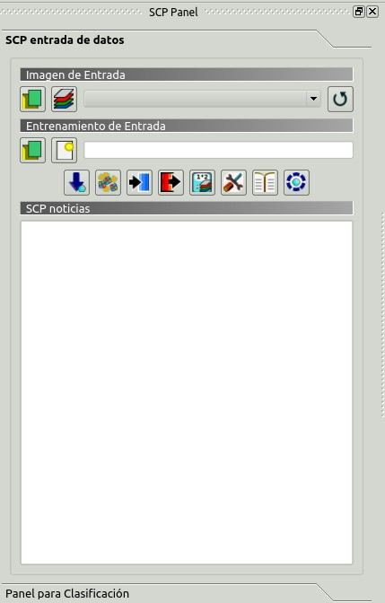
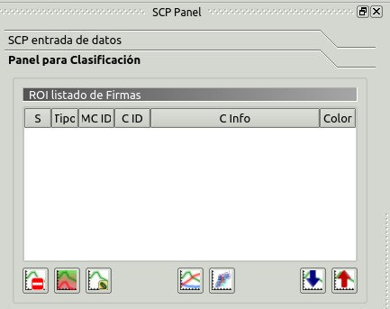
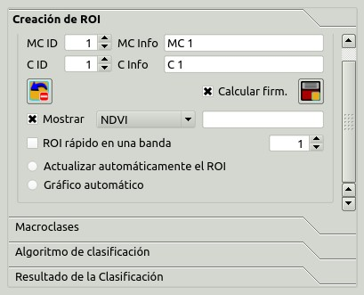
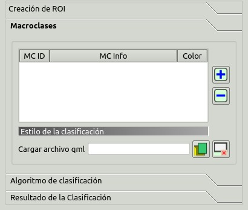
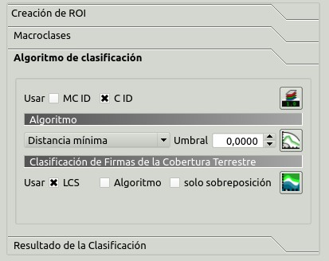
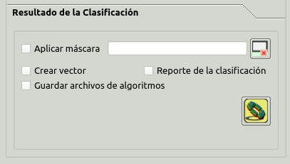

.. _SCP_dock:

*******************
SCP dock
*******************

.. |br| raw:: html

  
	
.. contents::
    :depth: 2
    :local:
	
.. |registry_save| image:: _static/registry_save.png
	:width: 20pt
	
.. |project_save| image:: _static/project_save.png
	:width: 20pt
	
.. |optional| image:: _static/optional.png
	:width: 20pt
	
.. |input_list| image:: _static/input_list.jpg
	:width: 20pt
	
.. |input_text| image:: _static/input_text.jpg
	:width: 20pt
	
.. |input_date| image:: _static/input_date.jpg
	:width: 20pt
	
.. |input_number| image:: _static/input_number.jpg
	:width: 20pt
	
.. |input_slider| image:: _static/input_slider.jpg
	:width: 20pt
	
.. |input_table| image:: _static/input_table.jpg
	:width: 20pt
	
.. |open_file| image:: _static/semiautomaticclassificationplugin_open_file.png
	:width: 20pt
	
.. |new_file| image:: _static/semiautomaticclassificationplugin_new_file.png
	:width: 20pt

.. |add| image:: _static/semiautomaticclassificationplugin_add.png
	:width: 20pt
	
.. |remove| image:: _static/semiautomaticclassificationplugin_remove.png
	:width: 20pt
	
.. |reset| image:: _static/semiautomaticclassificationplugin_reset.png
	:width: 20pt
	
.. |run| image:: _static/semiautomaticclassificationplugin_run.png
	:width: 24pt
	
.. |bandset_tool| image:: _static/semiautomaticclassificationplugin_bandset_tool.png
	:width: 20pt
	
.. |download| image:: _static/semiautomaticclassificationplugin_download_arrow.png
	:width: 20pt
	
.. |sign_plot| image:: _static/semiautomaticclassificationplugin_sign_tool.png
	:width: 20pt
	
.. |tools| image:: _static/semiautomaticclassificationplugin_roi_tool.png
	:width: 20pt
	
.. |preprocessing| image:: _static/semiautomaticclassificationplugin_class_tool.png
	:width: 20pt
	
.. |postprocessing| image:: _static/semiautomaticclassificationplugin_post_process.png
	:width: 20pt
			
.. |bandcalc| image:: _static/semiautomaticclassificationplugin_bandcalc_tool.png
	:width: 20pt
		
.. |settings| image:: _static/semiautomaticclassificationplugin_settings_tool.png
	:width: 20pt
		
.. |batch_tool| image:: _static/semiautomaticclassificationplugin_batch.png
	:width: 20pt
	
.. |save_roi| image:: _static/semiautomaticclassificationplugin_save_roi.png
	:width: 20pt
	
.. |delete_signature| image:: _static/semiautomaticclassificationplugin_delete_signature.png
	:width: 20pt

.. |scatter_plot| image:: _static/semiautomaticclassificationplugin_scatter_tool.png
	:width: 20pt
	
.. |merge_sign| image:: _static/semiautomaticclassificationplugin_merge_sign_tool.png
	:width: 20pt
	
.. |guide| image:: _static/guide.png
	:width: 20pt
				
.. |help| image:: _static/help.png
	:width: 20pt
	
.. |reload| image:: _static/semiautomaticclassificationplugin_reload.png
	:width: 20pt
	
.. |checkbox| image:: _static/checkbox.png
	:width: 18pt
	
.. |calculate_signature| image:: _static/semiautomaticclassificationplugin_calculate_signature.png
	:width: 20pt
	
.. |import_spectral_library| image:: _static/semiautomaticclassificationplugin_import_spectral_library.png
	:width: 20pt
	
.. |export_spectral_library| image:: _static/semiautomaticclassificationplugin_export_spectral_library.png
	:width: 20pt
	
.. |roi_multiple| image:: _static/semiautomaticclassificationplugin_roi_multiple.png
	:width: 20pt
	
.. |undo_save_roi| image:: _static/semiautomaticclassificationplugin_undo_save_roi.png
	:width: 20pt
	
.. |radiobutton| image:: _static/radiobutton.png
	:width: 18pt
	
.. |weight_tool| image:: _static/semiautomaticclassificationplugin_weight_tool.png
	:width: 20pt
	
.. |threshold_tool| image:: _static/semiautomaticclassificationplugin_threshold_tool.png
	:width: 20pt
	
.. |zoom_to_preview| image:: _static/semiautomaticclassificationplugin_zoom_to_preview.png
	:width: 20pt

.. |preview| image:: _static/semiautomaticclassificationplugin_preview.png
	:width: 20pt
	
.. |preview_redo| image:: _static/semiautomaticclassificationplugin_preview_redo.png
	:width: 20pt
	
.. |remove_temp| image:: _static/semiautomaticclassificationplugin_remove_temp.png
	:width: 20pt
	
The :guilabel:`SCP dock` allows for the definition of inputs, the creation of ROIs (Regions Of Interest) and spectral signatures, and the classification of an input image.

The :ref:`input_image`, to be classified, can be a multi-band raster or a set of single bands defined in the :ref:`band_set_tab`.
	
The :ref:`training_input`, created with :guilabel:`SCP`, stores the ROI polygons and spectral signatures used for the land cover classification of the :ref:`input_image`.

ROIs are polygons used for the definition of the spectral characteristics of land cover classes.
:guilabel:`SCP` allows for the creation of :guilabel:`temporary ROI polygons` using a region growing algorithm or drawn manually.
Using the region growing algorithm the image is segmented around a pixel seed including spectrally homogeneous pixels.
:guilabel:`Temporary ROI polygons` can be saved in the :ref:`training_input` along with the spectral signatures of the ROI.
It is worth pointing out that classification is always based on spectral signatures.

In :guilabel:`SCP`, land cover classes (and ROIs) are defined with a system of :guilabel:`Classes` (:guilabel:`Class ID`) and :guilabel:`Macroclasses` (:guilabel:`Macroclass ID`) (see :ref:`classes_definition`) that are used for the classification process; each :guilabel:`Macroclass ID` is related to a :guilabel:`Macroclass Information` (e.g. macroclass name) and each :guilabel:`Class ID` is related to a :guilabel:`Class Information` (e.g. class name), but only :guilabel:`Macroclass ID` and :guilabel:`Class ID` are used for the classification process.

Training input is composed of a vector part (i.e. a shapefile) and a spectral signature part which are independent.
The attribute table of the vector contains four fields as in the following table.

	:guilabel:`Training input fields`
	
+-------------------------------------+--------------------------+------------------------+
| Description                         | Field name               |  Field type            |
+=====================================+==========================+========================+
| Macroclass ID                       | MC_ID                    |  int                   |
+-------------------------------------+--------------------------+------------------------+
| Macroclass Information              | MC_info                  |  string                |
+-------------------------------------+--------------------------+------------------------+
| Class ID                            | C_ID                     |  int                   |
+-------------------------------------+--------------------------+------------------------+
| Class Information                   | C_info                   |  string                |
+-------------------------------------+--------------------------+------------------------+
	
Spectral signatures of classes are calculated from the ROIs and saved in the :ref:`training_input`.
In addition, spectral signatures can be imported from other sources (see :ref:`import_signatures_tab`).

The use of the :guilabel:`Macroclass ID` or :guilabel:`Class ID` for classifications is defined with the option :guilabel:`Use MC ID or C ID` in the :ref:`classification_alg`.
It is worth highlighting that when using :guilabel:`Macroclass ID` all the spectral signatures are evaluated separately and each pixel is classified with the corresponding :guilabel:`MC ID` (i.e. there is no combination of signatures before the classification).

The **classification** can be performed for the entire image ( :ref:`classification_output` ) or a part of it, creating a :ref:`classification_preview`.

The functions are described in detail in the following paragraphs, using these conventions:

|input_date| = Input date

|input_text| = Input text

|input_list| = List

|input_number| = Input number

|optional| = Optional

|project_save| = Configuration stored in the active project of QGIS

|registry_save| = Configuration stored in QGIS registry

|input_slider| = Slider

|input_table| = Table

.. _SCP_input:
 
SCP input 
================================

	
	:guilabel:`SCP input`
	
.. _input_image:
 
Input image
----------------------------------------

This section allows for the selection of the image to be classified.
Raster files must be already loaded in QGIS.

Input image can be a multi-band raster or a set of single bands defined in the :ref:`band_set_tab`.
If a multi-band raster is selected, raster bands are listed in the :ref:`band_set_tab`.
	
* |open_file|: open one or more raster files and add them :ref:`band_set_tab`;
* |bandset_tool|: open the :ref:`band_set_tab`;
* :guilabel:`Input image` |input_list| |project_save|: select the input image from a list of multi-spectral images loaded in QGIS; if the :ref:`band_set_tab` is defined, then this list will contain the item :guilabel:`<< band set >>`;
* |reload|: refresh layer list;
	
.. _training_input:
 
Training input
----------------------------------------

The training input is a file ``.scp`` created in :guilabel:`SCP` (i.e. a zip file containing a shapefile and an xml file) used for storing ROIs and spectral signatures.

	**Warning**: Signature list files saved with previous versions of :guilabel:`SCP` are not compatible with SPC 5; however you can import a ROI shapefile using the tool :ref:`import_shapefile_tab`.

ROIs and spectral signatures are displayed in the :ref:`ROI_list`.
ROIs and spectral signatures can be imported from other sources (see :ref:`import_signatures_tab`) and exported (see :ref:`export_signatures_tab`).
ROIs are displayed in QGIS as vector file (in order to prevent data loss, you should not edit this layer using QGIS functions).

* |open_file|: open a training input file; ROIs and spectral signatures are loaded in :ref:`ROI_list`; the vector part of the training input is loaded in QGIS;
* |new_file|: create an empty training input file (``.scp``); the vector part of the training input is loaded in QGIS; also a backup file is created (a file ``.scp.backup`` in the same directory as the file ``.scp``) when the training input file is saved;
* :guilabel:`Training input` |input_text| |project_save|: it displays the path to the training input file;
* |download|: open the :ref:`download_tab`;
* |tools|: open the  :ref:`tools_tab`;
* |preprocessing|: open the  :ref:`pre_processing_tab`;
* |postprocessing|: open the  :ref:`post_processing_tab`;
* |bandcalc|: open the  :ref:`band_calc_tab`;
* |settings|: open the  :ref:`settings_tab`;
* |guide|: open the online user manual in a web browser;
* |help|: open the `Online help <http://fromgistors.blogspot.com/p/online-help.html>`_ in a web browser; also, a `Facebook group <https://www.facebook.com/groups/SemiAutomaticClassificationPlugin/>`_ and a `Google+ Community <https://plus.google.com/communities/107833394986612468374>`_ are available for sharing information and asking for help about :guilabel:`SCP`;
	
.. _SCP_news:
 
SCP news
----------------------------------------

This section displays news about the :guilabel:`SCP` and related services.
News are downloaded on startup (internet connection required).
It can be enabled or disabled in the settings :ref:`dock_settings`.

.. _classification_dock:
 
Classification dock
================================
	
The :guilabel:`Classification dock` is designed to manage the **spectral signatures**, and **classify** the :ref:`input_image`.

.. _ROI_list:
 
ROI Signature list
----------------------------------------

	
	:guilabel:`ROI Signature list`
	
The :guilabel:`ROI Signature list` displays the ROI polygons and spectral signatures contained in the :ref:`training_input`.
If an item is a ROI polygon, double click the item to zoom to that ROI in the map.
Items in the table can be highlighted with the mouse left click.

Changes in the :guilabel:`ROI Signature list` are applied to the file :ref:`training_input` only when the QGIS project is saved.
ROIs can be edited, deleted and merged from this table.

	**WARNING**: In order to avoid data loss, do not edit the vector :guilabel:`Training input` using the QGIS tools. Use only the tools of :guilabel:`SCP` for managing the :guilabel:`Training input`.

* |input_table| :guilabel:`ROI Signature list`:
	* :guilabel:`S`: selection checkbox; only the spectral signatures checked in this list are used for the classification process;
	* :guilabel:`Type`: type of the item:
		* :guilabel:`R` = only ROI polygon;
		* :guilabel:`S` = only spectral signature;
		* :guilabel:`B` = both ROI and spectral signature;
	* :guilabel:`MC ID`: ROI Macroclass ID [int]; it can be edited with a single click; :guilabel:`MC Info` is displayed in :ref:`classification_style`; if the ID of a spectral signature is set 0, then pixels belonging to this signature are labelled as unclassified;
	* :guilabel:`C ID`: ROI Class ID [int]; it can be edited with a single click;
	* :guilabel:`C Info`: ROI Class Information [text]; it can be edited with a single click;
	* :guilabel:`Color`: C ID color; double click to select a color for the class that is used in the classification; if the ID of a spectral signature is set 0, then pixels belonging to this signature are labelled as unclassified;

* |delete_signature|: delete highlighted ROIs and signatures;
* |merge_sign|: merge highlighted spectral signatures or ROIs obtaining a new signature calculated as the average of signature values for each band (covariance matrix is excluded);
* |calculate_signature|: calculate spectral signatures of highlighted ROIs;
* |sign_plot|: show the ROI spectral signature in the :ref:`spectral_signature_plot`; spectral signature is calculated from the :ref:`input_image`;
* |scatter_plot| : open the :ref:`scatter_plot`;
* |export_spectral_library|: open the tab :ref:`export_signatures_tab`;
* |import_spectral_library|: open the tab :ref:`import_signatures_tab`;
	
.. _ROI_creation:

ROI creation
----------------------------------------

	
	:guilabel:`ROI creation`
	
:guilabel:`ROI creation` is complementary to the :ref:`working_toolbar` and it allows for saving ROIs to the :ref:`training_input` defining classes and macroclasses.
A :ref:`band_set_tab` must be defined before the ROI creation, and ROI polygons must be inside the area of the :guilabel:`Band set`.

* :guilabel:`MC ID` |input_number| |project_save|: ROI Macroclass ID [int]; the corresponding :guilabel:`MC Info` is loaded if already defined in :ref:`classification_style`;
* :guilabel:`MC Info` |input_text| |project_save|: ROI Macroclass information [text]; style and information for macroclasses are defined in :ref:`classification_style`;
* :guilabel:`C ID` |input_number| |project_save|: ROI Class ID [int];
* :guilabel:`C Info` |input_text| |project_save|: ROI Class information [text];
* |undo_save_roi|: delete the last saved ROI from the :ref:`training_input`;
* |checkbox| :guilabel:`Calculate sig.` |project_save|: if checked, while saving a ROI, the spectral signature thereof is calculated (from :ref:`input_image` pixels under ROI polygon) and saved to :ref:`training_input` (calculation time depends on the band number of :ref:`input_image`);
* |save_roi|: save the temporary ROI to the :ref:`training_input` using the defined classes and macroclasses; ROI is displayed in the :ref:`ROI_list`;
* |checkbox| :guilabel:`Display` |input_list| |project_save|: if the ROI creation pointer is active (see :ref:`working_toolbar`), the pixel value of selected vegetation index is  displayed on the map; vegetation indices available in the combo box are:
	* NDVI (Normalized Difference Vegetation Index); NDVI requires the near-infrared and red bands;
	* EVI (Enhanced Vegetation Index); EVI requires the blue, near-infrared and red bands converted to reflectance; wavelengths must be defined in the :ref:`band_set_tab`;
	* Custom; use the custom expression defined in the following line :guilabel:`Expression`;
* :guilabel:`Expression` |input_text| |project_save|: set a custom expression; expression is based on the :guilabel:`Band set`; bands are defined as :guilabel:`bandset#b + band number` (e.g. ``bandset#b1`` for the first band of the :guilabel:`Band set`); for example NDVI for a Landsat image would be ( ``bandset#b4`` - ``bandset#b3`` ) / ( ``bandset#b4`` + ``bandset#b3`` );
* |checkbox| :guilabel:`Rapid ROI band` |input_number| |project_save|: if checked, temporary ROI is created with region growing using only one :ref:`input_image` band (i.e.region growing is rapider); the band is defined by the :guilabel:`Band set` number; if unchecked, ROI is the result of the intersection between ROIs calculated on every band (i.e. region growing is slower, but ROI is spectrally homogeneous in every band);
* |radiobutton| :guilabel:`Automatic refresh ROI`: calculate automatically a new temporary ROI while :guilabel:`Region growing parameters` in the :ref:`working_toolbar` are being changed;
* |radiobutton| :guilabel:`Automatic plot`: calculate automatically the temporary ROI spectral signature and display it in the :ref:`spectral_signature_plot` (``MC Info`` of this spectral signature is set ``tempo_ROI``);
	
.. _classification_style:

Macroclasses
---------------------------

	
	:guilabel:`Macroclasses`
	
:guilabel:`Macroclasses` allows for the definition of **Macroclass names and colors** (used to display the results of :ref:`classification_preview` and :ref:`classification_output`).
According to :ref:`classification_alg`, classifications performed using :guilabel:`C ID` have the colors defined for classes in the :ref:`ROI_list`; classifications performed using :guilabel:`MC ID`  have the colors defined in the :ref:`classification_style`. 

:guilabel:`MC IDs` are automatically added to this table when a new ROI is saved to the :ref:`ROI_list` (if the :guilabel:`MC ID` is not already in the list).
Settings are stored in :ref:`training_input`.

* |input_table| :guilabel:`Macroclasses` |project_save|:
	* :guilabel:`MC ID`: Macroclass ID [int]; it can be edited with a single click;
	* :guilabel:`MC Info`: Macroclass Information [text]; it can be edited with a single click;
	* :guilabel:`Color`: MC ID color; double click to select a color for the class that is used in the classification;

* |add|: add a new row to the table;
* |remove|: delete the highlighted rows from the table;

.. _qml_style:

Classification style
^^^^^^^^^^^^^^^^^^^^^^^^^^^^^^^^^^^^^^^^^^^^^^^^^^^

In addition, a previously saved `classification style` (QGIS .qml file) can be loaded and used for classification style.

* :guilabel:`Load qml` |open_file| |project_save|: select a .qml file overriding the colors defined for :guilabel:`C ID` or :guilabel:`MC ID`;
* |reset|: reset style to default (i.e. use the colors defined for :guilabel:`C ID` or :guilabel:`MC ID`);
	
.. _classification_alg:

Classification algorithm
------------------------

	
	:guilabel:`Classification algorithm`
	
The :guilabel:`Classification algorithm` includes several functions for the classification process used also during the :ref:`classification_preview`.

* :guilabel:`Use` |checkbox| :guilabel:`MC ID` |checkbox| :guilabel:`C ID` |registry_save|: if :guilabel:`MC ID` is checked, the classification is performed using the Macroclass ID (code `MC ID` of the signature); if :guilabel:`C ID` is checked, the classification is performed using the Class ID (code `C ID` of the signature);
* |weight_tool| : open the :ref:`Algorithm_band_weight_tab` for the definition of band weights;

.. _classification_algorithm:

Algorithm
^^^^^^^^^^^^^^^^^

Classification is performed using the selected algorithm.

* |input_list| |project_save|: available :ref:`classification_algorithm_definition` are:

	* :ref:`minimum_distance_algorithm`;
	* :ref:`max_likelihood_algorithm`;
	* :ref:`spectra_angle_mapping_algorithm`;

* :guilabel:`Threshold` |input_number| |optional|: it allows for the definition of a classification threshold (applied to all the spectral signatures); for advanced settings see :ref:`Signature_threshold_tab`; if threshold is equal to 0, then no threshold is considered and all image pixels are classified; otherwise:
	* for Minimum Distance, pixels are unclassified if distance is greater than threshold value;
	* for Maximum Likelihood, pixels are unclassified if probability is less than threshold  value (max 100);
	* for Spectral Angle Mapping, pixels are unclassified if spectral angle distance is greater than threshold value (max 90);

* |threshold_tool|: open the :ref:`Signature_threshold_tab` for the definition of signature thresholds;

.. _LCS_classification:

Land Cover Signature Classification 
^^^^^^^^^^^^^^^^^^^^^^^^^^^^^^^^^^^^^^^^^^^^^^^^^^^

:ref:`LCS_algorithm` is a classification that can be used as alternative or in combination with the :ref:`classification_algorithm` (see :ref:`LCS_threshold`).
Pixels belonging to two or more different classes (or macroclasses) are classified as :guilabel:`Class overlap` with raster value = -1000.

* :guilabel:`Use` |checkbox| :guilabel:`LCS` |checkbox| :guilabel:`Algorithm` |checkbox| :guilabel:`only overlap`: if :guilabel:`LCS` is checked, the :guilabel:`Land Cover Signature Classification` is used; if :guilabel:`Algorithm` is checked, the selected :ref:`classification_algorithm` is used for unclassified pixels of the :guilabel:`Land Cover Signature Classification`; if :guilabel:`only overlap` is checked, the selected :ref:`classification_algorithm` is used only for class overlapping pixels of the :guilabel:`Land Cover Signature Classification`; unclassified pixels of the :guilabel:`Land Cover Signature Classification` are left unclassified;
* |threshold_tool|: open the :ref:`LCS_threshold`;

.. _classification_output:

Classification output
---------------------

	
	:guilabel:`Classification output`
	
:guilabel:`Classification output` allows for the classification of the :ref:`input_image` according to the parameters defined in :ref:`classification_alg`. 

Classification raster is a file ``.tif`` (a QGIS style file ``.qml`` is saved along with the classification); also other outputs can be optionally calculated.
Outputs are loaded in QGIS after the calculation.

* |checkbox| :guilabel:`Apply mask` |optional|: if checked, a shapefile can be selected for masking the classification output (i.e. the area outside the shapefile is not classified);
* |reset|: reset the mask shapefile;
* |checkbox| :guilabel:`Create vector` |optional|: if checked, in addition to the classification raster, a classification shapefile is saved in the same directory and with the same name as the :guilabel:`Classification output`; conversion to vector can also be performed at a later time (see :ref:`classification_vector_tab`);
* |checkbox| :guilabel:`Classification report` |optional|: if checked, a report about the land cover classification is calculated and saved as a .csv file in the same directory and with the same name (with the suffix ``_report``) as the :guilabel:`Classification output`; report can also be performed at a later time (see :ref:`classification_report_tab`);
* |checkbox| :guilabel:`Save algorithm files` |optional| |registry_save|: if checked, the :ref:`algorithm_raster` is saved, in addition to the classification raster, in the same directory as the :guilabel:`Classification output`; a raster for each spectral signature used as input (with the suffix ``_sig_MC ID_C ID``) and a general algorithm raster (with the suffix ``_alg_raster``) are created;
* |run|: choose the output destination and start the image classification;
