.. _thematic_tutorials_lcs:

***************************************************************
Tutorial: Land Cover Signature Classification
***************************************************************

.. |br| raw:: html

  

.. |add| image:: _static/semiautomaticclassificationplugin_add.png
	:width: 20pt
	
.. |checkbox| image:: _static/checkbox.png
	:width: 18pt
	
.. |pointer| image:: _static/semiautomaticclassificationplugin_pointer_tool.png
	:width: 20pt
	
.. |radiobutton| image:: _static/radiobutton.png
	:width: 18pt
	
.. |reload| image:: _static/semiautomaticclassificationplugin_reload.png
	:width: 20pt
	
.. |reset| image:: _static/semiautomaticclassificationplugin_reset.png
	:width: 20pt
	
.. |remove| image:: _static/semiautomaticclassificationplugin_remove.png
	:width: 20pt
	
.. |run| image:: _static/semiautomaticclassificationplugin_run.png
	:width: 24pt
	
.. |open_file| image:: _static/semiautomaticclassificationplugin_open_file.png
	:width: 20pt
	
.. |new_file| image:: _static/semiautomaticclassificationplugin_new_file.png
	:width: 20pt
	
.. |open_dir| image:: _static/semiautomaticclassificationplugin_open_dir.png
	:width: 20pt
	
.. |select_all| image:: _static/semiautomaticclassificationplugin_select_all.png
	:width: 20pt
	
.. |move_up| image:: _static/semiautomaticclassificationplugin_move_up.png
	:width: 20pt
	
.. |move_down| image:: _static/semiautomaticclassificationplugin_move_down.png
	:width: 20pt
	
.. |search_images| image:: _static/semiautomaticclassificationplugin_search_images.png
	:width: 20pt

.. |image_preview| image:: _static/semiautomaticclassificationplugin_download_image_preview.png
	:width: 20pt

.. |import| image:: _static/semiautomaticclassificationplugin_import.png
	:width: 20pt
	
.. |export| image:: _static/semiautomaticclassificationplugin_export.png
	:width: 20pt

.. |plus| image:: _static/semiautomaticclassificationplugin_plus.png
	:width: 20pt

.. |order_by_name| image:: _static/semiautomaticclassificationplugin_order_by_name.png
	:width: 20pt

.. |sign_edit_range| image:: _static/semiautomaticclassificationplugin_sign_edit_range.png
	:width: 20pt
	
.. |image_overview| image:: _static/semiautomaticclassificationplugin_download_image_overview.png
	:width: 20pt
	
.. |enter| image:: _static/semiautomaticclassificationplugin_enter.png
	:width: 20pt

.. |download| image:: _static/semiautomaticclassificationplugin_download_arrow.png
	:width: 20pt
	
.. |landsat_download| image:: _static/semiautomaticclassificationplugin_landsat8_download_tool.png
	:width: 20pt

.. |sentinel_download| image:: _static/semiautomaticclassificationplugin_sentinel_download_tool.png
	:width: 20pt
	
.. |tools| image:: _static/semiautomaticclassificationplugin_roi_tool.png
	:width: 20pt
	
.. |roi_multiple| image:: _static/semiautomaticclassificationplugin_roi_multiple.png
	:width: 20pt

.. |import_spectral_library| image:: _static/semiautomaticclassificationplugin_import_spectral_library.png
	:width: 20pt
	
.. |export_spectral_library| image:: _static/semiautomaticclassificationplugin_export_spectral_library.png
	:width: 20pt
	
.. |weight_tool| image:: _static/semiautomaticclassificationplugin_weight_tool.png
	:width: 20pt
	
.. |threshold_tool| image:: _static/semiautomaticclassificationplugin_threshold_tool.png
	:width: 20pt
	
.. |LCS_threshold| image:: _static/semiautomaticclassificationplugin_LCS_threshold_tool.png
	:width: 20pt
	
.. |LCS_threshold_set_tool| image:: _static/semiautomaticclassificationplugin_LCS_threshold_set_tool.png
	:width: 20pt
	
.. |preprocessing| image:: _static/semiautomaticclassificationplugin_class_tool.png
	:width: 20pt
	
.. |landsat_tool| image:: _static/semiautomaticclassificationplugin_landsat8_tool.png
	:width: 20pt
	
.. |sentinel2_tool| image:: _static/semiautomaticclassificationplugin_sentinel_tool.png
	:width: 20pt
	
.. |aster_tool| image:: _static/semiautomaticclassificationplugin_aster_tool.png
	:width: 20pt
	
.. |split_raster| image:: _static/semiautomaticclassificationplugin_split_raster.png
	:width: 20pt
	
.. |clip_tool| image:: _static/semiautomaticclassificationplugin_clip_tool.png
	:width: 20pt
	
.. |pca_tool| image:: _static/semiautomaticclassificationplugin_pca_tool.png
	:width: 20pt
	
.. |vector_to_raster_tool| image:: _static/semiautomaticclassificationplugin_vector_to_raster_tool.png
	:width: 20pt
	
.. |post_process| image:: _static/semiautomaticclassificationplugin_post_process.png
	:width: 20pt
	
.. |accuracy_tool| image:: _static/semiautomaticclassificationplugin_accuracy_tool.png
	:width: 20pt
	
.. |land_cover_change| image:: _static/semiautomaticclassificationplugin_land_cover_change.png
	:width: 20pt
	
.. |report_tool| image:: _static/semiautomaticclassificationplugin_report_tool.png
	:width: 20pt

.. |class_to_vector_tool| image:: _static/semiautomaticclassificationplugin_class_to_vector_tool.png
	:width: 20pt

.. |reclassification_tool| image:: _static/semiautomaticclassificationplugin_reclassification_tool.png
	:width: 20pt

.. |edit_raster| image:: _static/semiautomaticclassificationplugin_edit_raster.png
	:width: 20pt

.. |undo_edit_raster| image:: _static/semiautomaticclassificationplugin_undo_edit_raster.png
	:width: 20pt

.. |classification_sieve| image:: _static/semiautomaticclassificationplugin_classification_sieve.png
	:width: 20pt

.. |classification_erosion| image:: _static/semiautomaticclassificationplugin_classification_erosion.png
	:width: 20pt

.. |classification_dilation| image:: _static/semiautomaticclassificationplugin_classification_dilation.png
	:width: 20pt

.. |bandcalc_tool| image:: _static/semiautomaticclassificationplugin_bandcalc_tool.png
	:width: 20pt
	
.. |batch_tool| image:: _static/semiautomaticclassificationplugin_batch.png
	:width: 20pt

.. |bandset_tool| image:: _static/semiautomaticclassificationplugin_bandset_tool.png
	:width: 20pt
	
.. |settings_tool| image:: _static/semiautomaticclassificationplugin_settings_tool.png
	:width: 20pt
	
.. |manual_ROI| image:: _static/semiautomaticclassificationplugin_manual_ROI.png
	:width: 20pt

.. |save_roi| image:: _static/semiautomaticclassificationplugin_save_roi.png
	:width: 20pt
	
.. |roi_single| image:: _static/semiautomaticclassificationplugin_roi_single.png
	:width: 20pt
	
.. |roi_redo| image:: _static/semiautomaticclassificationplugin_roi_redo.png
	:width: 20pt

.. |preview| image:: _static/semiautomaticclassificationplugin_preview.png
	:width: 20pt
	
.. |preview_redo| image:: _static/semiautomaticclassificationplugin_preview_redo.png
	:width: 20pt
	
.. |delete_signature| image:: _static/semiautomaticclassificationplugin_delete_signature.png
	:width: 20pt

.. |sign_plot| image:: _static/semiautomaticclassificationplugin_sign_tool.png
	:width: 20pt

.. |cumulative_stretch| image:: _static/semiautomaticclassificationplugin_bandset_cumulative_stretch_tool.png
	:width: 20pt

.. |std_dev_stretch| image:: _static/semiautomaticclassificationplugin_bandset_std_dev_stretch_tool.png
	:width: 20pt

.. |calculate_spectral_distances| image:: _static/semiautomaticclassificationplugin_calculate_spectral_distances.png
	:width: 20pt
	
.. |LCS_threshold_ROI_tool| image:: _static/semiautomaticclassificationplugin_LCS_threshold_ROI_tool.png
	:width: 20pt
	
.. contents::
    :depth: 2
    :local:
	
This tutorial is about the :ref:`LCS_algorithm`.
It is assumed that one has the basic knowledge of :guilabel:`SCP` and :ref:`tutorials`.

Following the video of this tutorial.

.. raw:: html

	<iframe allowfullscreen="" frameborder="0" height="360" src="http://www.youtube.com/embed/wUr5ZjpWBo0?rel=0" width="100%"></iframe>

http://www.youtube.com/watch?v=wUr5ZjpWBo0

First download the sample image from `this link <https://docs.google.com/uc?id=0BysUrKXWIDwBMXdFLW5rYVRGLTg>`_ (© Copernicus Sentinel data 2016) which is a Sentinel-2 image, and unzip the file.

.. _tutorial_lcs_band_set:

Create the Band Set
---------------------------------

Open the tab |bandset_tool| :ref:`band_set_tab`, click the button |open_file| and select the bands of the downloaded Sentinel-2 image.
In the table :guilabel:`Band set definition` order the band names in ascending order (click |order_by_name| to sort bands by name automatically), then highlight band ``8A`` (i.e. single click on band name in the table) and use the buttons |move_up| or |move_down| to place this band at number 8.
Finally, select :guilabel:`Sentinel-2` from the list :guilabel:`Quick wavelength settings`, in order to set automatically the :guilabel:`Center wavelength` of each band and the :guilabel:`Wavelength unit` (required for spectral signature calculation).

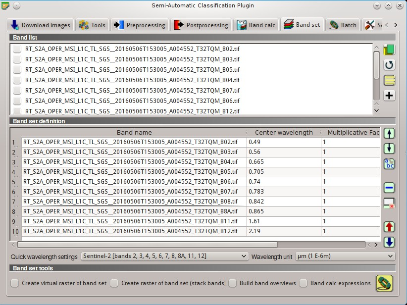
	
	:guilabel:`Band set definition`
	
.. _tutorial_lcs_ROIs:

Create the ROIs and Define the Spectral Thresholds 
------------------------------------------------------

In the :ref:`SCP_dock` click the button |new_file| and define a file name for the :guilabel:`Training input`.
We are going to create ROIs similarly to :ref:`tutorial_2`.
	
We are going to use the following Macroclass IDs (see :ref:`classes_definition`).
	
	:guilabel:`Macroclasses`
	
+-----------------------------+--------------------------+
| Macroclass name             | Macroclass ID            |
+=============================+==========================+
| Water                       |  1                       |
+-----------------------------+--------------------------+
| Built-up                    |  2                       |
+-----------------------------+--------------------------+
| Vegetation                  |  3                       |
+-----------------------------+--------------------------+
| Bare soil                   |  4                       |
+-----------------------------+--------------------------+

In addition, we can mask clouds in the image, creating ROIs of clouds and assigning the special :guilabel:`MC ID` = 0.

In the list :guilabel:`RGB=` of :ref:`working_toolbar` define a :ref:`color_composite_definition` such as ``RGB = 3-2-1`` or ``RGB = 7-3-2``.

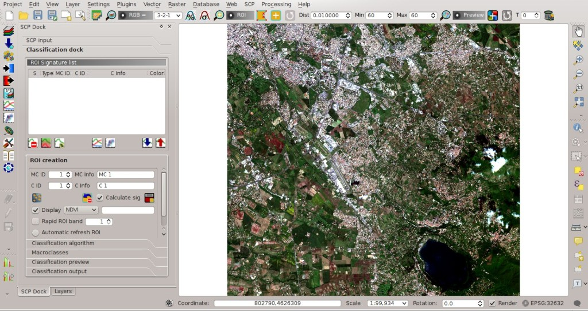
	
	:guilabel:`Color composite`
	
Now create some ROIs.
ROIs are used in :ref:`LCS_algorithm` for defining a spectral region.
The :ref:`LCS_algorithm` can use additional classification algorithms for pixels falling inside overlapping regions or outside any spectral region (in this tutorial we are going to use :ref:`minimum_distance_algorithm`), therefore it is important that ROIs are homogeneous in order to train correctly the additional algorithm.
Following the ROI creation we are going to change the signature thresholds in the :ref:`LCS_threshold`.

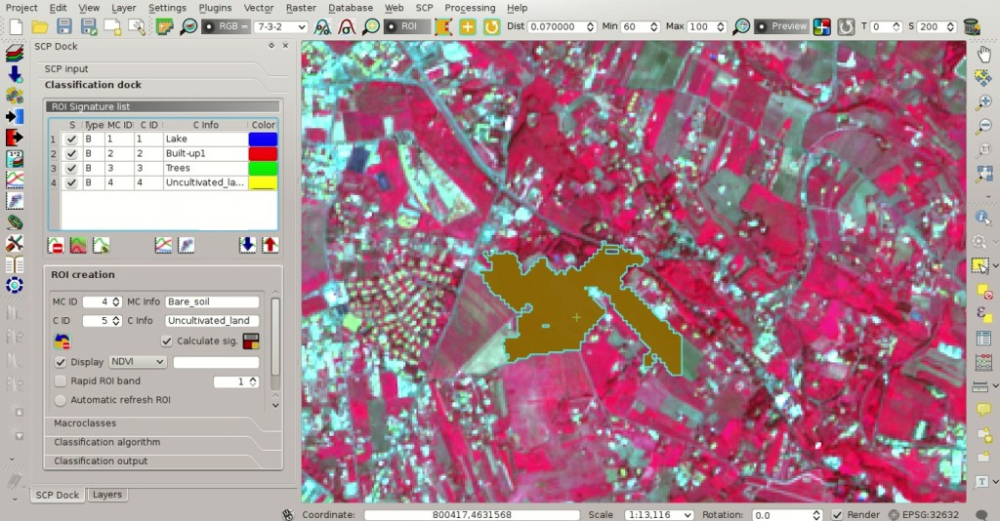
	
	:guilabel:`ROI creation`
	
After the ROI creation, in the :ref:`ROI_list` highlight these spectral signatures, then click the button |sign_plot|.

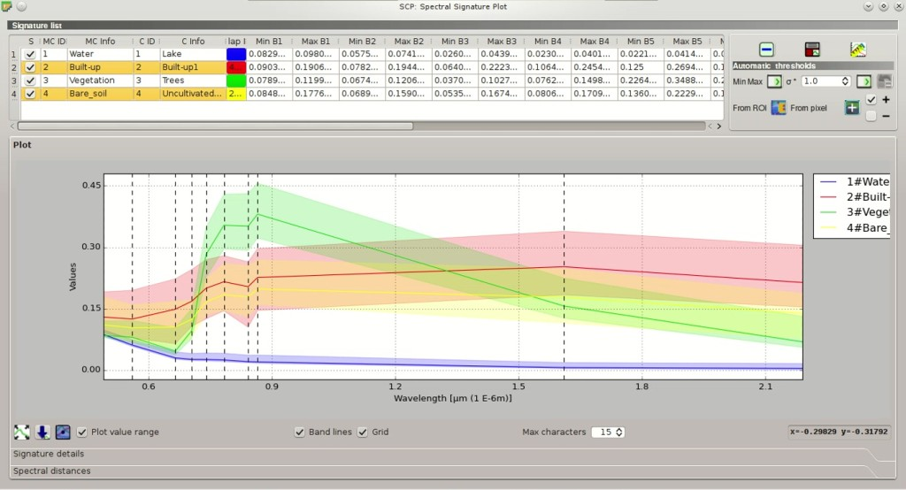
	
	:guilabel:`Signature plot`
	
Spectral signatures are displayed with the respective colors; also, the semi-transparent area represents the spectral range of each ROI.
The minimum and maximum values of these spectral range are displayed in the :ref:`signature_list_plot`.
You can manually edit these ranges or use the tools :ref:`plot_automatic_thresholds`.
It is worth noticing the same spectral ranges (of spectral signatures in :ref:`ROI_list`) are displayed in the :ref:`Signature_threshold_tab`.

In :ref:`classification_alg` select :guilabel:`Use` |checkbox| :guilabel:`LCS` to use the in :ref:`LCS_algorithm`.
Now create a classification preview over the lake (see :ref:`tutorial_2_3`).

	
	:guilabel:`Classification preview`
	
You can see that several pixels are unclassified (black) because they are outside any spectral range.
In the :ref:`signature_list_plot` highlight a signature of macroclass ``Water`` and click the button :guilabel:`From pixel` |LCS_threshold_set_tool|.
This tool allows you to extend the spectral range to include a pixel signature.
Click an unclassified pixel in the map over the lake; you should see that the spectral range of highlighted signature is larger now.
Click the button |preview_redo| in the :ref:`working_toolbar`.

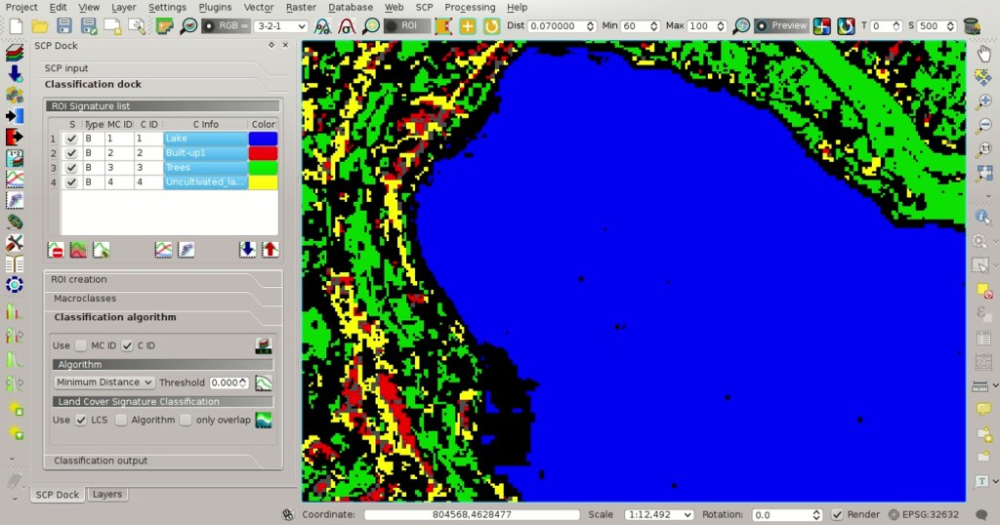
	
	:guilabel:`Classification preview`
	
Now the area classified as water is larger and should include the pixel that was clicked before.
Create a temporary ROI over the unclassified area of the lake and click the button :guilabel:`From ROI` |LCS_threshold_ROI_tool|.

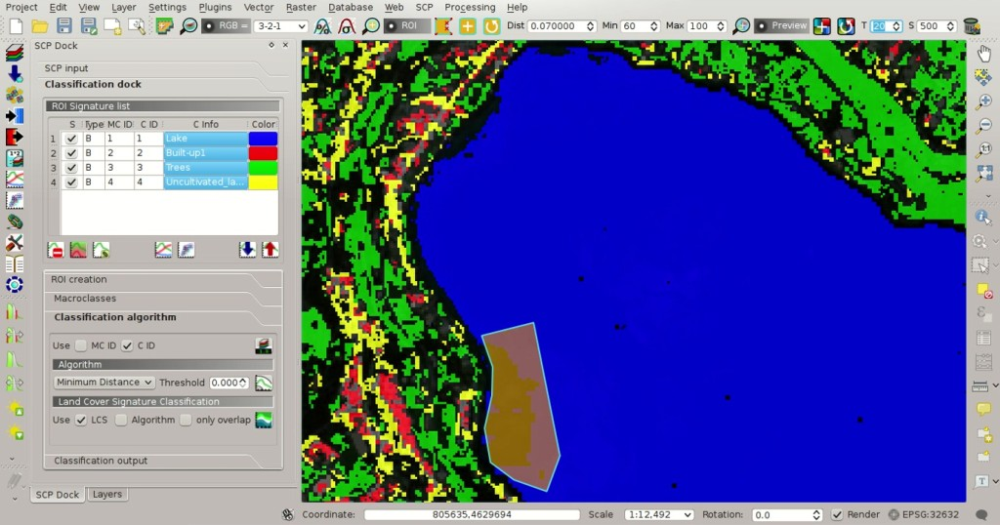
	
	:guilabel:`Signature plot: the spectral range is extended`
	
This way, the spectral range is extended to include the minimum and maximum value of this ROI for each band.

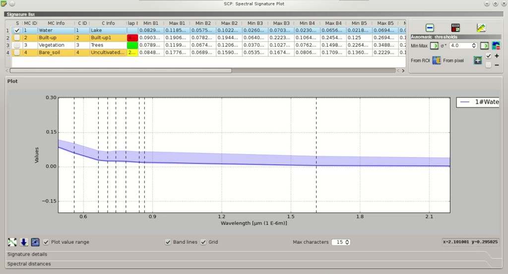
	
	:guilabel:`Signature plot: the spectral range is extended`
	
Creating another classification preview we can see that the classified area is extended according to the temporary ROI.
	

	
	:guilabel:`Classification preview`
	
You can extend the spectral range to classify the whole lake as water.

	**TIP** : During ROI creation, click the button |roi_single| in :ref:`working_toolbar` and right click on the map for displaying the spectral signature of a pixel in the :ref:`spectral_signature_plot`. This can be useful for assessing unclassified pixels and extend one or more spectral ranges.

Particular attention should be posed on the spectral similarity of classes.
For instance soil and built-up can have very similar spectral signatures.
Therefore, several ROIs should be collected in the attempt to separate these classes.

Spectral ranges should not overlap in order to avoid unclassified pixels.
In the following figure, two signatures have overlapping ranges (it means that potentially there is a signature whose values fall in two classes); these signatures are highlighted in orange in the :ref:`signature_list_plot` (also in the :ref:`LC_signature_threshold`) and the combinations ``MC ID - C ID`` of overlapping signatures are displayed in the column :guilabel:`Color [overlap MC_ID-C_ID]`.

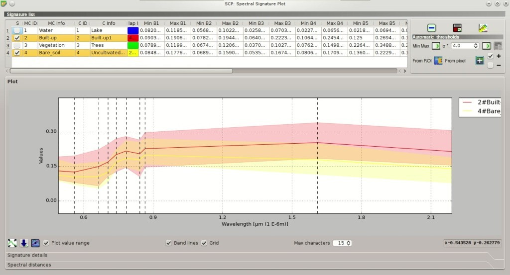
	
	:guilabel:`Overlapping signatures`
	
It is possible to reduce the range with the button :guilabel:`From ROI` |LCS_threshold_ROI_tool| or :guilabel:`From pixel` |LCS_threshold_set_tool| if the checkbox |checkbox| **–** is checked.
In this case, the range is reduced to exclude the values of selected pixels or ROIs.

In addition, it is possible to edit the range directly from the plot.
In the :ref:`signature_list_plot` highlight a signature, click the button |sign_edit_range|, then click inside the plot to extend or reduce the range.
As a general procedure, you should compare spectral signatures and identify one or more values that could separate the overlapping ranges (if spectral ranges are not overlapping at least in one band then classes are  correctly separated).

In case two spectral regions belonging to different classes are overlapping, you should consider reducing the ranges, collecting other spectral signatures with reduced ranges, or extending the spectral range of one signature to include the range of the other spectral signature that will be deleted.
For instance, it could be convenient to create two spectral ranges (with two spectral signatures) for the same class in order to easily separate a third spectral signature whose values are comprised between the minimum and maximum values of the other two ranges.

	**TIP** : Check the |radiobutton| :guilabel:`Automatic plot` to display automatically the plot of a temporary ROI in the :ref:`spectral_signature_plot`, and assess the spectral range before saving the ROI.

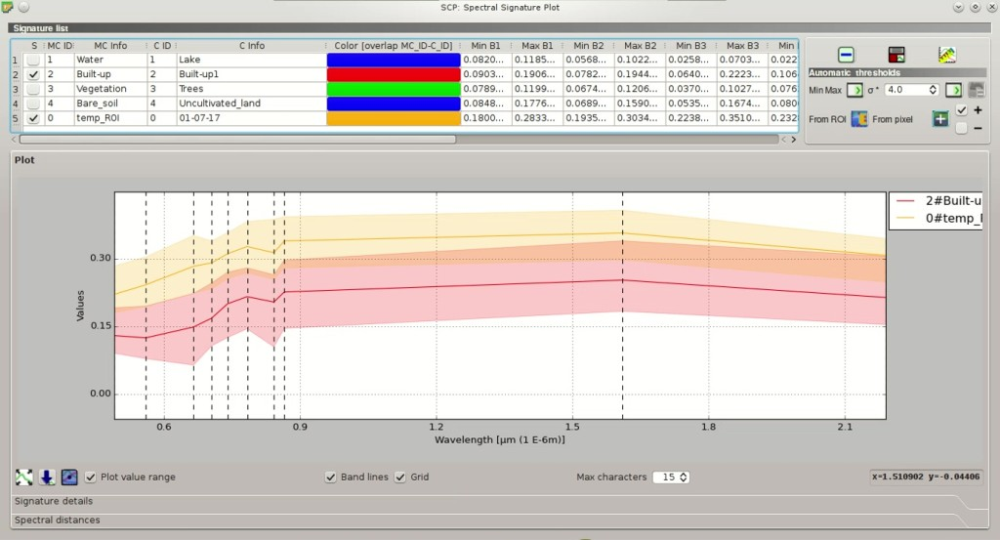
	
	:guilabel:`The plot of a temporary ROI`
	
Now check |checkbox| :guilabel:`MC ID` in :ref:`classification_alg`.
When |checkbox| :guilabel:`MC ID` is checked, the classification is performed using all the spectral signatures (without any modification of original spectral values) but assigning the macroclass code.
Moreover, only overlapping signatures belonging to different macroclasses are highlighted in :ref:`signature_list_plot`.
This allows spectral signatures sharing the same :guilabel:`MC ID` to be overlapping.

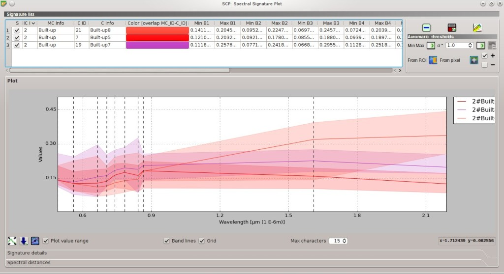
	
	:guilabel:`Overlapping regions belonging to the same MC ID`
	
Also, open the tab :ref:`LCS_threshold` for checking the overlap of all the spectral signatures saved in the :guilabel:`Training input`.
	
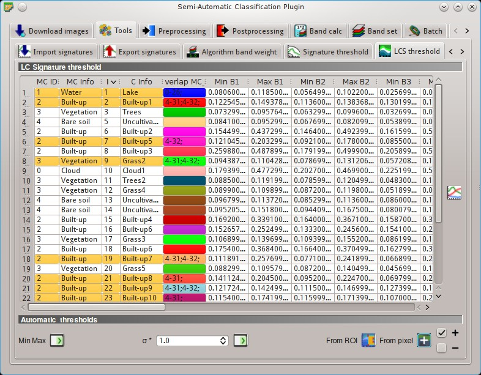
	
	:guilabel:`LCS threshold. Overlapping regions are highlighted in orange`
	
.. _tutorial_lcs_classification:

Land Cover Classification
------------------------------------------------------

After the creation of several ROIs and the definition of spectral ranges, we can perform the classification for the whole image.

Having selected |checkbox| :guilabel:`MC ID` and |checkbox| :guilabel:`LCS` in :ref:`classification_alg`, click the button |run| in the :ref:`classification_output` and select an output destination.
After the processing, the classification will be displayed in QGIS.

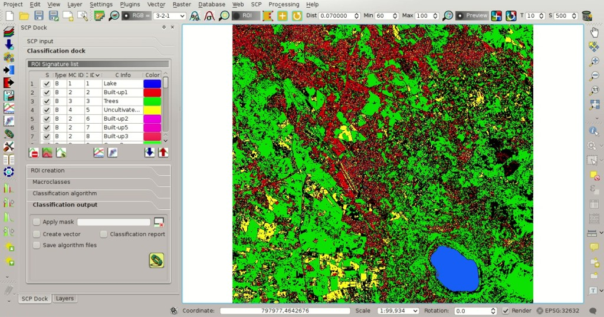
	
	:guilabel:`LCS classification`
	
Unclassified pixels, displayed in black, are pixels whose spectral signature is not completely contained in any spectral region.
Also, pixels contained in more than one spectral region (having different :guilabel:`MC ID`) are classified as :guilabel:`Class Overlap`.

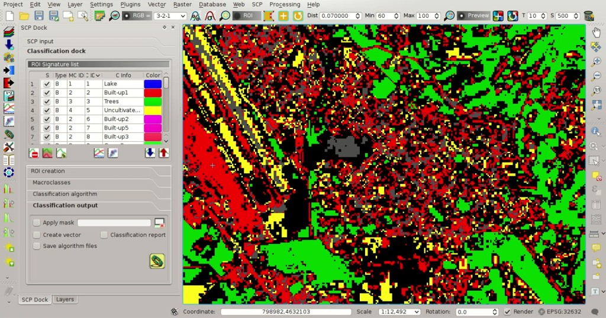
	
	:guilabel:`LCS classification. Class Overlap`

We could create other spectral regions in order to classify all the unclassified pixels.
Alternatively, we can use the selected :ref:`classification_algorithm` for classifying those pixels.
Check the |checkbox| :guilabel:`Algorithm` in :ref:`LCS_classification` and select the :ref:`minimum_distance_algorithm` in :ref:`classification_algorithm`; then click the button |run| in the :ref:`classification_output`. 

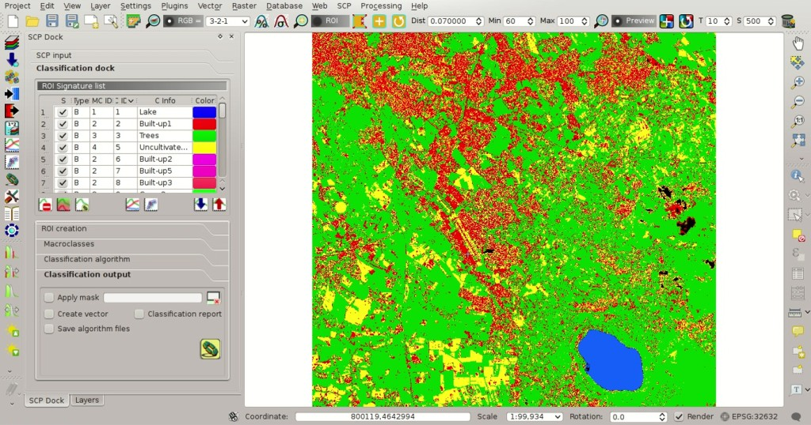
	
	:guilabel:`LCS classification. Classification using the additional classification algorithm`
	
Pixels that were unclassified by :guilabel:`LCS` now are classified using the :ref:`minimum_distance_algorithm`, which compares calculates the Euclidean distance between pixels and spectral signatures.
Black pixels are clouds classified using the special :guilabel:`MC ID` = 0.

In addition, we can use the :ref:`minimum_distance_algorithm` to classify only pixels that were labelled :guilabel:`Class Overlap` by :guilabel:`LCS`, leaving unclassified pixels whose spectral signature is not completely contained in any spectral region.
Check |checkbox| :guilabel:`only overlap` in :ref:`LCS_classification`, leaving checked |checkbox| :guilabel:`Algorithm`; then click the button |run| in the :ref:`classification_output`. 

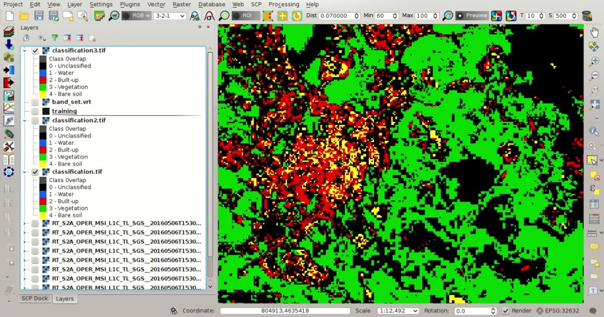
	
	:guilabel:`LCS classification. Classification using the additional classification algorithm only for Class Overlap`
	
The :ref:`LCS_algorithm` can be useful for the classification of a single land cover class, defining only the spectral ranges that identify our objective.
For instance, if we were interested in built-up classification only, we could collect only ROIs for this class, obtaining a classification such as in the following image.

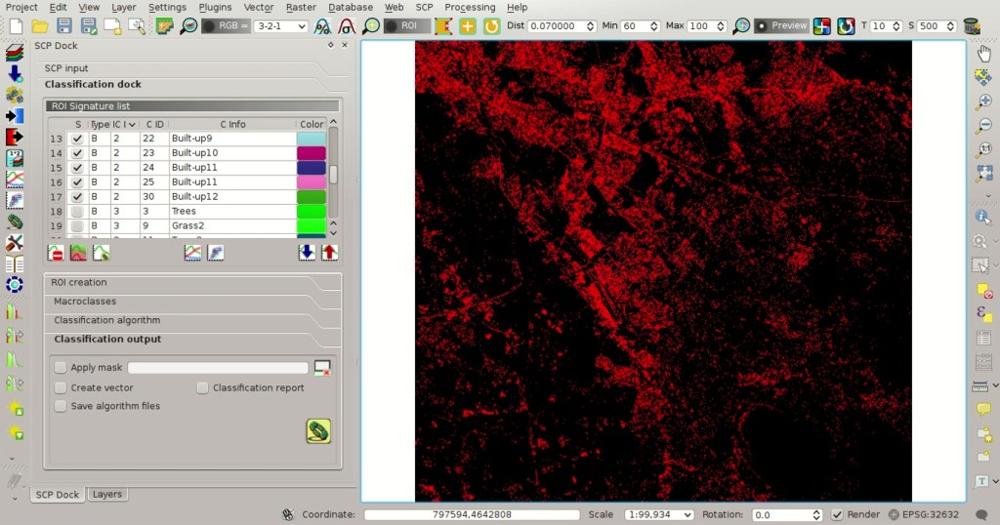
	
	:guilabel:`LCS classification. Classification of the class Built-up`
	
.. _other_tutorials_lcs:

Other Tutorials
----------------------------------------------

For other tutorials visit the blog `From GIS to Remote Sensing <http://fromgistors.blogspot.com/search/label/Tutorial>`_ .
