.. _thematic_tutorials_temperature:

***************************************************************************
Tutorial: Estimation of Land Surface Temperature with Landsat and ASTER
***************************************************************************

.. |br| raw:: html

  

.. |add| image:: _static/semiautomaticclassificationplugin_add.png
	:width: 20pt
	
.. |checkbox| image:: _static/checkbox.png
	:width: 18pt
	
.. |pointer| image:: _static/semiautomaticclassificationplugin_pointer_tool.png
	:width: 20pt
	
.. |radiobutton| image:: _static/radiobutton.png
	:width: 18pt
	
.. |reload| image:: _static/semiautomaticclassificationplugin_reload.png
	:width: 20pt
	
.. |reset| image:: _static/semiautomaticclassificationplugin_reset.png
	:width: 20pt
	
.. |remove| image:: _static/semiautomaticclassificationplugin_remove.png
	:width: 20pt
	
.. |run| image:: _static/semiautomaticclassificationplugin_run.png
	:width: 24pt
	
.. |open_file| image:: _static/semiautomaticclassificationplugin_open_file.png
	:width: 20pt
	
.. |new_file| image:: _static/semiautomaticclassificationplugin_new_file.png
	:width: 20pt
	
.. |open_dir| image:: _static/semiautomaticclassificationplugin_open_dir.png
	:width: 20pt
	
.. |select_all| image:: _static/semiautomaticclassificationplugin_select_all.png
	:width: 20pt
	
.. |move_up| image:: _static/semiautomaticclassificationplugin_move_up.png
	:width: 20pt
	
.. |move_down| image:: _static/semiautomaticclassificationplugin_move_down.png
	:width: 20pt
	
.. |search_images| image:: _static/semiautomaticclassificationplugin_search_images.png
	:width: 20pt

.. |image_preview| image:: _static/semiautomaticclassificationplugin_download_image_preview.png
	:width: 20pt

.. |import| image:: _static/semiautomaticclassificationplugin_import.png
	:width: 20pt
	
.. |export| image:: _static/semiautomaticclassificationplugin_export.png
	:width: 20pt

.. |plus| image:: _static/semiautomaticclassificationplugin_plus.png
	:width: 20pt

.. |order_by_name| image:: _static/semiautomaticclassificationplugin_order_by_name.png
	:width: 20pt

.. |sign_edit_range| image:: _static/semiautomaticclassificationplugin_sign_edit_range.png
	:width: 20pt
	
.. |image_overview| image:: _static/semiautomaticclassificationplugin_download_image_overview.png
	:width: 20pt
	
.. |enter| image:: _static/semiautomaticclassificationplugin_enter.png
	:width: 20pt

.. |download| image:: _static/semiautomaticclassificationplugin_download_arrow.png
	:width: 20pt
	
.. |landsat_download| image:: _static/semiautomaticclassificationplugin_landsat8_download_tool.png
	:width: 20pt

.. |sentinel_download| image:: _static/semiautomaticclassificationplugin_sentinel_download_tool.png
	:width: 20pt
	
.. |tools| image:: _static/semiautomaticclassificationplugin_roi_tool.png
	:width: 20pt
	
.. |roi_multiple| image:: _static/semiautomaticclassificationplugin_roi_multiple.png
	:width: 20pt

.. |import_spectral_library| image:: _static/semiautomaticclassificationplugin_import_spectral_library.png
	:width: 20pt
	
.. |export_spectral_library| image:: _static/semiautomaticclassificationplugin_export_spectral_library.png
	:width: 20pt
	
.. |weight_tool| image:: _static/semiautomaticclassificationplugin_weight_tool.png
	:width: 20pt
	
.. |threshold_tool| image:: _static/semiautomaticclassificationplugin_threshold_tool.png
	:width: 20pt
	
.. |LCS_threshold| image:: _static/semiautomaticclassificationplugin_LCS_threshold_tool.png
	:width: 20pt
	
.. |LCS_threshold_set_tool| image:: _static/semiautomaticclassificationplugin_LCS_threshold_set_tool.png
	:width: 20pt
	
.. |preprocessing| image:: _static/semiautomaticclassificationplugin_class_tool.png
	:width: 20pt
	
.. |landsat_tool| image:: _static/semiautomaticclassificationplugin_landsat8_tool.png
	:width: 20pt
	
.. |sentinel2_tool| image:: _static/semiautomaticclassificationplugin_sentinel_tool.png
	:width: 20pt
	
.. |aster_tool| image:: _static/semiautomaticclassificationplugin_aster_tool.png
	:width: 20pt
	
.. |split_raster| image:: _static/semiautomaticclassificationplugin_split_raster.png
	:width: 20pt
	
.. |clip_tool| image:: _static/semiautomaticclassificationplugin_clip_tool.png
	:width: 20pt
	
.. |pca_tool| image:: _static/semiautomaticclassificationplugin_pca_tool.png
	:width: 20pt
	
.. |vector_to_raster_tool| image:: _static/semiautomaticclassificationplugin_vector_to_raster_tool.png
	:width: 20pt
	
.. |post_process| image:: _static/semiautomaticclassificationplugin_post_process.png
	:width: 20pt
	
.. |accuracy_tool| image:: _static/semiautomaticclassificationplugin_accuracy_tool.png
	:width: 20pt
	
.. |land_cover_change| image:: _static/semiautomaticclassificationplugin_land_cover_change.png
	:width: 20pt
	
.. |report_tool| image:: _static/semiautomaticclassificationplugin_report_tool.png
	:width: 20pt

.. |class_to_vector_tool| image:: _static/semiautomaticclassificationplugin_class_to_vector_tool.png
	:width: 20pt

.. |reclassification_tool| image:: _static/semiautomaticclassificationplugin_reclassification_tool.png
	:width: 20pt

.. |edit_raster| image:: _static/semiautomaticclassificationplugin_edit_raster.png
	:width: 20pt

.. |undo_edit_raster| image:: _static/semiautomaticclassificationplugin_undo_edit_raster.png
	:width: 20pt

.. |classification_sieve| image:: _static/semiautomaticclassificationplugin_classification_sieve.png
	:width: 20pt

.. |classification_erosion| image:: _static/semiautomaticclassificationplugin_classification_erosion.png
	:width: 20pt

.. |classification_dilation| image:: _static/semiautomaticclassificationplugin_classification_dilation.png
	:width: 20pt

.. |bandcalc_tool| image:: _static/semiautomaticclassificationplugin_bandcalc_tool.png
	:width: 20pt
	
.. |batch_tool| image:: _static/semiautomaticclassificationplugin_batch.png
	:width: 20pt

.. |bandset_tool| image:: _static/semiautomaticclassificationplugin_bandset_tool.png
	:width: 20pt
	
.. |settings_tool| image:: _static/semiautomaticclassificationplugin_settings_tool.png
	:width: 20pt
	
.. |manual_ROI| image:: _static/semiautomaticclassificationplugin_manual_ROI.png
	:width: 20pt

.. |save_roi| image:: _static/semiautomaticclassificationplugin_save_roi.png
	:width: 20pt
	
.. |roi_single| image:: _static/semiautomaticclassificationplugin_roi_single.png
	:width: 20pt
	
.. |roi_redo| image:: _static/semiautomaticclassificationplugin_roi_redo.png
	:width: 20pt

.. |preview| image:: _static/semiautomaticclassificationplugin_preview.png
	:width: 20pt
	
.. |preview_redo| image:: _static/semiautomaticclassificationplugin_preview_redo.png
	:width: 20pt
	
.. |delete_signature| image:: _static/semiautomaticclassificationplugin_delete_signature.png
	:width: 20pt

.. |sign_plot| image:: _static/semiautomaticclassificationplugin_sign_tool.png
	:width: 20pt

.. |cumulative_stretch| image:: _static/semiautomaticclassificationplugin_bandset_cumulative_stretch_tool.png
	:width: 20pt

.. |std_dev_stretch| image:: _static/semiautomaticclassificationplugin_bandset_std_dev_stretch_tool.png
	:width: 20pt

.. |calculate_spectral_distances| image:: _static/semiautomaticclassificationplugin_calculate_spectral_distances.png
	:width: 20pt
	
.. |LCS_threshold_ROI_tool| image:: _static/semiautomaticclassificationplugin_LCS_threshold_ROI_tool.png
	:width: 20pt
	
.. contents::
    :depth: 2
    :local:
	
This tutorial is about the estimation land surface temperature using :ref:`Landsat_definition` and :ref:`ASTER_definition` images.
In this tutorial we are going to use a **land cover classification** for the definition of **surface emissivity**, which is required for the calculation of the **land surface temperature**.
It is assumed that one has the basic knowledge of :guilabel:`SCP` and :ref:`tutorials`.

Our study area will be Paris (France), an area covered by urban surfaces, vegetation and agricultural fields.

Before downloading data, please watch the following video that illustrates the study area and provides very useful information about thermal infrared images, and their application (footage courtesy of European Space Agency/ESA).
Also, a brief description of the area that we are going to classify is available `here <http://www.esa.int/Our_Activities/Observing_the_Earth/Earth_from_Space_Hot_spots>`_ .

.. raw:: html

	<iframe allowfullscreen="" frameborder="0" height="360" src="http://www.youtube.com/embed/Vjg5REQb-Bc?rel=0" width="100%"></iframe> 

http://www.youtube.com/watch?v=Vjg5REQb-Bc

The **thermal infrared** band is particularly useful for assessing the temperature difference between the city and the surrounding rural areas, and studying the urban heat island phenomenon.
We are going to use **Landsat and ASTER images** for the estimation of land surface temperature.
For more information about the conversion of raster bands please read :ref:`landsat_conversion_to_temperature`.
Following the video of this tutorial.

.. raw:: html

	<iframe allowfullscreen="" frameborder="0" height="360" src="http://www.youtube.com/embed/7W4IwlvPLbQ?rel=0" width="100%"></iframe>

http://www.youtube.com/watch?v=7W4IwlvPLbQ

.. _tutorial_temperature_download_data:

Data Download and Conversion
---------------------------------

We are going to download the **Landsat 8** image acquired in 2015 (image ID = ``LC81990262015270LGN00``, data available from the U.S. Geological Survey).

Start a new QGIS project.
Open the tab :ref:`download_tab` clicking the button |download| in the :ref:`SCP_menu`, or the :ref:`toolbar_tools`, or the :ref:`SCP_dock`.
Select the tab :ref:`Landsat_download_tab`.

In :ref:`login_Landsat` you should enter the user name and password for accessing data (`free registration at USGS EROS is required <https://ers.cr.usgs.gov/register>`_) in :guilabel:`User` and :guilabel:`Password`.
However, in this case login should not be required because this Landsat 8 image is available directly from the `Amazon Web Services (AWS) <http://aws.amazon.com/public-data-sets/landsat/>`_ .

In :ref:`search_area_Landsat` enter:

* :guilabel:`UL X (Lon)`: 2
* :guilabel:`UL Y (Lat)`: 49
* :guilabel:`LR X (Lon)`: 2.5
* :guilabel:`LR Y (Lat)`: 48.8

	**TIP** : In general it is possible to define the area coordinates clicking the button |pointer| and drawing a rectangle in the map.
	
In :ref:`search_Landsat` select ``L8 OLI/TIRS`` from the list :guilabel:`Satellites` and set the acquisition date:

* :guilabel:`Date from`: 2015-09-27
* :guilabel:`to`: 2015-09-27

Now click the button :guilabel:`Find` |search_images| and after a few seconds the image will be listed in the ``Image list``.

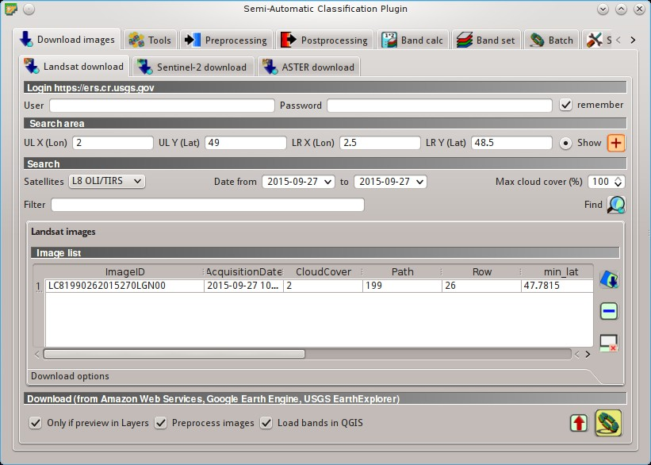
	
	:guilabel:`Landsat search result`
	
In the result table, click the item ``LC81990262015270LGN00`` in the field :guilabel:`ImageID`, and click the button |image_preview|.
A preview will be downloaded and displayed in the map, which is useful for assessing the quality of the image and the cloud cover.
	
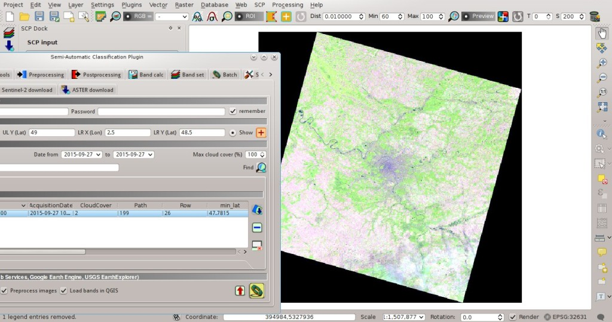
	
	:guilabel:`Image preview`
	
Click the tab :ref:`landsat_download_options` and leave checked only the following bands:

* 2 = Blue
* 3 = Green
* 4 = Red
* 5 = Near-Infrared
* 6 = Short Wavelength Infrared 1
* 7 = Short Wavelength Infrared 2
* 10 = Thermal Infrared (TIRS) 1

Bands from 2 to 7 will be used for the land cover classification, and band 10 for the estimation of land surface temperature (see :ref:`FAQ_processing_2`).

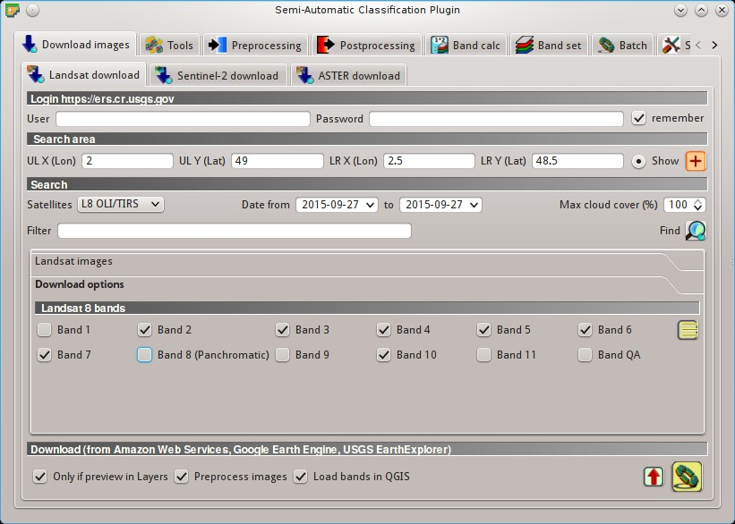

	:guilabel:`Selection of bands for download`
	
The checkbox |checkbox| :guilabel:`Preprocess images` allows for the automatic conversion of bands after the download, according to the settings defined in :ref:`landsat_tab`; we are going to apply the :ref:`DOS1_correction`.
Bands from 2 to 7 will be converted to reflectance and band 10 will be converted to At-Satellite Brightness Temperature.
Open the tab :ref:`landsat_tab`, check |checkbox| :guilabel:`Apply DOS1 atmospheric correction` and uncheck |checkbox| :guilabel:`Create Band set and use Band set tools` (we are going to create the :guilabel:`Band set` after the clip of the image to study area).
	
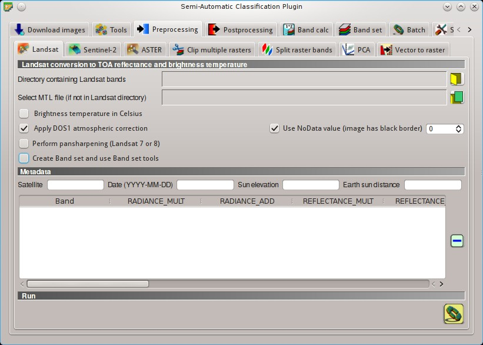

	:guilabel:`Conversion settings`
	
In order to start the **download and conversion process**, open the tab :ref:`Landsat_download_tab`, click the button |run| and select the directory where converted bands are saved (e.g. ``Desktop``).
After a few minutes, converted bands are loaded and displayed (file name starts with ``RT_``).

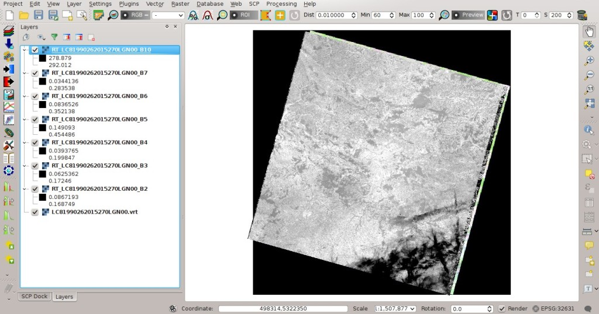

	:guilabel:`Converted Landsat bands`
	
.. _tutorial_temperature_clip:

Clip to Study Area
------------------------------------------------------

We are going to **clip the Landsat images** to our study area.

Open the tab :ref:`pre_processing_tab` clicking the button |preprocessing| in the :ref:`SCP_menu`, or the :ref:`toolbar_tools`, or the :ref:`SCP_dock`.
Select the tab :ref:`clip_multiple_rasters_tab` and click the button |reload| to refresh the layer list and show the loaded rasters.
Click the button |select_all| to select all the rasters to be clipped, and in :ref:`clip_coordinates` type the following values:

* :guilabel:`UL X`: 402705
* :guilabel:`UL Y`: 5461065
* :guilabel:`LR X`: 480824
* :guilabel:`LR Y`: 5381535

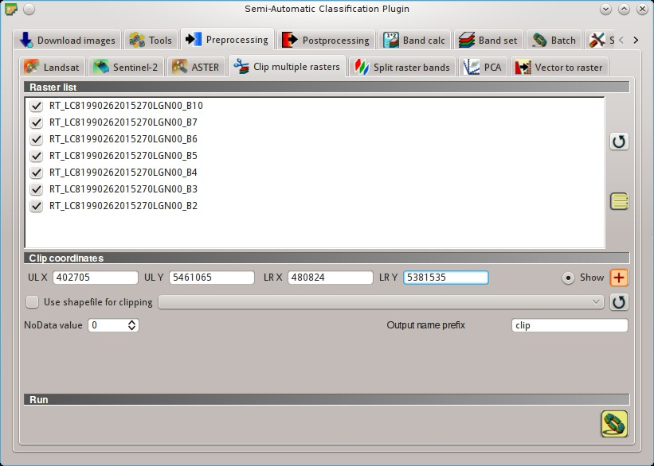

	:guilabel:`Clip area`
	
Now click the button |run| and select the directory where clipped bands are saved (e.g. ``Desktop``).
Clipped bands have the prefix ``clip_`` and will be automatically loaded and displayed.
We can remove the bands whose names start with ``RT_`` from QGIS layers.

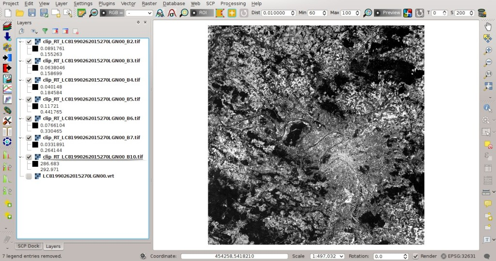

	:guilabel:`Clipped bands`
	
.. _tutorial_temperature_classification:

Land Cover Classification
------------------------------------------------------

Now we need to classify land cover, which will be used later for the creation of the emissivity raster.
For detailed instructions about the **classification process** please see :ref:`tutorial_2`.

We are going to use the following **Macroclass IDs** (see :ref:`classes_definition`).
	
	:guilabel:`Macroclasses`
	
+-----------------------------+--------------------------+
| Macroclass name             | Macroclass ID            |
+=============================+==========================+
| Water                       |  1                       |
+-----------------------------+--------------------------+
| Built-up                    |  2                       |
+-----------------------------+--------------------------+
| Vegetation                  |  3                       |
+-----------------------------+--------------------------+
| Bare soil                   |  4                       |
+-----------------------------+--------------------------+

Open the tab :ref:`band_set_tab` clicking the button |bandset_tool| and define the Landsat 8 :guilabel:`Band set` using clipped bands from 2 to 7 (excluding band 10).

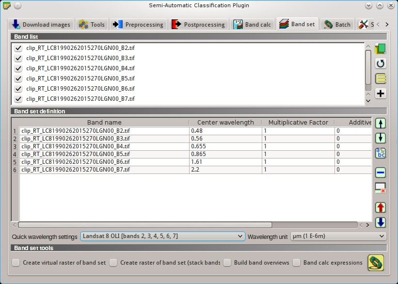

	:guilabel:`Band set`
	
In the :ref:`SCP_dock` click the button |new_file| , define a file name for the :guilabel:`Training input`.
In the list :guilabel:`RGB=` of :ref:`working_toolbar` select ``4-3-2`` to display a false color composite corresponding to the bands: Near-Infrared, Red, and Green (see :ref:`color_composite_definition`).

.. figure:: _static/tutorial_temperature/tutorial_temperature_3_2.jpg
	:align: center

	:guilabel:`Color composite`
	
After the creation of several ROIs for each land cover class, we can perform the classification of the whole image (see :ref:`tutorial_2`).
After setting the colors of :guilabel:`MC ID` (in the tab :ref:`classification_style` of the :ref:`SCP_dock`), in the tab :ref:`classification_alg` check the option |checkbox| :guilabel:`MC ID` to use Macroclass IDs and select the classification algorithm :ref:`max_likelihood_algorithm`.

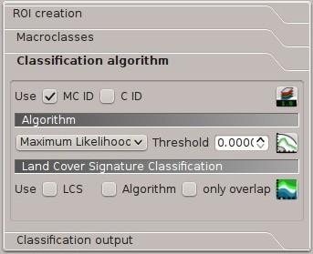

	:guilabel:`Classification algorithm`
	
Then, open the tab :ref:`classification_output`, click the button |run| and define the name of the classification output.

.. figure:: _static/tutorial_temperature/tutorial_temperature_3_4.jpg
	:align: center

	:guilabel:`Land cover classification`

.. _tutorial_temperature_reclassification:

Reclassification of Land Cover Classification to Emissivity Values
--------------------------------------------------------------------------

Now we are going to reclassify the classification raster using the **land surface emissivity** values.
The emissivity (e) values for the land cover classes are provided in the following table (values used in this tutorial are only indicative, because emissivity of every material should be obtained from field survey):

	:guilabel:`Emissivity values`
	
+-----------------------------+--------------------------+
| Land surface                | Emissivity e             |
+=============================+==========================+
| Water                       |  0.98                    |
+-----------------------------+--------------------------+
| Built-up                    |  0.94                    |
+-----------------------------+--------------------------+
| Vegetation                  |  0.98                    |
+-----------------------------+--------------------------+
| Bare soil                   |  0.93                    |
+-----------------------------+--------------------------+

Open the tab :ref:`post_processing_tab` clicking the button |post_process| in the :ref:`SCP_menu`, or the :ref:`toolbar_tools`, or the :ref:`SCP_dock`.
Select the tab :ref:`reclassification_tab` and click the button |reload| to refresh the layer list and show the loaded rasters.
Select the classification raster from the list.

Click the button |add| to add 4 rows to the table :guilabel:`Values`.
In this table, set the old value (the Macroclass ID of the classification) and the new value (the corresponding emissivity e ) for every land cover class.
Uncheck the checkbox |checkbox| :guilabel:`Use code from Signature list`, click the button |run| and define the name of the output raster (e.g. ``emissivity.tif``).

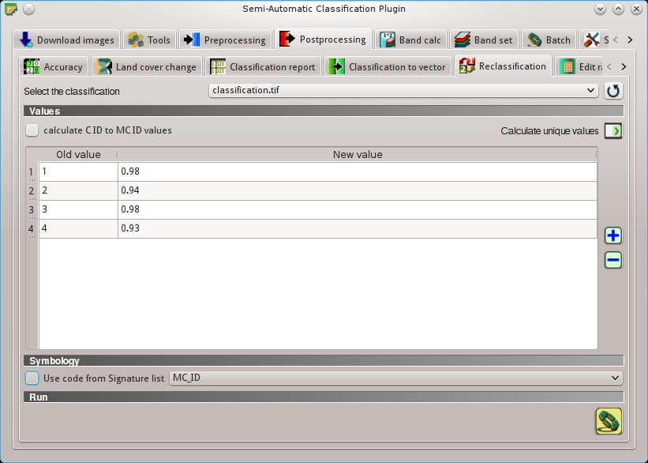

	:guilabel:`Reclassification`

This is the emissivity raster, where each pixel has the emissivity value that we have defined for the respective land cover class.

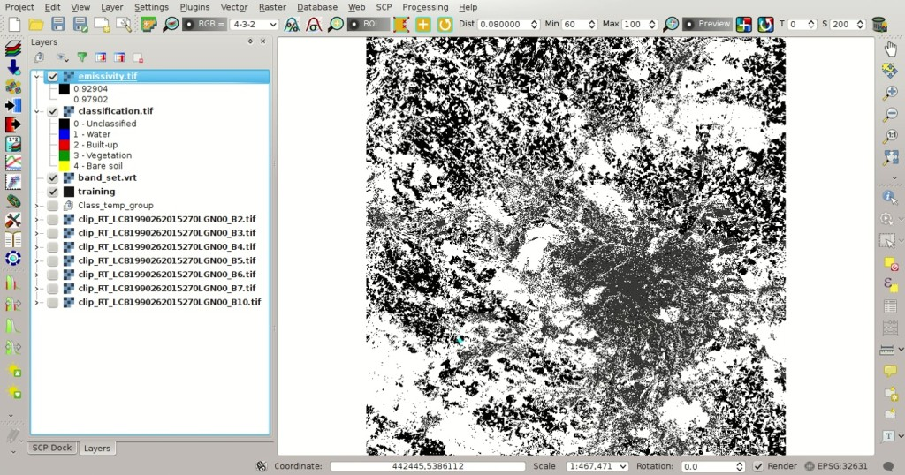

	:guilabel:`Emissivity raster`
	
.. _tutorial_temperature_conversion:

Conversion from At-Satellite Temperature to Land Surface Temperature
--------------------------------------------------------------------------

Now we are ready to convert the At-Satellite Brightness Temperature to **Land Surface Temperature**, using the following equation (see :ref:`conversion_to_surface_temperature`):

.. math::
	T = T_{B} / [ 1 +  (\lambda * T_{B} / c_{2}) * ln(e) ]

where:

* :math:`\lambda` = wavelength of emitted radiance
* :math:`c_{2} = h * c / s = 1.4388 * 10^{-2}` m K = 14388 µm K
* :math:`h` = Planck’s constant = :math:`6.626 * 10^{-34}`  J s
* :math:`s` = Boltzmann constant = :math:`1.38 * 10^{-23}` J/K
* :math:`c` = velocity of light = :math:`2.998 * 10^{8}` m/s

The values of :math:`\lambda` for Landsat bands are listed in the following table.

	:guilabel:`Center wavelength of Landsat bands`
	
+-----------------------------+--------------------------+--------------------------+
| Satellite                   | Band                     |  :math:`\lambda  (µm)`   |
+=============================+==========================+==========================+
| Landsat 4, 5, and 7         |  6                       |  11.45                   |
+-----------------------------+--------------------------+--------------------------+
| Landsat 8                   |  10                      |  10.8                    |
+-----------------------------+--------------------------+--------------------------+
| Landsat 8                   |  11                      |  12                      |
+-----------------------------+--------------------------+--------------------------+

Open the tab :ref:`band_calc_tab` clicking the button |bandcalc_tool| in the :ref:`SCP_menu`, or the :ref:`toolbar_tools`, or the :ref:`SCP_dock`.
Click the button |reload| to refresh the layer list and show the loaded rasters.
We have used band 10 of Landsat 8, therefore in the :ref:`expression` type the equation for conversion adapted to our rasters::

	"clip_RT_LC81990262015270LGN00_B10.tif" / ( 1 + ( 10.8 * "clip_RT_LC81990262015270LGN00_B10.tif" / 14388 ) * ln("emissivity.tif") )

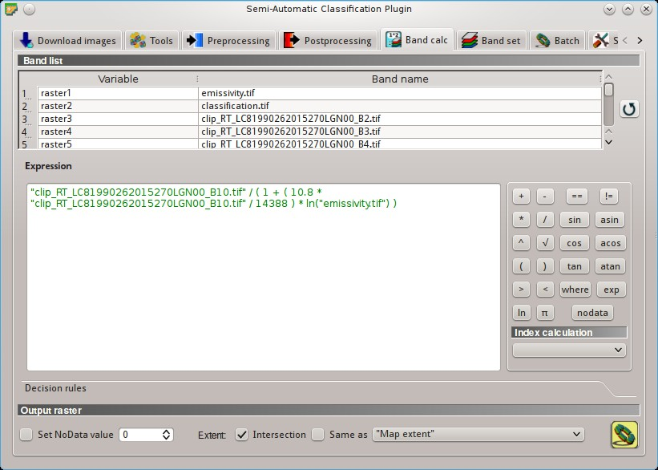

	:guilabel:`Calculation of surface temperature`
	
Click the button |run| and define the name of the output raster (e.g. ``surface_temperature.tif``).
After the calculation, the Land Surface Temperature (in kelvin) will be loaded, and we can change the layer style.
In addition, in the tab :ref:`band_calc_tab` we can calculate the temperature in Celsius with the expression::

	"surface_temperature.tif" - 273.15

|br|

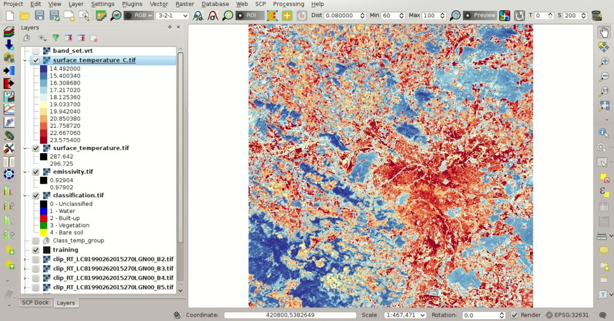

	:guilabel:`Land Surface Temperature of the Landsat Image`
	

We can notice that the urban area and uncultivated land have the highest temperatures, while vegetation has the lowest temperature.
The aim of this tutorial is to describe a methodology for the estimation of surface temperature using open source programs and free images.
It is worth highlighting that in order to achieve more accurate results, one should perform field survey for improving the land cover classification and the estimation of surface emissivities.

In addition to Landsat, we are going to use an ASTER image and use the same methodology for the estimation of Land Surface Temperature.

.. _tutorial_temperature_download_ASTER_data:

Data Download and Conversion of ASTER Image
-----------------------------------------------

Open the tab :ref:`download_tab` and select the tab :ref:`ASTER_download_tab`.

In :ref:`login_ASTER` enter the user name and password required for accessing data (`free registration at EOSDIS Earthdata is required <https://urs.earthdata.nasa.gov/users/new>`_) in :guilabel:`User` and :guilabel:`Password`.
The ASTER L1T data products are retrieved from the online Data Pool, courtesy of the NASA Land Processes Distributed Active Archive Center (LP DAAC), USGS/Earth Resources Observation and Science (EROS) Center, Sioux Falls, South Dakota, https://lpdaac.usgs.gov/data_access/data_pool.

In :ref:`search_area_ASTER` enter:

* :guilabel:`UL X (Lon)`: 2
* :guilabel:`UL Y (Lat)`: 49
* :guilabel:`LR X (Lon)`: 2.5
* :guilabel:`LR Y (Lat)`: 48.8
	
In :ref:`search_ASTER` set the acquisition date:

* :guilabel:`Date from`: 2000-08-24
* :guilabel:`to`: 2000-08-24

Now click the button :guilabel:`Find` |search_images| and after a few seconds the image will be listed in the ``Image list``.

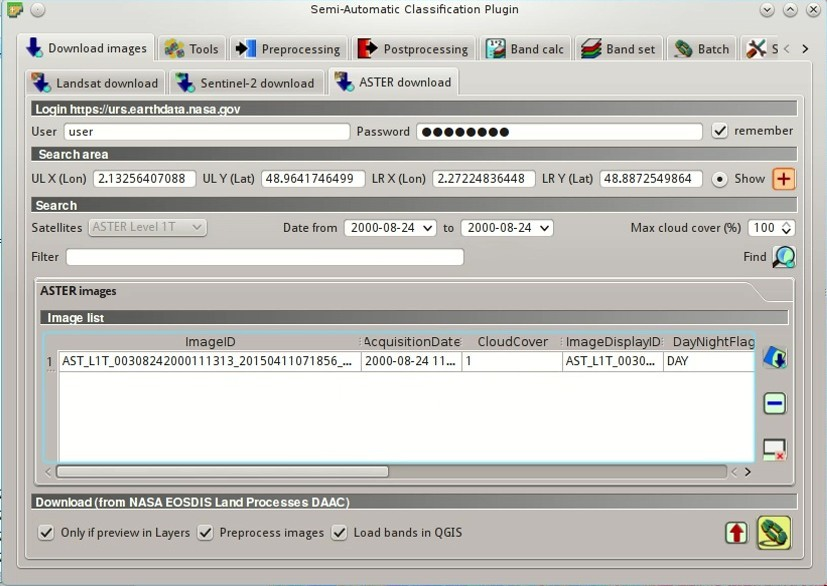
	
	:guilabel:`ASTER search result`
	
In the result table, click the item ``AST_L1T_00308242000111313_20150411071856_3805`` in the field :guilabel:`ImageID`, and click the button |image_preview|.
A preview will be downloaded and displayed in the map, which is useful for assessing the quality of the image and the cloud cover.
	
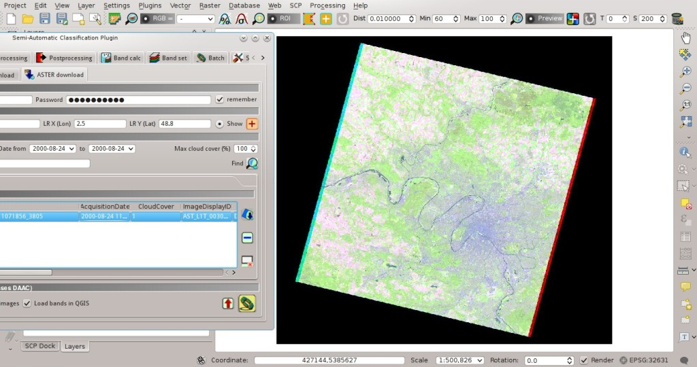
	
	:guilabel:`ASTER image preview`

As we did for Landsat, we are going to apply the :ref:`DOS1_correction`.
The checkbox |checkbox| :guilabel:`Preprocess images` allows for the automatic conversion of bands after the download, according to the settings defined in :ref:`aster_tab`.
Bands from 1 to 9 will be converted to reflectance and bands from 10 to 14 will be converted to At-Satellite Brightness Temperature.

Open the tab :ref:`aster_tab`, check |checkbox| :guilabel:`Apply DOS1 atmospheric correction` and leave checked |checkbox| :guilabel:`Create Band set and use Band set tools` (this is useful to automatiacally create a :guilabel:`Band set`, which is required for the next step).
	
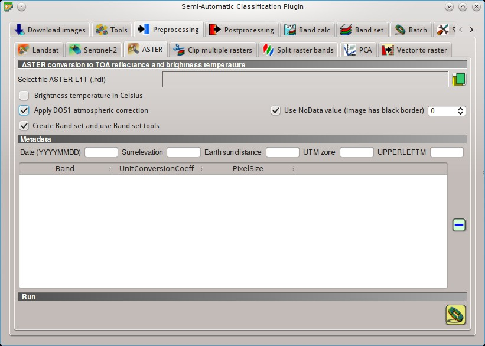

	:guilabel:`Conversion settings`
	
In order to start the **download and conversion process**, open the tab :ref:`ASTER_download_tab`, click the button |run| and select the directory where converted bands are saved (e.g. ``Desktop``).
After a few minutes, converted bands are loaded and displayed (file name starts with ``RT_``).

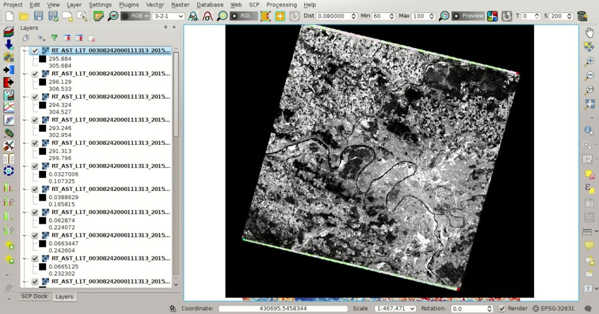

	:guilabel:`Converted ASTER bands`
	
.. _tutorial_temperature_clip_aster:

Clip to Study Area of ASTER image
------------------------------------------------------

We are going to **clip the ASTER images** to our study area, because bands are not aligned at the border.

Open the tab :ref:`pre_processing_tab` clicking the button |preprocessing|.
Select the tab :ref:`clip_multiple_rasters_tab` and click the button |reload| to refresh the layer list and show the loaded rasters.
:guilabel:`Band set`Click the button |select_all| to select all the rasters to be clipped, and check |checkbox| :guilabel:`Use temporary ROI for clipping`.
Now, we can draw a manual ROI (because a :guilabel:`Band set` is already defined, see :ref:`ROI_creation`) about the same shape of the ASTER image, about 20 pixels within the border thereof (in order to align the border of all the bands).

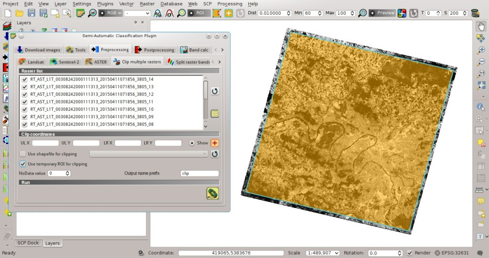

	:guilabel:`Clip area`
	
Now click the button |run| and select the directory where clipped bands are saved (e.g. ``Desktop``).
Clipped bands have the prefix ``clip_`` and will be automatically loaded and displayed.
We can remove the bands whose names start with ``RT_`` from QGIS layers.

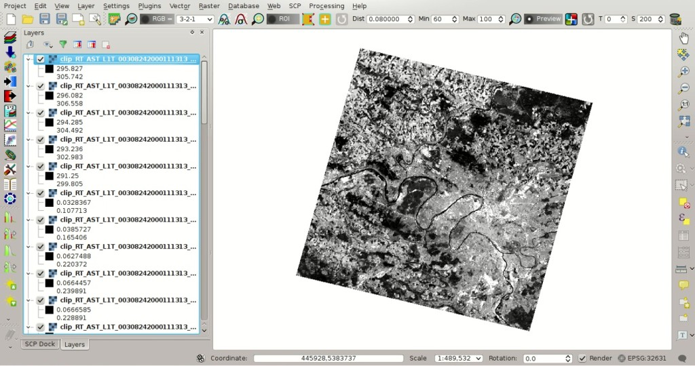

	:guilabel:`Clipped bands`
	
	
.. _tutorial_temperature_classification_ASTER:

Land Cover Classification of ASTER Image
------------------------------------------------------

Using the same Macroclass IDs used for Landsat, we are going to classify the ASTER image.

Open the tab :ref:`band_set_tab` clicking the button |bandset_tool|.
Click tha button |reset| to clear all bands from :guilabel:`Band set` and define the ASTER :guilabel:`Band set` using the clipped bands from 1 to 9.

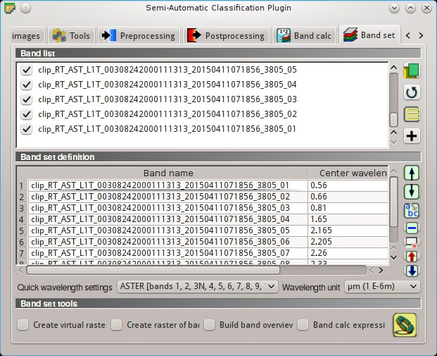

	:guilabel:`ASTER band set`
	
In the :ref:`SCP_dock` click the button |new_file| , define a file name for the :guilabel:`Training input` (e.g. ``training_ASTER``).
Clear the table :ref:`ROI_list` highlighting all the spectral signatures created previously for Landsat and clicking the button |delete_signature|.

In the list :guilabel:`RGB=` of :ref:`working_toolbar` select ``3-2-1`` to display a false color composite corresponding to the bands: Near-Infrared, Red, and Green (see :ref:`color_composite_definition`).

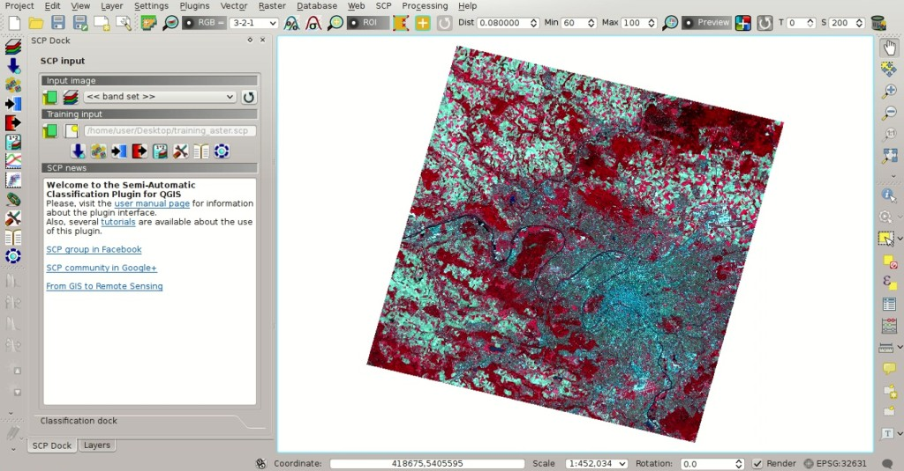

	:guilabel:`ASTER color composite`
	
After the creation of several ROIs for each land cover class, we can perform the classification of the whole image.
After setting the colors of :guilabel:`MC ID` (in the tab :ref:`classification_style` of the :ref:`SCP_dock`), in the tab :ref:`classification_alg` check the option |checkbox| :guilabel:`MC ID` to use Macroclass IDs and select the classification algorithm :ref:`max_likelihood_algorithm`.
Then, open the tab :ref:`classification_output`, click the button |run| and define the name of the classification output (e.g. ``classification_aster.tif``).

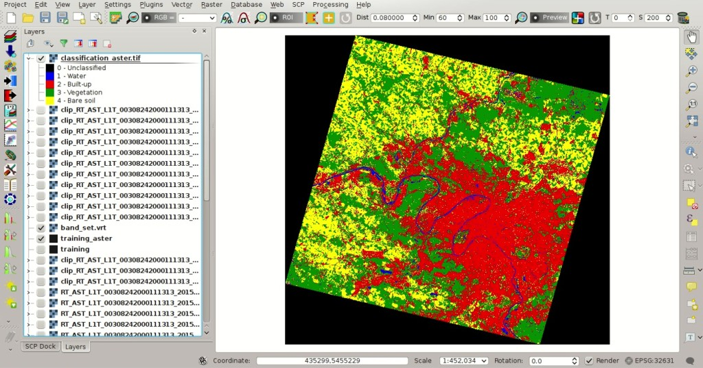

	:guilabel:`ASTER land cover classification`

.. _tutorial_temperature_reclassification_ASTER:

Reclassification of Land Cover Classification to Emissivity Values of ASTER Image
------------------------------------------------------------------------------------------

Now we are going to reclassify the classification raster using the same **land surface emissivity** values used for Landsat.

Open the tab :ref:`post_processing_tab` clicking the button |post_process|.
Select the tab :ref:`reclassification_tab` and click the button |reload| to refresh the layer list and show the loaded rasters.
Select the classification raster from the list.

Click the button |add| to add 4 rows to the table :guilabel:`Values`.
In this table, set the old value (the Macroclass ID of the classification) and the new value (the corresponding emissivity e ) for every land cover class.
Uncheck the checkbox |checkbox| :guilabel:`Use code from Signature list`, click the button |run| and define the name of the output raster (e.g. ``emissivity_aster.tif``).

	:guilabel:`ASTER reclassification`

The following figure show the emissivity raster of ASTER image.

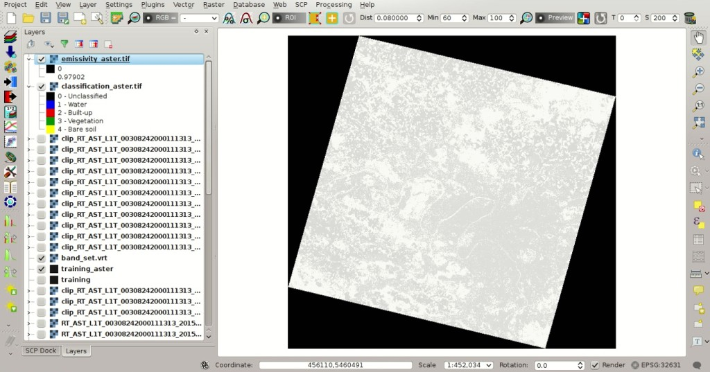

	:guilabel:`ASTER emissivity raster`
	
.. _tutorial_temperature_conversion_ASTER:

Conversion from At Satellite Temperature to Land Surface Temperature of ASTER Image
-------------------------------------------------------------------------------------

We can convert the At-Satellite Brightness Temperature to **Land Surface Temperature**, using the same equation used for Landsat (see :ref:`conversion_to_surface_temperature`).

The values of :math:`\lambda` for ASTER bands are listed in the following table.

	:guilabel:`Center wavelength of ASTER bands`
	
+-----------------------------+--------------------------+--------------------------+
| Satellite                   | Band                     |  :math:`\lambda  (µm)`   |
+=============================+==========================+==========================+
| ASTER                       |  10                      |  8.3                     |
+-----------------------------+--------------------------+--------------------------+
| ASTER                       |  11                      |  8.65                    |
+-----------------------------+--------------------------+--------------------------+
| ASTER                       |  12                      |  9.1                     |
+-----------------------------+--------------------------+--------------------------+
| ASTER                       |  13                      |  10.6                    |
+-----------------------------+--------------------------+--------------------------+
| ASTER                       |  14                      |  11.3                    |
+-----------------------------+--------------------------+--------------------------+

We are going to use ASTER band 13 that has a :math:`\lambda` value very similar to the Landsat band 10.

Open the tab :ref:`band_calc_tab` clicking the button |bandcalc_tool|.
Click the button |reload| to refresh the layer list and show the loaded rasters, and in the :ref:`expression` type equation for conversion adapted to our rasters::

	"clip_RT_AST_L1T_00308242000111313_20150411071856_3805_13.tif" / ( 1 + ( 10.6 * "clip_RT_AST_L1T_00308242000111313_20150411071856_3805_13.tif" / 14388 ) * ln("emissivity_aster.tif") )

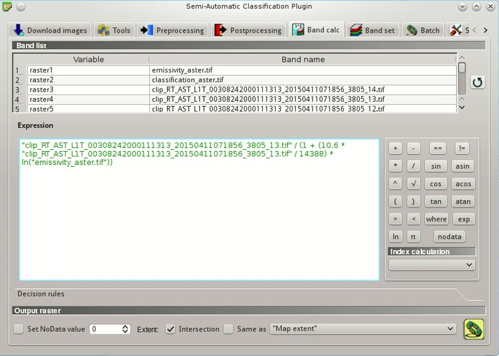

	:guilabel:`Calculation of surface temperature`
	
Click the button |run| and define the name of the output raster (e.g. ``surface_temperature_aster.tif``).
After the calculation, the Land Surface Temperature (in kelvin) will be loaded, and we can change the layer style.
In addition, in the tab :ref:`band_calc_tab` we can calculate the temperature in Celsius with the expression::

	"surface_temperature_aster.tif" - 273.15

|br|

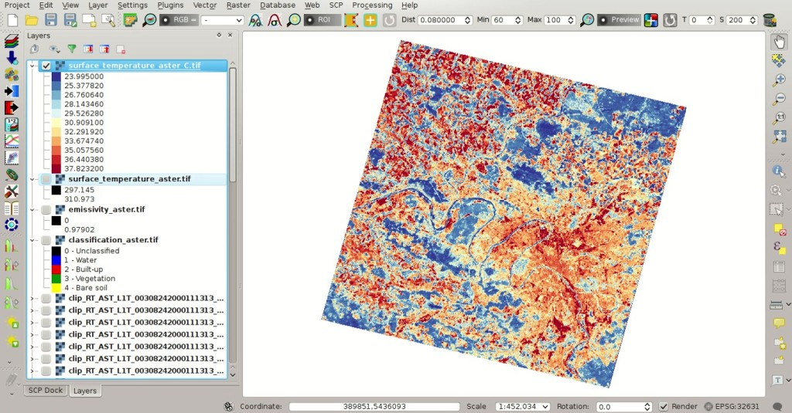

	:guilabel:`Land Surface Temperature of the ASTER Image`
	
The ASTER image shows temperature values higher than the Landsat image.
For instance, we could perform the difference between the two surface temperature rasters (Landsat and ASTER) to assess the variation of temperature.
However, we should notice that the two images were acquired in different months (Landsat on 27-09-2015 and ASTER on 24-08-2000).

The large availability of Landsat and ASTER images for the past decades allows for the reliable monitoring of land cover and surface temperature.
Nevertheless, cloud cover can limit the number of images that can be effectively used.

This tutorial illustrated a methodology of temperature estimation using these satellite images and open source programs.
One should always consider that the estimation accuracy depends on several factors, such as the thematic and spatial accuracy of land cover classifications and the reliability of the emissivity values.
Estimation errors can be of 1 K or even more.
Other methods have been developed which can provide more accurate results, and the reader can continue the research.

.. _other_tutorials_temperature:

Other Tutorials
----------------------------------------------

For other tutorials visit the blog `From GIS to Remote Sensing <http://fromgistors.blogspot.com/search/label/Tutorial>`_ .
