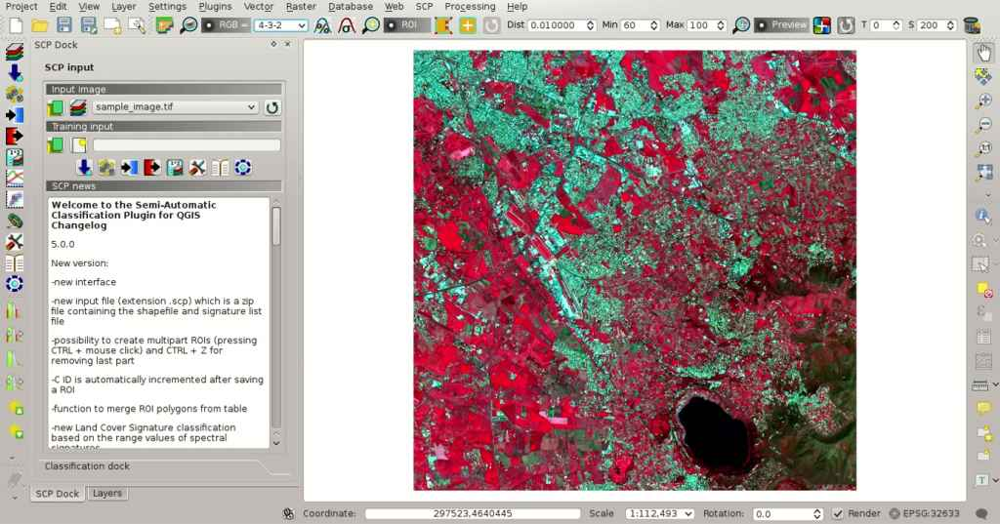
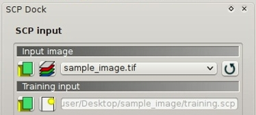
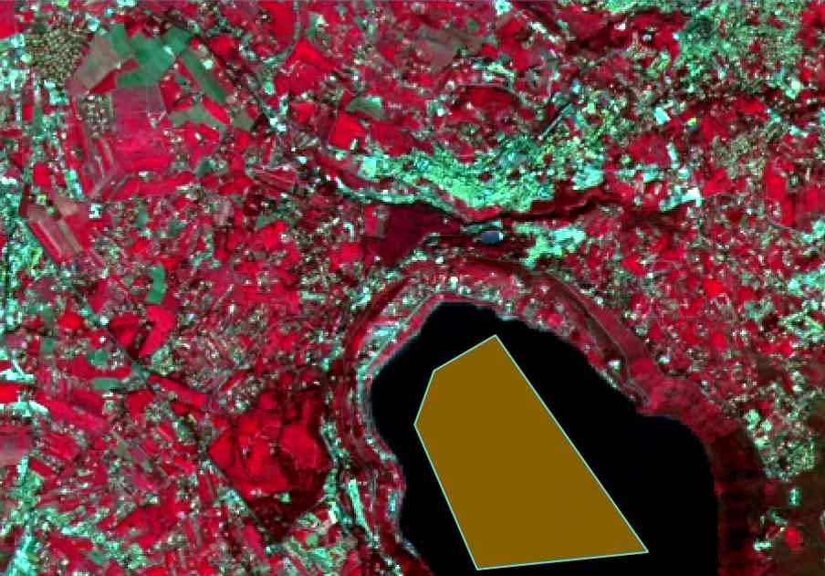
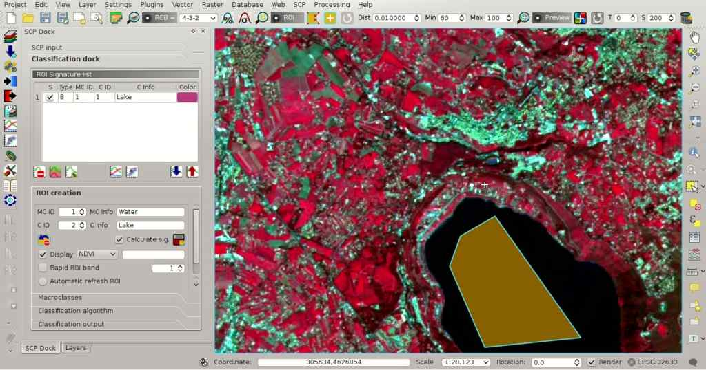
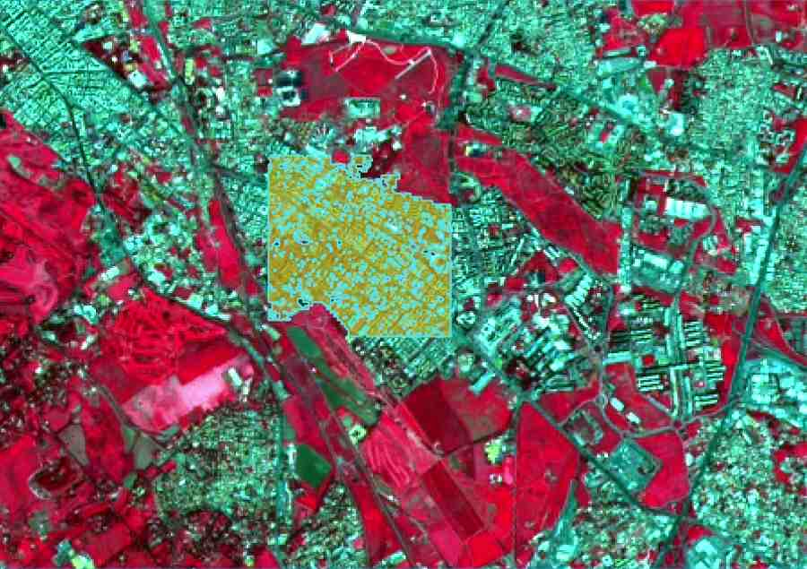
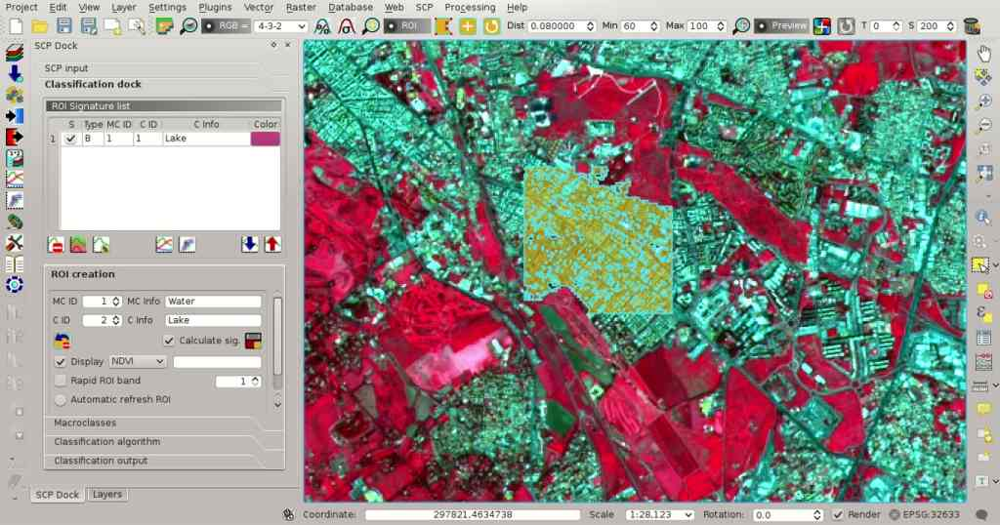
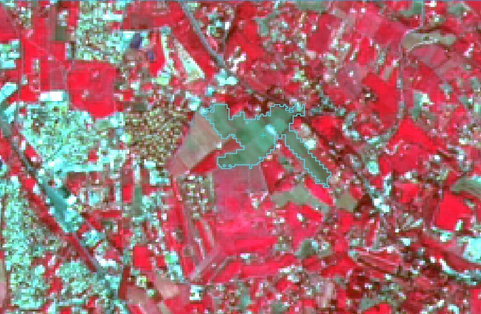
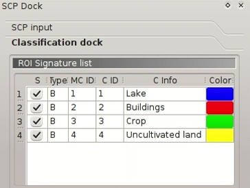
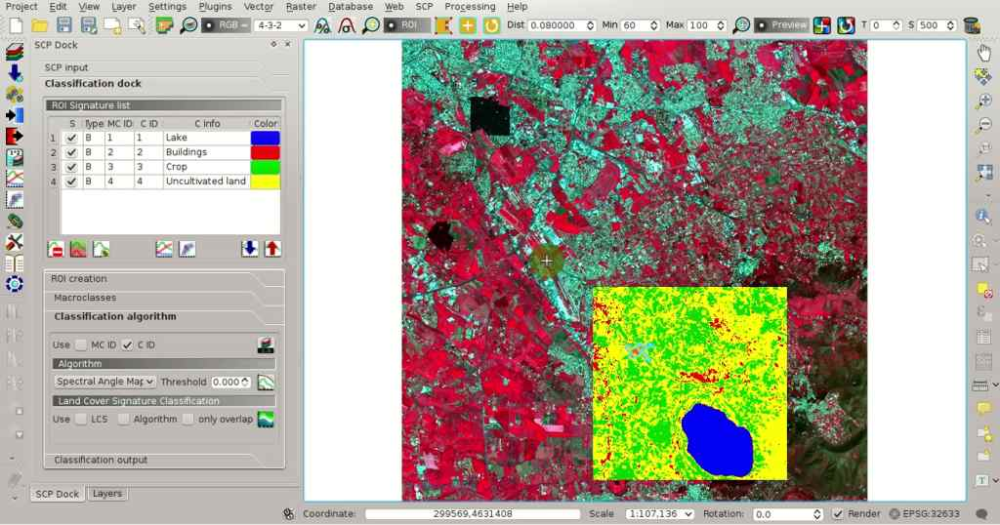
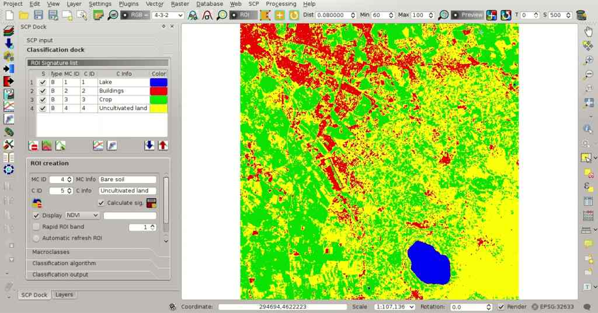

.. _basic_tutorial_1:

***************************************************************
Tutorial 1
***************************************************************

.. |br| raw:: html

  

.. |add| image:: _static/semiautomaticclassificationplugin_add.png
	:width: 20pt
	
.. |checkbox| image:: _static/checkbox.png
	:width: 18pt
	
.. |pointer| image:: _static/semiautomaticclassificationplugin_pointer_tool.png
	:width: 20pt
	
.. |radiobutton| image:: _static/radiobutton.png
	:width: 18pt
	
.. |reload| image:: _static/semiautomaticclassificationplugin_reload.png
	:width: 20pt
	
.. |reset| image:: _static/semiautomaticclassificationplugin_reset.png
	:width: 20pt
	
.. |remove| image:: _static/semiautomaticclassificationplugin_remove.png
	:width: 20pt
	
.. |run| image:: _static/semiautomaticclassificationplugin_run.png
	:width: 24pt
	
.. |open_file| image:: _static/semiautomaticclassificationplugin_open_file.png
	:width: 20pt
	
.. |new_file| image:: _static/semiautomaticclassificationplugin_new_file.png
	:width: 20pt
	
.. |open_dir| image:: _static/semiautomaticclassificationplugin_open_dir.png
	:width: 20pt
	
.. |select_all| image:: _static/semiautomaticclassificationplugin_select_all.png
	:width: 20pt
	
.. |move_up| image:: _static/semiautomaticclassificationplugin_move_up.png
	:width: 20pt
	
.. |move_down| image:: _static/semiautomaticclassificationplugin_move_down.png
	:width: 20pt
	
.. |search_images| image:: _static/semiautomaticclassificationplugin_search_images.png
	:width: 20pt

.. |image_preview| image:: _static/semiautomaticclassificationplugin_download_image_preview.png
	:width: 20pt

.. |import| image:: _static/semiautomaticclassificationplugin_import.png
	:width: 20pt
	
.. |export| image:: _static/semiautomaticclassificationplugin_export.png
	:width: 20pt

.. |plus| image:: _static/semiautomaticclassificationplugin_plus.png
	:width: 20pt

.. |order_by_name| image:: _static/semiautomaticclassificationplugin_order_by_name.png
	:width: 20pt

.. |image_overview| image:: _static/semiautomaticclassificationplugin_download_image_overview.png
	:width: 20pt
	
.. |enter| image:: _static/semiautomaticclassificationplugin_enter.png
	:width: 20pt

.. |download| image:: _static/semiautomaticclassificationplugin_download_arrow.png
	:width: 20pt
	
.. |landsat_download| image:: _static/semiautomaticclassificationplugin_landsat8_download_tool.png
	:width: 20pt

.. |sentinel_download| image:: _static/semiautomaticclassificationplugin_sentinel_download_tool.png
	:width: 20pt
	
.. |tools| image:: _static/semiautomaticclassificationplugin_roi_tool.png
	:width: 20pt
	
.. |roi_multiple| image:: _static/semiautomaticclassificationplugin_roi_multiple.png
	:width: 20pt

.. |import_spectral_library| image:: _static/semiautomaticclassificationplugin_import_spectral_library.png
	:width: 20pt
	
.. |export_spectral_library| image:: _static/semiautomaticclassificationplugin_export_spectral_library.png
	:width: 20pt
	
.. |weight_tool| image:: _static/semiautomaticclassificationplugin_weight_tool.png
	:width: 20pt
	
.. |threshold_tool| image:: _static/semiautomaticclassificationplugin_threshold_tool.png
	:width: 20pt
	
.. |LCS_threshold| image:: _static/semiautomaticclassificationplugin_LCS_threshold_tool.png
	:width: 20pt
	
.. |LCS_threshold_set_tool| image:: _static/semiautomaticclassificationplugin_LCS_threshold_set_tool.png
	:width: 20pt
	
.. |preprocessing| image:: _static/semiautomaticclassificationplugin_class_tool.png
	:width: 20pt
	
.. |landsat_tool| image:: _static/semiautomaticclassificationplugin_landsat8_tool.png
	:width: 20pt
	
.. |sentinel2_tool| image:: _static/semiautomaticclassificationplugin_sentinel_tool.png
	:width: 20pt
	
.. |aster_tool| image:: _static/semiautomaticclassificationplugin_aster_tool.png
	:width: 20pt
	
.. |split_raster| image:: _static/semiautomaticclassificationplugin_split_raster.png
	:width: 20pt
	
.. |clip_tool| image:: _static/semiautomaticclassificationplugin_clip_tool.png
	:width: 20pt
	
.. |pca_tool| image:: _static/semiautomaticclassificationplugin_pca_tool.png
	:width: 20pt
	
.. |vector_to_raster_tool| image:: _static/semiautomaticclassificationplugin_vector_to_raster_tool.png
	:width: 20pt
	
.. |post_process| image:: _static/semiautomaticclassificationplugin_post_process.png
	:width: 20pt
	
.. |accuracy_tool| image:: _static/semiautomaticclassificationplugin_accuracy_tool.png
	:width: 20pt
	
.. |land_cover_change| image:: _static/semiautomaticclassificationplugin_land_cover_change.png
	:width: 20pt
	
.. |report_tool| image:: _static/semiautomaticclassificationplugin_report_tool.png
	:width: 20pt

.. |class_to_vector_tool| image:: _static/semiautomaticclassificationplugin_class_to_vector_tool.png
	:width: 20pt

.. |reclassification_tool| image:: _static/semiautomaticclassificationplugin_reclassification_tool.png
	:width: 20pt

.. |edit_raster| image:: _static/semiautomaticclassificationplugin_edit_raster.png
	:width: 20pt

.. |undo_edit_raster| image:: _static/semiautomaticclassificationplugin_undo_edit_raster.png
	:width: 20pt

.. |classification_sieve| image:: _static/semiautomaticclassificationplugin_classification_sieve.png
	:width: 20pt

.. |classification_erosion| image:: _static/semiautomaticclassificationplugin_classification_erosion.png
	:width: 20pt

.. |classification_dilation| image:: _static/semiautomaticclassificationplugin_classification_dilation.png
	:width: 20pt

.. |bandcalc_tool| image:: _static/semiautomaticclassificationplugin_bandcalc_tool.png
	:width: 20pt
	
.. |batch_tool| image:: _static/semiautomaticclassificationplugin_batch.png
	:width: 20pt

.. |bandset_tool| image:: _static/semiautomaticclassificationplugin_bandset_tool.png
	:width: 20pt
	
.. |settings_tool| image:: _static/semiautomaticclassificationplugin_settings_tool.png
	:width: 20pt
	
.. |manual_ROI| image:: _static/semiautomaticclassificationplugin_manual_ROI.png
	:width: 20pt

.. |save_roi| image:: _static/semiautomaticclassificationplugin_save_roi.png
	:width: 20pt
	
.. |roi_single| image:: _static/semiautomaticclassificationplugin_roi_single.png
	:width: 20pt
	
.. |roi_redo| image:: _static/semiautomaticclassificationplugin_roi_redo.png
	:width: 20pt

.. |preview| image:: _static/semiautomaticclassificationplugin_preview.png
	:width: 20pt
	
.. |preview_redo| image:: _static/semiautomaticclassificationplugin_preview_redo.png
	:width: 20pt
	
.. |delete_signature| image:: _static/semiautomaticclassificationplugin_delete_signature.png
	:width: 20pt

.. |sign_plot| image:: _static/semiautomaticclassificationplugin_sign_tool.png
	:width: 20pt

.. |cumulative_stretch| image:: _static/semiautomaticclassificationplugin_bandset_cumulative_stretch_tool.png
	:width: 20pt

.. |std_dev_stretch| image:: _static/semiautomaticclassificationplugin_bandset_std_dev_stretch_tool.png
	:width: 20pt

.. |calculate_spectral_distances| image:: _static/semiautomaticclassificationplugin_calculate_spectral_distances.png
	:width: 20pt
	
The following is very basic tutorials for land cover classification using the Semi-Automatic Classification Plugin (:guilabel:`SCP`).
It is assumed that you have a basic knowledge of QGIS.

.. contents::
    :depth: 2
    :local:
	

.. _tutorial_1:
 
Tutorial 1: Your First Land Cover Classification
===================================================

This is a basic tutorial about the use of :guilabel:`SCP` for the classification of a multi-spectral image.
It is recommended to read the :ref:`remote_sensing` before this tutorial.

The purpose of the classification is to identify the following land cover classes:

#. Water;
#. Built-up;
#. Vegetation;
#. Bare soil.

Following the video of this tutorial.

.. raw:: html

	<iframe allowfullscreen="" frameborder="0" height="360" src="http://www.youtube.com/embed/GFrDgQ6Nzqs?rel=0" width="100%"></iframe>

http://www.youtube.com/watch?v=GFrDgQ6Nzqs

.. _tutorial_1_data:

Data
-------------------------

**Download the image** from `this archive <https://docs.google.com/uc?id=0BysUrKXWIDwBNEtudThrcWlERDg>`_ (data available from the U.S. Geological Survey) and **unzip** the downloaded file.

The downloaded file is actually a :ref:`Landsat_definition` image (pan-sharpened) including the following bands:

#. Blue;
#. Green;
#. Red;
#. Near-Infrared;
#. Short Wavelength Infrared 1;
#. Short Wavelength Infrared 2.

In this tutorial we pretend this dataset is a generic multi-spectral raster in order to focus on the classification process (in the next tutorial we are going to use an image whose bands are single rasters).

.. _tutorial_1_1:

Set the Input Image in SCP
--------------------------------

Start QGIS.
In the :ref:`SCP_input` click the button |open_file| of the :ref:`input_image`, in order to select the file ``sample_image.tif``.
Once selected, ``sample_image.tif`` is set as :guilabel:`Input image`, the image is displayed in the map and bands are loaded in the :ref:`band_set_tab`.

We can display a :ref:`color_composite_definition` of bands: Near-Infrared, Red, and Green: in the :ref:`working_toolbar`, click the list :guilabel:`RGB=` and select the item ``4-3-2`` (corresponding to the band numbers in :ref:`band_set_tab`).
You can see that image colors in the map change according to the selected bands, and vegetation is highlighted in red (if the item ``3-2-1`` was selected, natural colors would be displayed).

	
	:guilabel:`Color composite RGB=4-3-2`
	
.. _tutorial_1_2:

Create the Training Input File
------------------------------------------------------

Now we need to create the :ref:`training_input` in order to collect :ref:`ROI_definition` (ROIs) and calculate the :ref:`spectral_signature_definition` thereof (which are used in classification).

In the :ref:`SCP_dock` click the button |new_file| and define a name (e.g. ``training.scp`` ) in order to create the :guilabel:`Training input`.
The path of the file is displayed in :guilabel:`Training input`.
A vector is added to QGIS layers with the same name as the ``Training input`` (in order to prevent data loss, you should not edit this layer using QGIS functions).

	
	:guilabel:`Definition of Training input in SCP`

.. _tutorial_1_3:

Create the ROIs
------------------------------------------------------

We are going to create ROIs defining the :ref:`classes_definition`. 
Each ROI identifies a land cover class through a Class ID.
The Class ID codes used in this tutorial are illustrated in the following table (for now we assign the same code to Class ID and Macroclass ID).
	
	:guilabel:`Macroclasses`
	
+-----------------------------+--------------------------+
| Class name                  | Class ID                 |
+=============================+==========================+
| Water                       |  1                       |
+-----------------------------+--------------------------+
| Built-up                    |  2                       |
+-----------------------------+--------------------------+
| Vegetation                  |  3                       |
+-----------------------------+--------------------------+
| Bare soil                   |  4                       |
+-----------------------------+--------------------------+

ROIs can be created by manually drawing a polygon or with an automatic region growing algorithm.

Zoom in the map over the dark area (it is a lake) in the lower right region of the image.
In order to create manually a ROI inside the dark area, click the button |manual_ROI| in the :ref:`working_toolbar` (you can ignore a message about wavelength unit not provided).
Left click on the map to define the ROI vertices and right click to define the last vertex closing the polygon.
An orange semi-transparent polygon is displayed over the image, which is a temporary polygon (i.e. it is not saved in the :guilabel:`Training input`).

	**TIP** : You can draw temporary polygons (the previous one will be overridden) until the shape covers the intended area.

	
	:guilabel:`A temporary ROI created manually`
	
If the shape of the temporary polygon is good we can save it to the :guilabel:`Training input`.

Open the :ref:`classification_dock` to define the :ref:`classes_definition` .
In the :ref:`ROI_creation` set :guilabel:`MC ID` = 1 and :guilabel:`MC Info` = ``Water``; also set :guilabel:`C ID` = 1 and :guilabel:`C Info` = ``Lake``.
Now click |save_roi| to save the ROI in the :guilabel:`Training input`.

After a few seconds, the ROI is listed in the :ref:`ROI_list` and the spectral signature is calculated (because |checkbox| :guilabel:`Calculate sig.` was checked).

	
	:guilabel:`The ROI saved in the Training input`
	
As you can see, the :guilabel:`C ID` in :ref:`ROI_creation` is automatically increased by 1.
Saved ROI is displayed as a dark polygon in the map and the temporary ROI is removed.
Also, in the :ref:`ROI_list` you can notice that the :guilabel:`Type` is :guilabel:`B`, meaning that the ROI spectral signature was calculated and saved in the :guilabel:`Training input`.

Now we are going to create a second ROI for the built-up class using the automatic region growing algorithm.
Zoom in the map over the blue area in the upper left region of the image.

In :ref:`working_toolbar` set the :guilabel:`Dist` value to 0.08 .
Click the button |roi_single| in the :ref:`working_toolbar` and click over the blue area of the map.
After a while the orange semi-transparent polygon is displayed over the image.

	**TIP** : :guilabel:`Dist` value should be set according to the range of pixel values; in general, increasing this value creates larger ROIs.

	
	:guilabel:`A temporary ROI created with the automatic region growing algorithm`
	
In the :ref:`ROI_creation` set :guilabel:`MC ID` = 2 and :guilabel:`MC Info` = ``Built-up`` ; also set :guilabel:`C ID` = 2 (it should be already set) and :guilabel:`C Info` = ``Buildings``.

	
	:guilabel:`The ROI saved in the Training input`
		
Again, the :guilabel:`C ID` in :ref:`ROI_creation` is automatically increased by 1.

Create a ROI for the class ``Vegetation`` (red pixels in color composite ``RGB=4-3-2``) and a ROI for the class ``Bare soil`` (green pixels in color composite ``RGB=4-3-2``) following the same steps described previously.
The following images show a few examples of these classes identified in the map.

.. figure:: _static/tutorial_1/tutorial_1_3_5.jpg
	:align: center
	
	:guilabel:`Vegetation`
	

	
	:guilabel:`Bare soil`
	
.. _tutorial_1_4:

Create a Classification Preview
------------------------------------------------------

The classification process is based on collected ROIs (and spectral signatures thereof).
It is useful to create a :ref:`classification_preview` in order to assess the results (influenced by spectral signatures) before the final classification.
In case the results are not good, we can collect more ROIs to better classify land cover.

Before running a classification (or a preview), set the color of land cover classes that will be displayed in the classification raster.
In the :ref:`ROI_list`, double click the color (in the column :guilabel:`Color`) of each ROI to choose a representative color of each class.
	

	
	:guilabel:`Definition of class colors`
	
Now we need to select the classification algorithm.
In this tutorial we are going to select the :ref:`spectra_angle_mapping_algorithm`.

In :ref:`classification_alg` select the :guilabel:`Spectral Angle Mapping` :ref:`classification_algorithm`.
In :ref:`classification_preview` set :guilabel:`Size` = 500; click the button |preview| and then left click a point of the image in the map.
The classification process should be rapid, and the result is a classified square centered in clicked point.

	
	:guilabel:`Classification preview displayed over the image`
	
Previews are temporary rasters (deleted after QGIS is closed) placed in a group named :guilabel:`Class_temp_group` in the QGIS panel Layers.

	**TIP** : When loading a previously saved QGIS project, a message could ask to handle missing layers, which are temporary layers that SCP creates during each session and are deleted afterwards; you can click :guilabel:`Cancel` and ignore these layers.

In general, it is good to perform a classification preview every time a ROI (or a spectral signature) is added to the :ref:`ROI_list`. Therefore, the phases :ref:`tutorial_1_3` and :ref:`tutorial_1_4` should be iterative and concurrent processes.

.. _tutorial_1_5:

Create the Classification Output
------------------------------------------------------

Assuming that the results of classification previews were good (i.e. pixels are assigned to the correct class defined in the :ref:`ROI_list`), we can perform the actual land cover classification of the whole image.

In the :ref:`classification_output` click the button |run| and define the path of the classification output, which is a raster file (.tif).
If |checkbox| :guilabel:`Play sound when finished` is checked in :ref:`classification_process` settings, a sound is played when the process is finished.

	
	:guilabel:`Result of the land cover classification`
	
**Well done!**
You have just performed your first land cover classification.

Water and vegetation are correctly identified.
However, you can see that there are several classification errors (especially soil classified as built-up and vice versa), because the number of ROIs (spectral signatures) is insufficient.

.. figure:: _static/tutorial_1/tutorial_1_5_2.jpg
	:align: center

	:guilabel:`Example of error: Bare soil classified as Built-up`
	
We can improve the classification using some of the tools described in the next tutorial.
