.. _basic_tutorial_2:

***************************************************************
Tutorial 2
***************************************************************

.. |br| raw:: html

  

.. |add| image:: _static/semiautomaticclassificationplugin_add.png
	:width: 20pt
	
.. |checkbox| image:: _static/checkbox.png
	:width: 18pt
	
.. |pointer| image:: _static/semiautomaticclassificationplugin_pointer_tool.png
	:width: 20pt
	
.. |radiobutton| image:: _static/radiobutton.png
	:width: 18pt
	
.. |reload| image:: _static/semiautomaticclassificationplugin_reload.png
	:width: 20pt
	
.. |reset| image:: _static/semiautomaticclassificationplugin_reset.png
	:width: 20pt
	
.. |remove| image:: _static/semiautomaticclassificationplugin_remove.png
	:width: 20pt
	
.. |run| image:: _static/semiautomaticclassificationplugin_run.png
	:width: 24pt
	
.. |open_file| image:: _static/semiautomaticclassificationplugin_open_file.png
	:width: 20pt
	
.. |new_file| image:: _static/semiautomaticclassificationplugin_new_file.png
	:width: 20pt
	
.. |open_dir| image:: _static/semiautomaticclassificationplugin_open_dir.png
	:width: 20pt
	
.. |select_all| image:: _static/semiautomaticclassificationplugin_select_all.png
	:width: 20pt
	
.. |move_up| image:: _static/semiautomaticclassificationplugin_move_up.png
	:width: 20pt
	
.. |move_down| image:: _static/semiautomaticclassificationplugin_move_down.png
	:width: 20pt
	
.. |search_images| image:: _static/semiautomaticclassificationplugin_search_images.png
	:width: 20pt

.. |image_preview| image:: _static/semiautomaticclassificationplugin_download_image_preview.png
	:width: 20pt

.. |import| image:: _static/semiautomaticclassificationplugin_import.png
	:width: 20pt
	
.. |export| image:: _static/semiautomaticclassificationplugin_export.png
	:width: 20pt

.. |plus| image:: _static/semiautomaticclassificationplugin_plus.png
	:width: 20pt

.. |order_by_name| image:: _static/semiautomaticclassificationplugin_order_by_name.png
	:width: 20pt

.. |image_overview| image:: _static/semiautomaticclassificationplugin_download_image_overview.png
	:width: 20pt
	
.. |enter| image:: _static/semiautomaticclassificationplugin_enter.png
	:width: 20pt

.. |download| image:: _static/semiautomaticclassificationplugin_download_arrow.png
	:width: 20pt
	
.. |landsat_download| image:: _static/semiautomaticclassificationplugin_landsat8_download_tool.png
	:width: 20pt

.. |sentinel_download| image:: _static/semiautomaticclassificationplugin_sentinel_download_tool.png
	:width: 20pt
	
.. |tools| image:: _static/semiautomaticclassificationplugin_roi_tool.png
	:width: 20pt
	
.. |roi_multiple| image:: _static/semiautomaticclassificationplugin_roi_multiple.png
	:width: 20pt

.. |import_spectral_library| image:: _static/semiautomaticclassificationplugin_import_spectral_library.png
	:width: 20pt
	
.. |export_spectral_library| image:: _static/semiautomaticclassificationplugin_export_spectral_library.png
	:width: 20pt
	
.. |weight_tool| image:: _static/semiautomaticclassificationplugin_weight_tool.png
	:width: 20pt
	
.. |threshold_tool| image:: _static/semiautomaticclassificationplugin_threshold_tool.png
	:width: 20pt
	
.. |LCS_threshold| image:: _static/semiautomaticclassificationplugin_LCS_threshold_tool.png
	:width: 20pt
	
.. |LCS_threshold_set_tool| image:: _static/semiautomaticclassificationplugin_LCS_threshold_set_tool.png
	:width: 20pt
	
.. |preprocessing| image:: _static/semiautomaticclassificationplugin_class_tool.png
	:width: 20pt
	
.. |landsat_tool| image:: _static/semiautomaticclassificationplugin_landsat8_tool.png
	:width: 20pt
	
.. |sentinel2_tool| image:: _static/semiautomaticclassificationplugin_sentinel_tool.png
	:width: 20pt
	
.. |aster_tool| image:: _static/semiautomaticclassificationplugin_aster_tool.png
	:width: 20pt
	
.. |split_raster| image:: _static/semiautomaticclassificationplugin_split_raster.png
	:width: 20pt
	
.. |clip_tool| image:: _static/semiautomaticclassificationplugin_clip_tool.png
	:width: 20pt
	
.. |pca_tool| image:: _static/semiautomaticclassificationplugin_pca_tool.png
	:width: 20pt
	
.. |vector_to_raster_tool| image:: _static/semiautomaticclassificationplugin_vector_to_raster_tool.png
	:width: 20pt
	
.. |post_process| image:: _static/semiautomaticclassificationplugin_post_process.png
	:width: 20pt
	
.. |accuracy_tool| image:: _static/semiautomaticclassificationplugin_accuracy_tool.png
	:width: 20pt
	
.. |land_cover_change| image:: _static/semiautomaticclassificationplugin_land_cover_change.png
	:width: 20pt
	
.. |report_tool| image:: _static/semiautomaticclassificationplugin_report_tool.png
	:width: 20pt

.. |class_to_vector_tool| image:: _static/semiautomaticclassificationplugin_class_to_vector_tool.png
	:width: 20pt

.. |reclassification_tool| image:: _static/semiautomaticclassificationplugin_reclassification_tool.png
	:width: 20pt

.. |edit_raster| image:: _static/semiautomaticclassificationplugin_edit_raster.png
	:width: 20pt

.. |undo_edit_raster| image:: _static/semiautomaticclassificationplugin_undo_edit_raster.png
	:width: 20pt

.. |classification_sieve| image:: _static/semiautomaticclassificationplugin_classification_sieve.png
	:width: 20pt

.. |classification_erosion| image:: _static/semiautomaticclassificationplugin_classification_erosion.png
	:width: 20pt

.. |classification_dilation| image:: _static/semiautomaticclassificationplugin_classification_dilation.png
	:width: 20pt

.. |bandcalc_tool| image:: _static/semiautomaticclassificationplugin_bandcalc_tool.png
	:width: 20pt
	
.. |batch_tool| image:: _static/semiautomaticclassificationplugin_batch.png
	:width: 20pt

.. |bandset_tool| image:: _static/semiautomaticclassificationplugin_bandset_tool.png
	:width: 20pt
	
.. |settings_tool| image:: _static/semiautomaticclassificationplugin_settings_tool.png
	:width: 20pt
	
.. |manual_ROI| image:: _static/semiautomaticclassificationplugin_manual_ROI.png
	:width: 20pt

.. |save_roi| image:: _static/semiautomaticclassificationplugin_save_roi.png
	:width: 20pt
	
.. |roi_single| image:: _static/semiautomaticclassificationplugin_roi_single.png
	:width: 20pt
	
.. |roi_redo| image:: _static/semiautomaticclassificationplugin_roi_redo.png
	:width: 20pt

.. |preview| image:: _static/semiautomaticclassificationplugin_preview.png
	:width: 20pt
	
.. |preview_redo| image:: _static/semiautomaticclassificationplugin_preview_redo.png
	:width: 20pt
	
.. |delete_signature| image:: _static/semiautomaticclassificationplugin_delete_signature.png
	:width: 20pt

.. |sign_plot| image:: _static/semiautomaticclassificationplugin_sign_tool.png
	:width: 20pt

.. |cumulative_stretch| image:: _static/semiautomaticclassificationplugin_bandset_cumulative_stretch_tool.png
	:width: 20pt

.. |std_dev_stretch| image:: _static/semiautomaticclassificationplugin_bandset_std_dev_stretch_tool.png
	:width: 20pt

.. |calculate_spectral_distances| image:: _static/semiautomaticclassificationplugin_calculate_spectral_distances.png
	:width: 20pt
	
.. contents::
    :depth: 2
    :local:

.. _tutorial_2:
 
Tutorial 2: Land Cover Classification of Sentinel-2 Images
===============================================================

This tutorial describes the main phases for the classification of images acquired by :ref:`Sentinel2_definition`.
In addition, some of the :guilabel:`SCP` tools are illustrated.

We are going to classify the following land cover classes:

#. Water;
#. Built-up;
#. Vegetation;
#. Bare soil.

Following the video of this tutorial.

.. raw:: html

	<iframe allowfullscreen="" frameborder="0" height="360" src="http://www.youtube.com/embed/FcETq8OWM0k?rel=0" width="100%"></iframe>

http://www.youtube.com/watch?v=FcETq8OWM0k

.. _tutorial_2_data_download:

Data Download
-------------------------

We are going to **download a Sentinel-2 image** provided by the Copernicus `Scientific Data Hub <https://scihub.copernicus.eu/>`_.
In particular we are going to use the following Sentinel-2 bands (for more information read :ref:`Sentinel2_definition`):

* Band 2 - Blue;
* Band 3 - Green;
* Band 4 - Red;
* Band 5 - Vegetation Red Edge;
* Band 6 - Vegetation Red Edge;
* Band 7 - Vegetation Red Edge;
* Band 8 - NIR;
* Band 8A - Vegetation Red Edge;
* Band 11 - SWIR;
* Band 12 - SWIR;

	**TIP** : In case you have slow internet connection you can download a subset of the image (about 50MB) from `this link <https://docs.google.com/uc?id=0BysUrKXWIDwBMXdFLW5rYVRGLTg>`_ (© Copernicus Sentinel data 2016) which is the result of steps :ref:`tutorial_2_data_download` and :ref:`tutorial_2_clip_data`.

Start a new QGIS project.
Open the tab :ref:`download_tab` clicking the button |download| in the :ref:`SCP_menu`, or the :ref:`toolbar_tools`, or the :ref:`SCP_dock`.
Select the tab :ref:`Sentinel_download_tab`.
We are searching a specific image acquired on May 06, 2016.

In :ref:`login_Sentinel` enter the user name and password for accessing data (`free registration is required <https://scihub.copernicus.eu/userguide/1SelfRegistration>`_).

	**WARNING** : The guest/guest account is not available anymore. Free registration is required. See https://scihub.copernicus.eu/news/News00097 .
	
In :ref:`area_coordinates_Sentinel` enter:

* :guilabel:`UL X (Lon)`: 12
* :guilabel:`UL Y (Lat)`: 42
* :guilabel:`LR X (Lon)`: 13
* :guilabel:`LR Y (Lat)`: 41

	**TIP** : In general it is possible to define the area coordinates clicking the button |pointer| and drawing a rectangle in the map.
	
In :ref:`search_Sentinel` set:

* :guilabel:`Date from`: 2016-05-06
* :guilabel:`to`: 2016-05-06

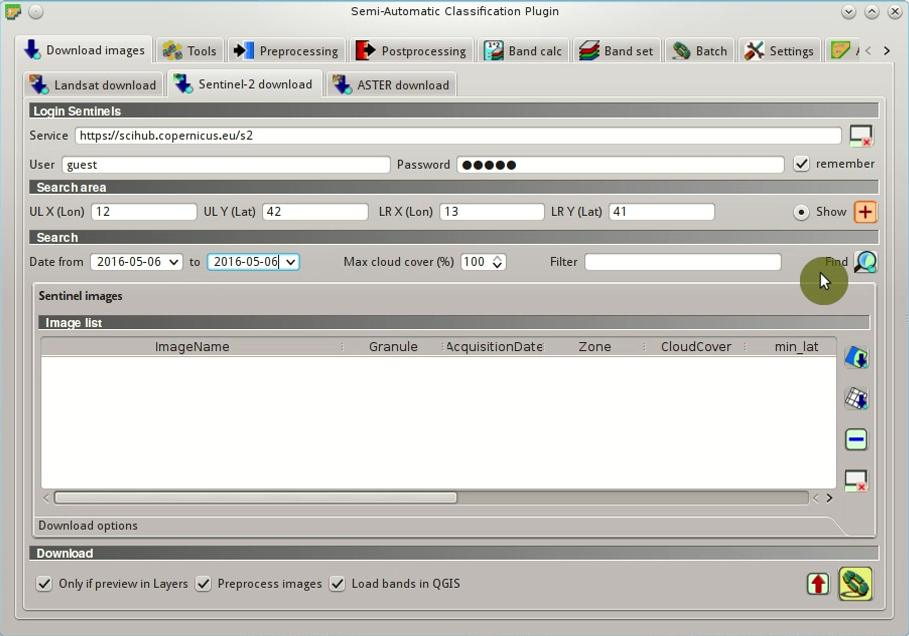

	:guilabel:`Search Sentinel-2 images`
	
Now click the button :guilabel:`Find` |search_images| and after a few seconds the image will be listed in the ``Image list``.

	**Tip**: download this `zip file <https://docs.google.com/uc?id=0BysUrKXWIDwBZHF6dENlZ0g1Y0k>`_ containing the shapefile of Sentinel-2 granules for identifying the zone; load this shapefile in QGIS, select the granules in your search area and open the attribute table to see the zone name.
	
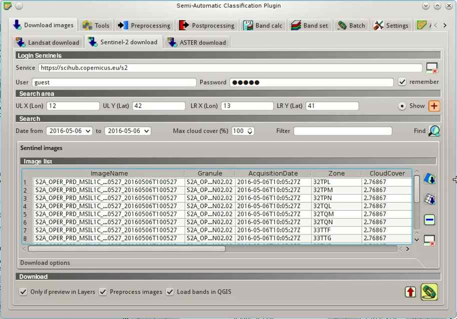

	:guilabel:`Sentinel-2 search result`
	
In the result table, click the item ``T32TQM`` in the field :guilabel:`Zone`, which is the :guilabel:`Granule` ``S2A_OPER_MSI_L1C_TL_SGS__20160506T153005_A004552_T32TQM``, and click the button |image_preview|.
A preview will be downloaded and displayed in the map, which is useful for assessing the quality of the image and the cloud cover.

	**TIP** : It is also possible to display the image overview (which is composed of several granules) with the button |image_overview|.

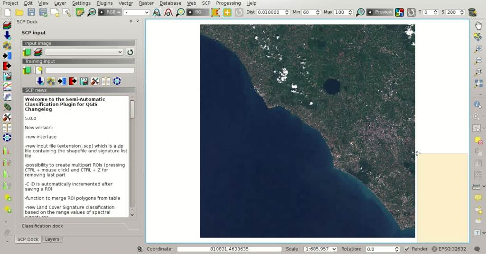

	:guilabel:`Image preview`
	
Click the tab :ref:`sentinel2_download_options` and uncheck bands 1, 9, and 10.
Also, uncheck the options |checkbox| :guilabel:`Preprocess images` (usually this should be checked, but for the purpose of this tutorial we are going to preprocess images in the step :ref:`tutorial_2_1`) and |checkbox| :guilabel:`Load bands in QGIS` (because we are going to clip the images).

	**TIP** : The option |checkbox| :guilabel:`Only if preview in Layers` allows for downloading only images in the result table which are loaded as previews in the map. It is convenient to check this option and remove the images previews in the QGIS layer list, leaving only the previews of images that one wish to download.

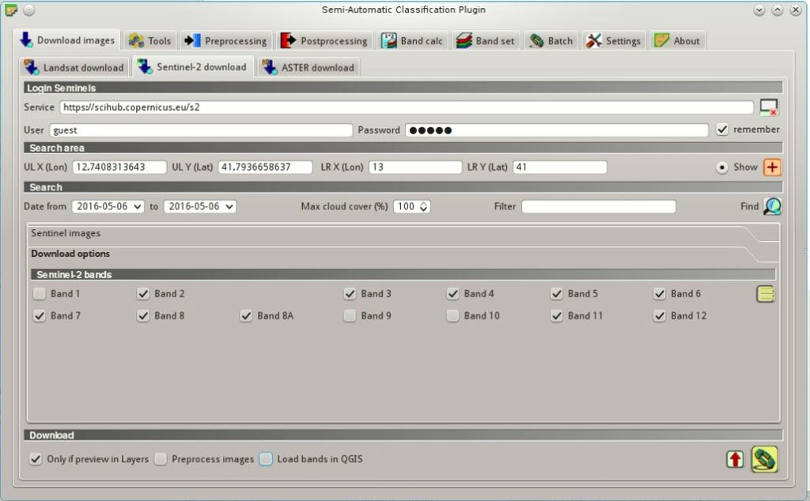

	:guilabel:`Selection of bands for download`

In order to start the image download, click the button |run| and select a directory where bands are saved (e.g. ``Desktop``).
The download could last a few minutes according to your internet connection speed (band size ranges from 30 to 90MB).
The download progress is displayed in a bar.

After the download, all the bands and the metadata files are saved in the output directory.

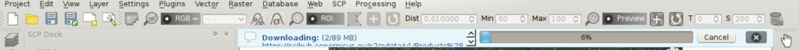

	:guilabel:`Download of Sentinel bands`

.. _tutorial_2_1:

Automatic Conversion to Surface Reflectance
------------------------------------------------------

Conversion to reflectance (see :ref:`radiance_reflectance_definition`) can be performed automatically.
The metadata file (a .xml file whose name contains ``MTD_SAFL1C``) downloaded with the images contains the required information for the conversion.
Read :ref:`conversion_to_reflectance` for information about the :ref:`TOA_conversion` and :ref:`Surface_conversion`.

In order to convert bands to reflectance, open the tab :ref:`pre_processing_tab` clicking the button |preprocessing| in the :ref:`SCP_menu`, or the :ref:`toolbar_tools`, or the :ref:`SCP_dock`, and select the tab :ref:`sentinel2_tab`.

Click the button :guilabel:`Directory containing Sentinel-2 bands` |open_file| and select the directory that should be named ``S2A_OPER_MSI_L1C_TL_SGS__20160506T153005_A004552_T32TQM``.
The list of bands is automatically loaded in the table :ref:`sentinel2_metadata`.
Also, the metadata information for each band is loaded (because the metadata file is inside the same directory).

	**TIP** : If a Sentinel-2 image was downloaded directly from the site https://scihub.copernicus.eu and you want to convert images to reflectance using :guilabel:`SCP`, you should copy the .xml file whose name contains ``MTD_SAFL1C`` (included in the granule directory) and paste it inside the same directory of bands (files .jp2).

In order to calculate :ref:`Surface_conversion` we are going to apply the :ref:`DOS1_correction`; therefore, enable the option :guilabel:`Apply DOS1 atmospheric correction`.

	**TIP** : It is recommended to perform the DOS1 atmospheric correction to the entire image (before clipping the image) in order to improve the calculation of parameters based on the image.

Uncheck the option |checkbox| :guilabel:`Create Band set and use Band set tools` because we are going to define this in the following step :ref:`tutorial_2_band_set`.
In order to start the conversion process, click the button |run| and select the directory where converted bands are saved (e.g. ``Desktop``).
	
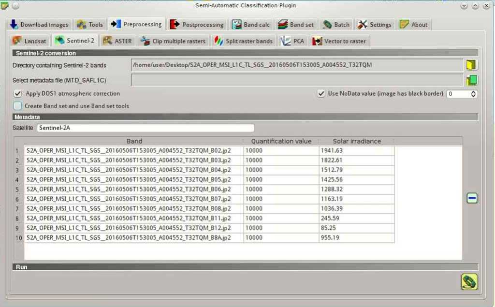

	:guilabel:`Sentinel-2 conversion to reflectance`
	
After a few minutes, converted bands are loaded and displayed (file name starts with ``RT_``).
If :guilabel:`Play sound when finished` is checked in :ref:`classification_process` settings, a sound is played when the process is finished.

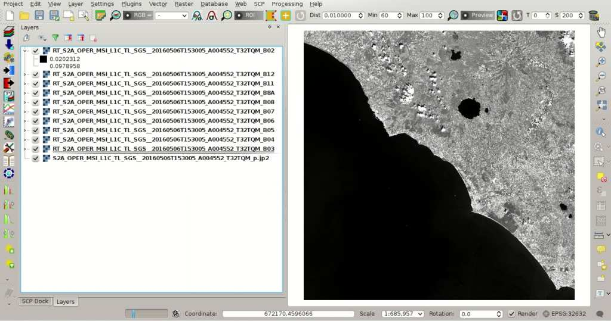

	:guilabel:`Converted Sentinel-2 bands`
	
.. _tutorial_2_clip_data:

Clip the Data
---------------------------------

Sentinel-2 images have a large extent.
In order to reduce the computational time, we are going to clip bands to the same study area as :ref:`tutorial_1`.	
Open the tab :ref:`pre_processing_tab` and select the tab :ref:`clip_multiple_rasters_tab`.

Click the button |reload| to refresh the layer list, and check all the layers whose name starts with ``RT_`` (the band number is at the end of the layer name).

Click the button |pointer| and select an area such as the following image, or enter the following values:

* :guilabel:`UL X`: 791810
* :guilabel:`UL Y`: 4643020
* :guilabel:`LR X`: 809750
* :guilabel:`LR Y`: 4626230

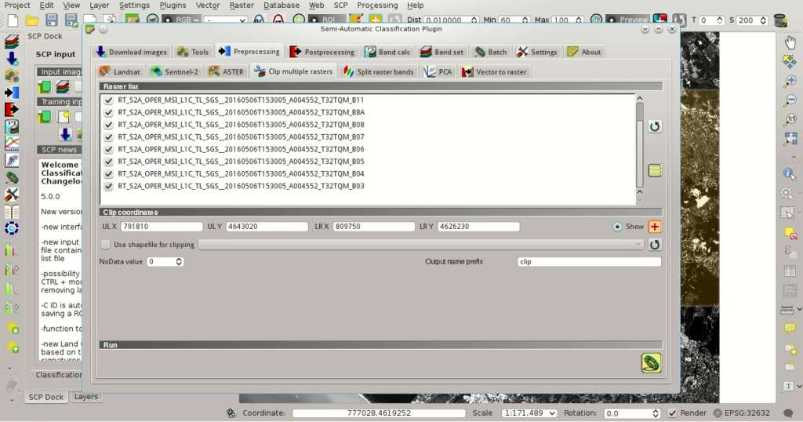

	:guilabel:`Clip area`
	
Click the button |run| and select a directory (e.g. ``clip``) where clipped bands are saved (with the file name prefix defined in :guilabel:`Output name prefix`).
When the process is completed, clipped rasters are loaded and displayed.
We can remove the bands whose names start with ``RT_`` from QGIS layers.

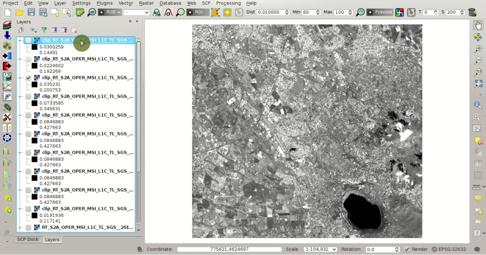

	:guilabel:`Clipped bands`
	
.. _tutorial_2_band_set:

Create the Band Set
---------------------------------
	
Now we need to define the :guilabel:`Band set` which is the input image for :guilabel:`SCP`.
Open the tab :ref:`band_set_tab` clicking the button |bandset_tool| in the :ref:`SCP_menu`, or the :ref:`toolbar_tools`, or the :ref:`SCP_dock`.

Click the button |reload| to refresh the layer list, and check all the clipped bands; then click |plus| to add selected rasters to the :guilabel:`Band set`.
In the table :guilabel:`Band set definition` order the band names in ascending order (click |order_by_name| to sort bands by name automatically), then highlight band ``8A`` (i.e. single click on band name in the table) and use the buttons |move_up| or |move_down| to place this band at number 8.
Finally, select :guilabel:`Sentinel-2` from the list :guilabel:`Quick wavelength settings`, in order to set automatically the :guilabel:`Center wavelength` of each band and the :guilabel:`Wavelength unit` (required for spectral signature calculation).

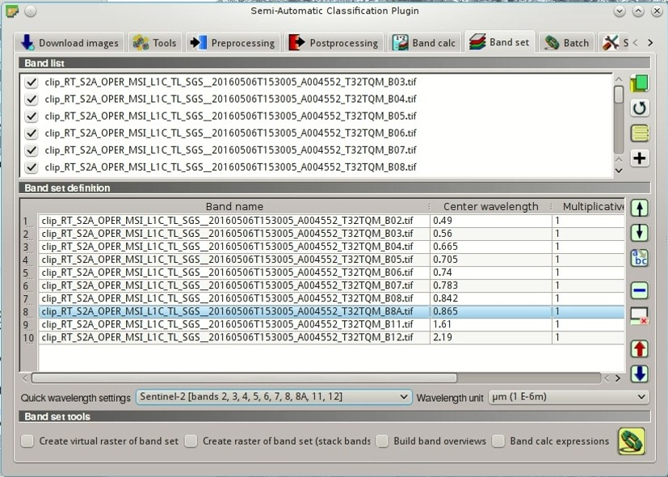

	:guilabel:`Definition of a band set`

You can notice that the item ``<< band set >>`` is selected as :ref:`input_image` in the :ref:`SCP_dock`.

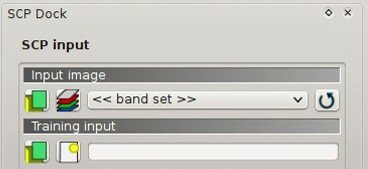

	:guilabel:`Band set`
	
.. _tutorial_2_2:

Create the ROIs
------------------------------------------------------

In order to collect ROIs we need to :ref:`tutorial_1_2` as described in :ref:`tutorial_1` (in the :ref:`SCP_dock` click the button |new_file| and define a file name).
The :guilabel:`Training input` stores the ROIs and the :ref:`spectral_signature_definition` thereof.

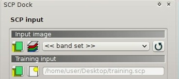
	
	:guilabel:`Definition of Training input in SCP`
	
We are going to create several ROIs using the Macroclass IDs defined in the following table (see :ref:`classes_definition`).
	
	:guilabel:`Macroclasses`
	
+-----------------------------+--------------------------+
| Macroclass name             | Macroclass ID            |
+=============================+==========================+
| Water                       |  1                       |
+-----------------------------+--------------------------+
| Built-up                    |  2                       |
+-----------------------------+--------------------------+
| Vegetation                  |  3                       |
+-----------------------------+--------------------------+
| Bare soil                   |  4                       |
+-----------------------------+--------------------------+

In this phase we are creating the database of spectral signatures used to identify land cover classes (the ones defined as macroclasses).
However, these macroclasses are composed of several materials having different spectral signatures; in order to achieve good classification results we should separate spectral signatures of different materials, even if belonging to the same macroclass.
Thus, we are going to create several ROIs for each macroclass (setting the same :guilabel:`MC ID`, but assigning a different :guilabel:`C ID` to every ROI).

In the list :guilabel:`RGB=` of :ref:`working_toolbar` select ``3-2-1`` to display a natural color image (see ref:`color_composite_definition` and :ref:`Sentinel2_definition`).
After a few seconds, the :ref:`color_composite_definition` will be displayed.
We can see that urban areas are white and vegetation is green.

	**TIP** : If a :ref:`band_set_tab` is defined, a temporary virtual raster (named ``band_set.vrt``) is created automatically, which allows for the display of :ref:`color_composite_definition`. In order to speed up the visualization, you can show only the virtual raster and hide all the layers in the QGIS Layers.

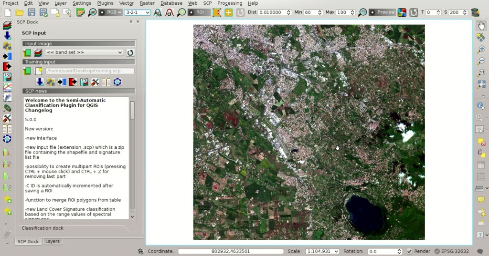
	
	:guilabel:`Color composite RGB = 3-2-1`
	
Now in the list :guilabel:`RGB=` of the :ref:`working_toolbar` type ``3-7-10`` (you can also use the tool :ref:`RGB_list_tab`).
Using this color composite, urban areas are purple and vegetation is green.
You can notice that this color composite ``RGB = 3-7-10`` highlights roads more than natural color (``RGB = 3-2-1``).
Also, you can see that there are clouds in the right part of the image.

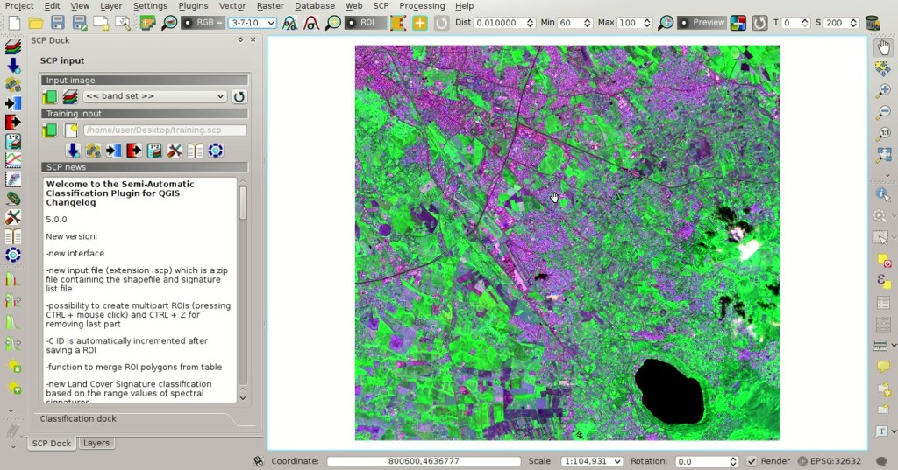
	
	:guilabel:`Color composite RGB = 3-7-10`

Now create the ROIs following the same steps described in :ref:`tutorial_1_3` of :ref:`tutorial_1`.	
After clicking the button |roi_single| in the :ref:`working_toolbar` you should notice that the cursor in the map displays a value changing over the image.
This is the NDVI value of the pixel beneath the cursor (NDVI is displayed because the function |checkbox| :guilabel:`Display` is checked in :ref:`ROI_creation`).
The NDVI value can be useful for identifying spectrally pure pixels, in fact vegetation has higher NDVI values than soil.

For instance, move the mouse over a vegetation area and left click to create a ROI when you see a local maximum value.
This way, the created ROI and the spectral signature thereof will be particularly representative of healthy vegetation.

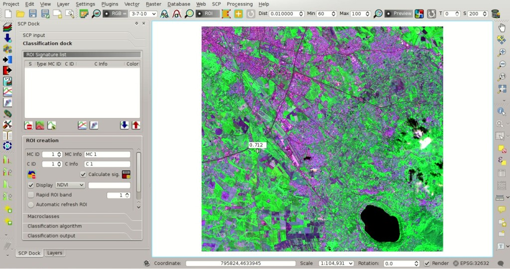
	
	:guilabel:`NDVI value of vegetation pixel displayed in the map`
	
The color composite ``RGB = 7-3-2`` is also useful for highlighting vegetation.

Create several ROIs (the more is the better).
The region growing algorithm can create more homogeneous ROIs (i.e. standard deviation of spectral signature values is low) than manually drawn ones; the manual creation of ROIs can be useful in order to account for the spectral variability of classes (especially when using the algorithm :ref:`max_likelihood_algorithm`).

In general, you should create one ROI for each color that you can distinguish in the image.
Therefore, change the color composite in order to identify the different types of land cover.

	**TIP** : Change frequently the :ref:`color_composite_definition` in order to clearly identify the materials at the ground; use the mouse wheel on the list :guilabel:`RGB=` of the :ref:`working_toolbar` for changing the color composite rapidly; also use the buttons |cumulative_stretch| and |std_dev_stretch| for better displaying the :guilabel:`Input image` (i.e. image stretching).

A few examples of ROIs are illustrated in the following figures. 

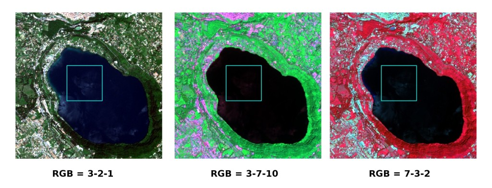
	
	:guilabel:`Water ROI: lake`
	
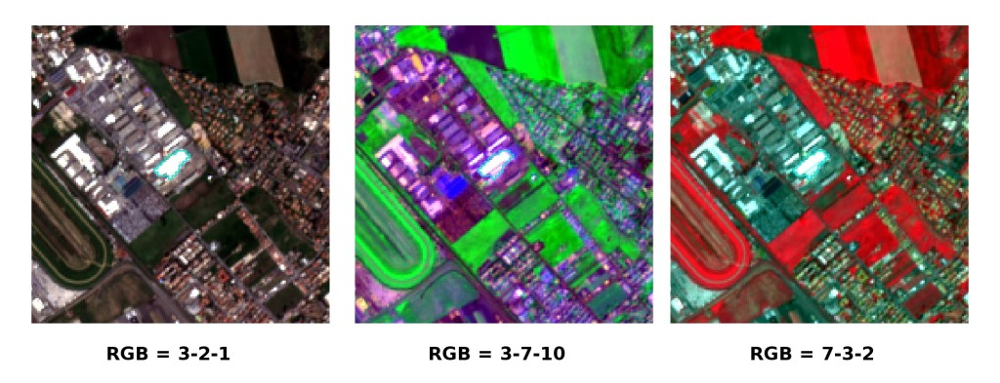
	
	:guilabel:`Built-up ROI: large buildings`
	
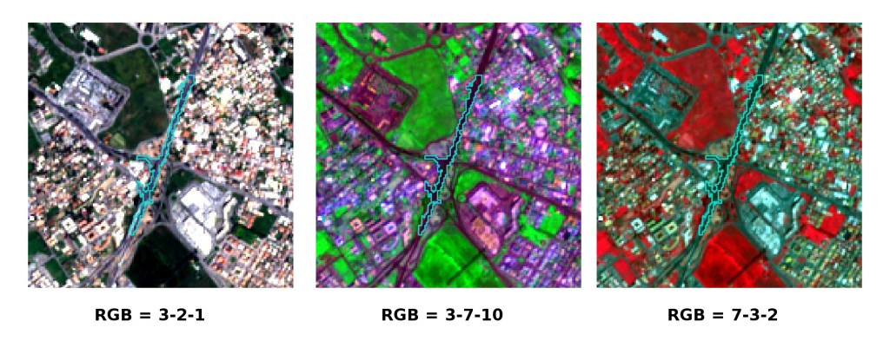
	
	:guilabel:`Built-up ROI: road`
	
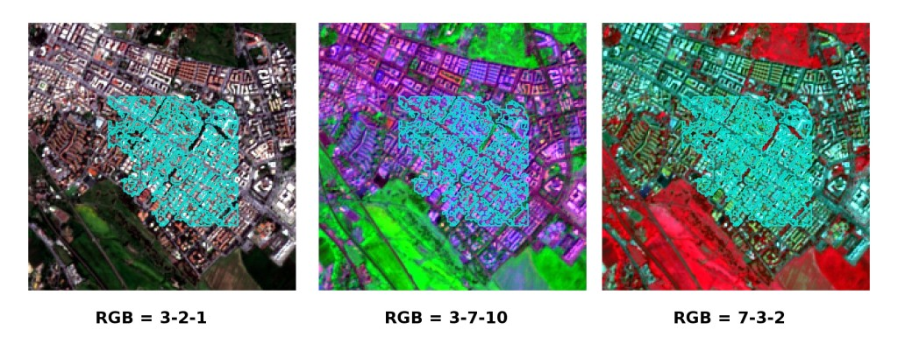
	
	:guilabel:`Built-up ROI: buildings and narrow roads`
	
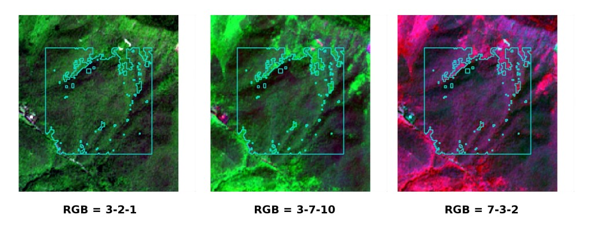
	
	:guilabel:`Vegetation ROI: deciduous trees`
	
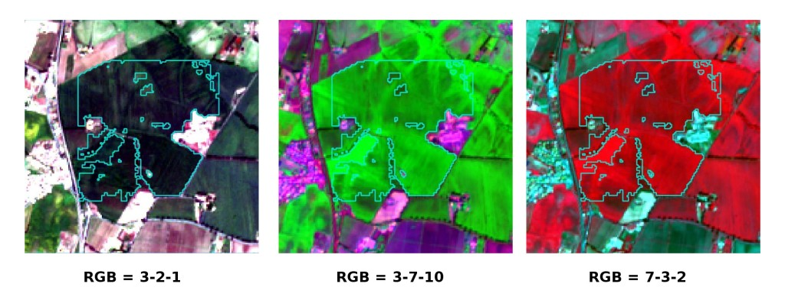
	
	:guilabel:`Vegetation ROI: crop`

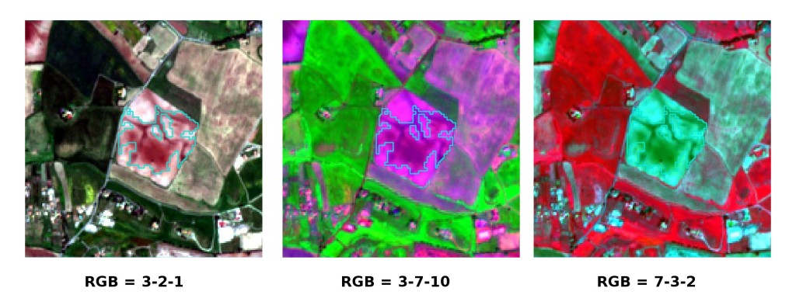
	
	:guilabel:`Bare soil ROI: uncultivated land`
	
It is worth mentioning that you can show or hide the temporary ROI clicking the button |radiobutton| :guilabel:`ROI` in :ref:`working_toolbar`.

	**TIP** : Install the plugin `QuickMapServices <http://plugins.qgis.org/plugins/quick_map_services/>`_ in QGIS, and add a map (e.g. `OpenStreetMap <http://www.openstreetmap.org>`_) in order to facilitate the identification of ROIs using high resolution data.

We can also try to mask clouds in the image, creating ROIs of clouds and assigning the special :guilabel:`MC ID` = 0 (which is an ID used for labelling intentionally unclassified pixels) and a different :guilabel:`C ID`.
In fact spectral signatures with the :guilabel:`MC ID` = 0 are normally used in the classification, but every pixel assigned to these spectral signatures is labelled ``unclassified`` in the classification result.
Therefore, this is a simple way for masking particular spectral signatures such as clouds (of course there are more advanced methods for masking clouds that will be discussed in other tutorials).

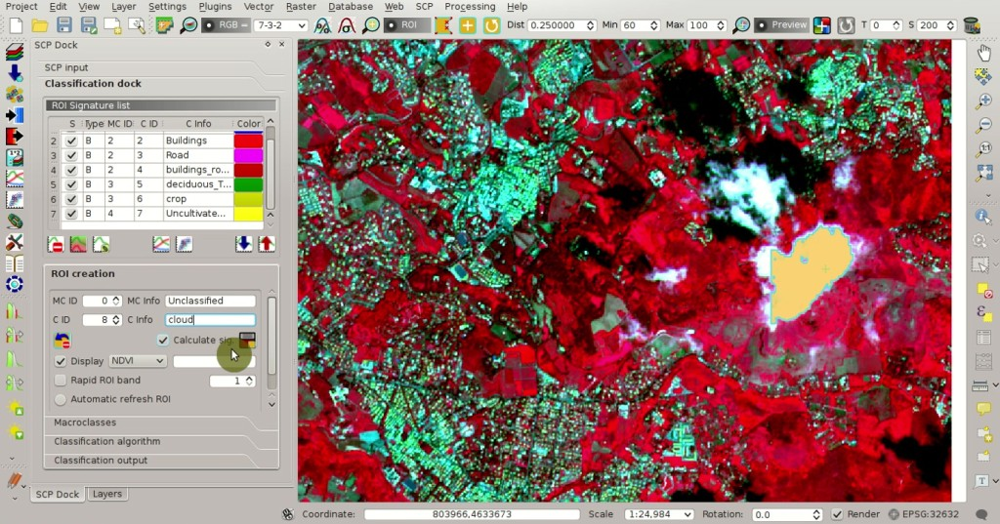
	
	:guilabel:`Example of ROI for clouds`
	
.. _tutorial_2_3:

Create a Classification Preview
------------------------------------------------------

As pointed out in :ref:`tutorial_1`, previews are temporary classifications that are useful for assessing the effects of spectral signatures during the ROI collection.

Set the colors of the spectral signatures in the :ref:`ROI_list`; then, in the :ref:`classification_alg` select the classification algorithm :ref:`max_likelihood_algorithm`.
In :ref:`classification_preview` set :guilabel:`Size` = 500; click the button |preview| and then left click a point of the image in the map.

The classification preview is displayed in the map.

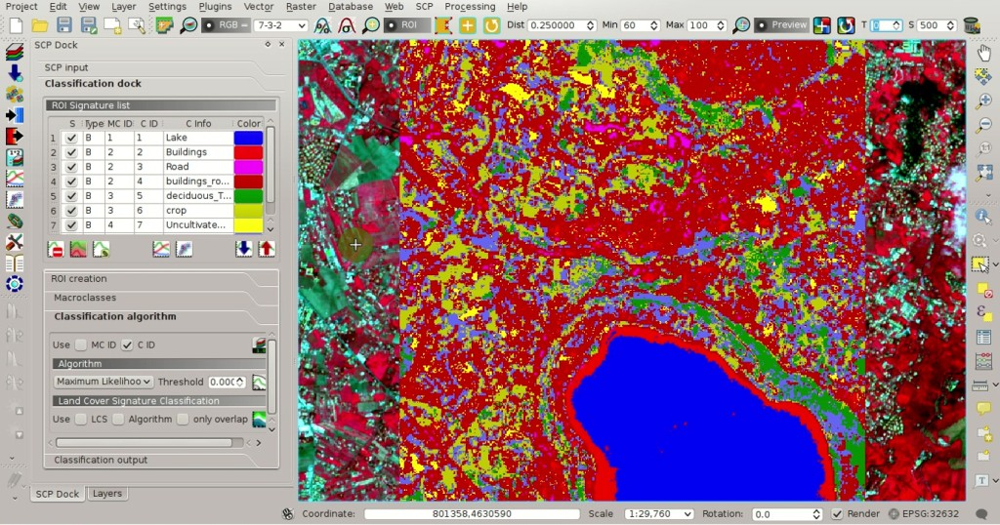

	:guilabel:`Example of preview using C IDs`
	
In order to create a classification preview using Macroclass IDs check the option |checkbox| :guilabel:`MC ID` in the tab :ref:`classification_alg` of the :ref:`SCP_dock`.
In the tab :ref:`classification_style` of the :ref:`SCP_dock` change the colors of :guilabel:`MC ID` (in the table :ref:`classification_style` double click the color of each macroclass to choose a representative color).

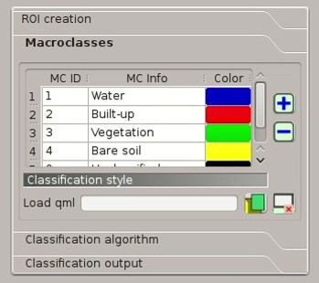

	:guilabel:`COlors of MC IDs`
	
Now click the button |preview_redo| in the :ref:`working_toolbar` to calculate a new preview at the same area of the previous one.
In the following figure you can notice that there are fewer classes (only the :guilabel:`MC ID`) than the previous preview; also, clouds are unclassified (black pixels).

	**TIP** : In the :ref:`working_toolbar` click the button |radiobutton| :guilabel:`Preview` to easily show or hide the classification previews, and the button |radiobutton| :guilabel:`RGB=` to show or hide the :guilabel:`Input image`.

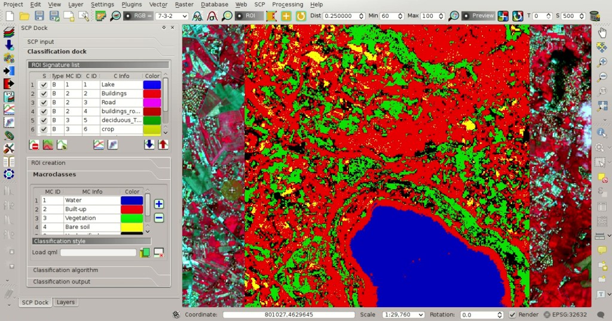

	:guilabel:`Example of preview using MC IDs`

.. _tutorial_2_4:

Assess Spectral Signatures
------------------------------------------------------
	
Spectral signatures are used by :ref:`classification_algorithm_definition` for labelling image pixels.
Different materials may have similar spectral signatures (especially considering multispectral images) such as built-up and soil.
If spectral signatures used for classification are too similar, pixels could be misclassified because the algorithm is unable to discriminate correctly those signatures.
Thus, it is useful to assess the :ref:`spectral_distance_definition` of signatures to find similar spectral signatures that must be removed.
Of course the concept of distance vary according to the algorithm used for classification.

One can simply assess spectral signature similarity by displaying a signature plot.
In order to display the signature plot, in the :ref:`ROI_list` highlight two or more spectral signatures (with click in the table), then click the button |sign_plot|.
The :ref:`spectral_signature_plot` is displayed in a new window.
Move ans zoom inside the :ref:`signature_plot` to see if signatures are similar (i.e. very close).
We can see in the following figure a signature plot of different materials. 

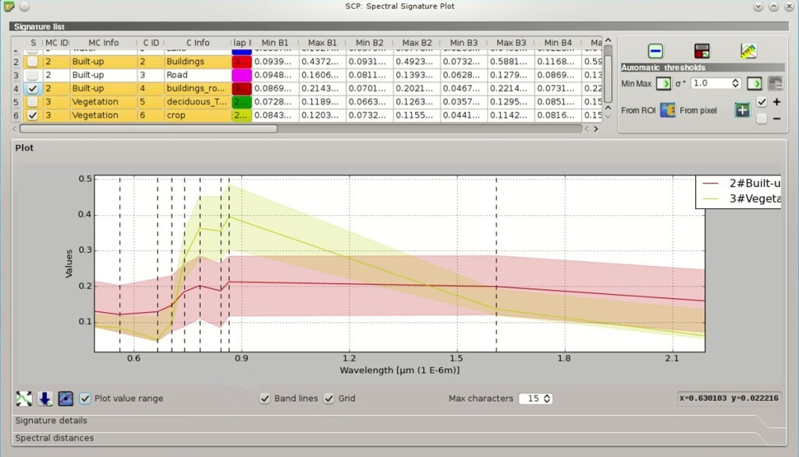
	
	:guilabel:`Spectral plot`
	
In the plot we can see the line of each signature (with the color defined in the :ref:`ROI_list`), and the spectral range (minimum and maximum) of each band (i.e. the semi-transparent area colored like the signature line).
The larger is the semi-transparent area of a signature, the higher is the standard deviation, and therefore the heterogeneity of pixels that composed that signature.
Spectral signature values are displayed in the :ref:`signature_details`.

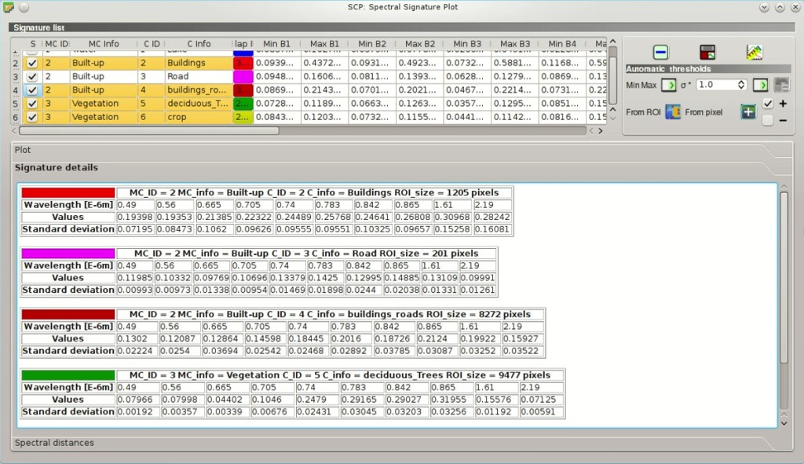
	
	:guilabel:`Spectral signature values`
	
Additionally, we can calculate the spectral distances of signatures (for more information see :ref:`spectral_distance_definition`).
Highlight two or more spectral signatures with click in the table :ref:`signature_list_plot`, then click the button |calculate_spectral_distances|; distances will be calculated for each pair of signatures.
Now open the tab :ref:`spectral_distances`; we can notice that similarity between signatures vary according to considered algorithm.

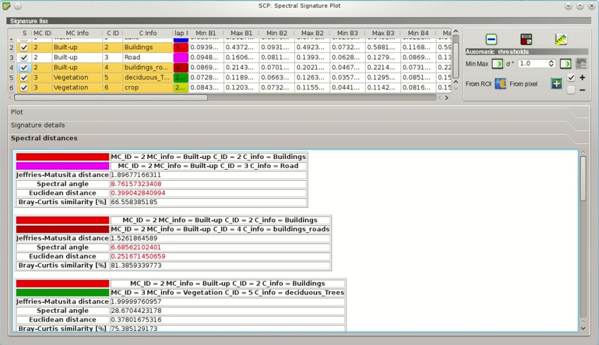
	
	:guilabel:`Spectral distances`
	
For instance, two signatures can be very similar :ref:`spectra_angle_mapping_algorithm` (very low :ref:`spectral_angle`), but quite distant for the :ref:`max_likelihood_algorithm` (:ref:`Jeffries_Matusita_distance` value near 2).
The similarity of signatures is affected by the similarity of materials (in relation to the number of spectral bands available in the :guilabel:`Input image`); also, the way we create ROIs influences the signatures. 

.. _tutorial_2_5:

Create the Classification Output
------------------------------------------------------
	
Repeat iteratively the phases :ref:`tutorial_2_2`, :ref:`tutorial_2_3`, and :ref:`tutorial_2_4` until the classification previews show good results.

To start the classification of the entire image, open the tab :ref:`classification_output`, click the button |run| and define the name of the classification output.

	**TIP** : Set the :guilabel:`Available RAM (MB)` in :ref:`ram` settings, in order to reduce the computational time; the recommended value is half of the system RAM.

If |checkbox| :guilabel:`Play sound when finished` is checked in :ref:`classification_process` settings, a sound is played when the process is finished.

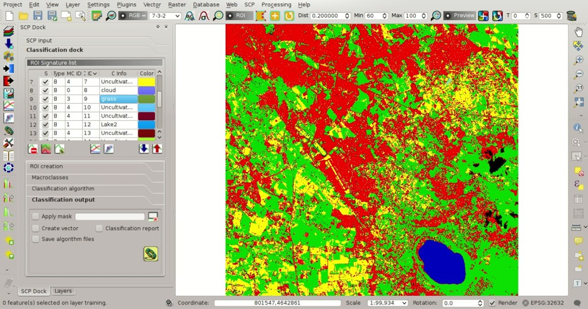
	
	:guilabel:`Classification`

It is worth mentioning that :guilabel:`SCP` provides other tools and techniques that can improve the classification results, which are described in :ref:`thematic_tutorials`.
	