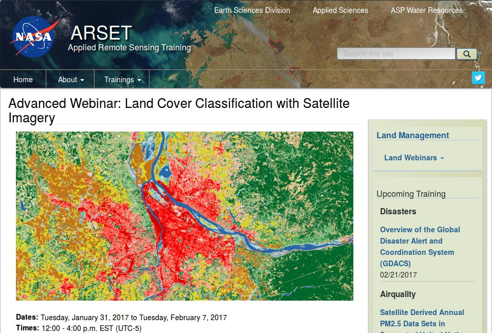

.. _webinar_nasa_arset:

***************************************************************
NASA ARSET Webinar
***************************************************************

.. |br| raw:: html

  

`NASA ARSET <https://arset.gsfc.nasa.gov>`_ is a program for fostering the acquisition and use of NASA satellite data for supporting decisions, through online webinars and in-person workshops.

NASA ARSET offered the webinar **Land Cover Classification with Satellite Imagery** which covered very interesting objectives such as access and download Landsat imagery and learn the basic steps for performing a supervised classifications using the :guilabel:`SCP`.

	
	:guilabel:`NASA ARSET website`

This webinar is organized in two sessions:

* Introduction to Land Cover Classification and QGIS
* Improving a Supervised Land Cover Classification

The entire webinar is very informative, and I recommend watching the recordings.
In particular, the :ref:`LCS_algorithm` is illustrated during the exercise of the second session.

Slides of presentations, in English and Spanish, and the recordings of both sessions are freely available at this link https://arset.gsfc.nasa.gov/land/webinars/advanced-land-classification.

Many thanks to NASA ARSET for their effort in teaching remote sensing using open source software.

